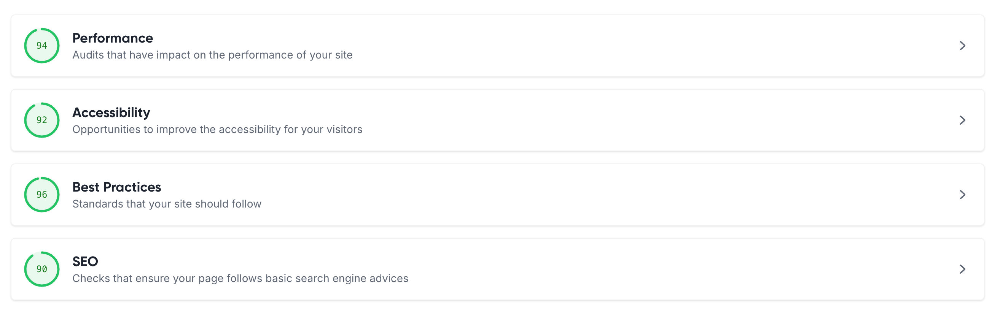

# Project Webpage
This page has been created as part of Spring 2025's P3 assignment: Project Webpage.

## Project Description
Our project will build on C4G's existing BLIS project. C4G Basic Laboratory Information System is a collaboration between Computing for Good (C4G) at Georgia Tech, the Center for Diseaser Control (CDC), and participating PEPFAR countries. The project provides software for tracking of lab test results in developing countries. We will provide support and maintenance, improve existing features, as well as provide new features to the system.

## Overall Project Goal
Our project will have a few different goals

- We will build a system for satellite labs to seamlessly access results from source labs. 
    - Source labs extract specimens from patients and send the specimens to satellite labs that have full capabilities to perform the tests needed. When satellite labs have extracted the results, these are currently sent through PDF's over email or even physically to the source labs. We are building capability within the BLIS system for satellite labs to seamlessly and privately share these results with source labs.
- We will improve translation of text for French speakers.
- We will deploy BLIS-on-cloud to labs.
- We will fix an existing bug where we can't enroll new clients younger than a year old.

## Team Members
- Sofia Muller: 
    - Team webpage
    - Functionality to extract satellite lab id when searching from a satellite lab account
- Princesca Dorsaint: 
    - Developed functionality to create a satellite lab user type in the db and allow satellite lab user ability to search for patient results. https://github.com/C4G/BLIS/pull/121
    - Remove satellite lab users ability to remove/modify specimen data. https://github.com/C4G/BLIS/pull/126
    - Add functionality to auto generate a satellite_lab_id for satellite lab users when creating  a satellite lab user type in the user table. Modify search_patients_by_...dyn functions to take in the $satellite_lab_id variable. Modify sql queries associated with search functions to filter for patients associated with the logged in satellite lab user. https://github.com/C4G/BLIS/pull/130
    - QA'd changes to ensure end to end functionality.
- Disha Patel: 
    - [Requirements gathering for Satellite labs feature](https://github.com/C4G/BLIS/pull/116)
    - [UI and database code changes related to adding satellite lab ID, updating satellite lab ID and viewing the satellite lab ID](https://github.com/C4G/BLIS/pull/127)
    - Performed end-to-end testing of the satellite lab id feature
- Mishwa Bhavsar:
    - French translation
    - Survey for peer evaluations
Note: Team members goals and contributions will change through the semester.

## Peer Evaluations
1. Please find our demo application here: https://demo.c4gblis.org/login.php
2. Answer the following survey: [BLIS Peer Evaluation Survey](https://forms.office.com/r/snWhypaQiy)
3. Troubleshooting contact: Sofia Muller or Mishwa Bhavsar on Microsoft teams

## Lighthouse Scores
- Performance: 94
- Accessibility: 92
- Best Practices: 96
- SEO: 90
