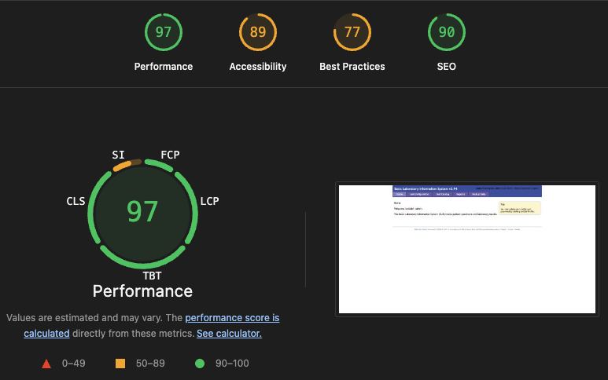

# Project Webpage
This page has been created as part of Spring 2026's P3 assignment: Project Webpage.

## Project Description
The Basic Laboratory Information System (BLIS) is the flagship initiative of Computing for Good (C4G) at Georgia Tech, developed in partnership with the CDC and PEPFAR. For over 15 years, BLIS has served public health laboratories across sub-Saharan Africa, managing patient specimens and diagnostic data to combat infectious diseases. 

Our team is collaborating with the Ministry of Health and National Public Health Labs to modernize the platform. While the partner's goal is a transition to a cloud-based, bi-directional system, significant infrastructure challenges currently block progress.

Our mission this semester is to bridge this gap by upgrading the legacy PHP core, securing the system with local password recovery tools, and implementing a reliable self-update mechanism that functions even in resource-constrained environments. 

## Overall Project Goal

### 1. Test the PHP 7 upgrade and support BLIS online development

To ensure long-term sustainability, we are migrating BLIS from legacy PGP 5.x to a secure PHP 7/MySQLi environment. 

- The Challenge: Legacy codebases often break during environment shifts. We are specifically tasked with fixing a high-priority bug in the BLIS 4.0 Registration Workflow that currently prevents new patient intake. 
- Deliverable: Further testing and support of BLIS online development regarding the PHP upgrade. 

### 2. Implement a password reset tool in the BLIS-NG desktop launcher

Lab staff frequently lose access to their local instances due to a lack of technical training. We are building a standalone recovery tool. 
- The Challenge: Providing a way for labs to self-sever without requiring a manual intervention from the limited IT staff.
- Deliverable: A secure utility built into the BLIS Desktop Launcher. 

### 3. Implement a self-update feature of the BLIS-NG desktop launcher

Current manual updates (copy-pasting ZIP contents) often result in a mix of old and new files, leading to unstable "Frankenstein" versions that are impossible to support. 
- The Challenge: Creating a robust, sequential SQL migration and file-syncing process that can reliably update the full BLIS stack. 
- Deliverable: A self-updating launcher that maintains version integrity. 

## Team Members
> TODO: Everybody fill out their planned role description

- Haki Atalov: 
    - Goal commitment: BLIS self-update feature
    - Role: Program Management + Engineering. Acting as Team Lead.
    - Email: hatalov3@gatech.edu
- Ranjini Unnikrishnan:
    - Planned role descripton
    - Goal commitment: Password reset utility
- Tanner Jones:
    - Planned role descripton
    - Goal commitment: BLIS PHP upgrade
- Luqman Rashad:
    - Coordinate with Haki and create a design document for the launcher-based self update feature
    - Add unit tests to test self update feature functionality
    - Goal commitment: BLIS self-update feature
- Tony Simo Dzumgang
    - Planned role descripton
    - Goal commitment: Password reset utility
- Emmanuel Asuquo
    - Planned role descripton
    - Goal commitment: BLIS PHP upgrade
    

## Peer Evaluations
1. Please find our demo application here: https://demo.c4gblis.org/login.php
2. Answer the following survey: [BLIS Peer Evaluation Survey](https://forms.office.com/r/snWhypaQiy)
3. Troubleshooting contact: Haki Atalov or Ranjini Unnikrishnan on Microsoft teams

## Lighthouse Scores

- Performance: 97
- Accessibility: 89
- Best Practices: 77
- SEO: 90

