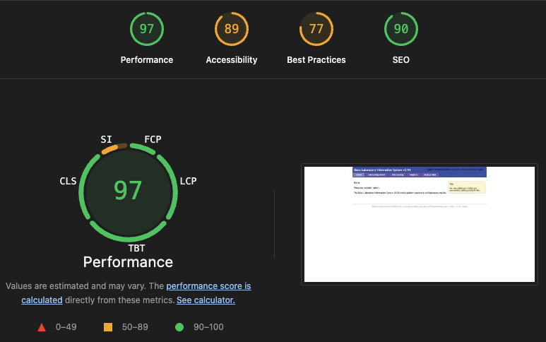

# Project Webpage
This page has been created as part of Spring 2026's P3 assignment: Project Webpage.

## Project Description
The Basic Laboratory Information System (BLIS) is the flagship initiative of Computing for Good (C4G) at Georgia Tech, developed in partnership with the CDC and PEPFAR. For over 15 years, BLIS has served public health laboratories across sub-Saharan Africa, managing patient specimens and diagnostic data to combat infectious diseases. 

Our team is collaborating with the Ministry of Health and National Public Health Labs to modernize the platform. While the partner's goal is a transition to a cloud-based, bi-directional system, significant infrastructure challenges currently block progress.

Our mission this semester is to bridge this gap by upgrading the legacy PHP core, securing the system with local password recovery tools, and implementing a reliable self-update mechanism that functions even in resource-constrained environments.

## Assignment Links
- [P6-Demo Presentation](https://gtvault-my.sharepoint.com/:v:/g/personal/hatalov3_gatech_edu/IQBht2wBxxVETZAyljo7sn7-AdHsssfrsJna-ixTSHoMFVc?e=Sm1fci&nav=eyJyZWZlcnJhbEluZm8iOnsicmVmZXJyYWxBcHAiOiJTdHJlYW1XZWJBcHAiLCJyZWZlcnJhbFZpZXciOiJTaGFyZURpYWxvZy1MaW5rIiwicmVmZXJyYWxBcHBQbGF0Zm9ybSI6IldlYiIsInJlZmVycmFsTW9kZSI6InZpZXcifX0%3D)

## Overall Project Goal

### 1. Test the PHP 7 upgrade and support BLIS online development

To ensure long-term sustainability, we are migrating BLIS from legacy PGP 5.x to a secure PHP 7/MySQLi environment. 

- The Challenge: Legacy codebases often break during environment shifts. We are specifically tasked with fixing a high-priority bug in the BLIS 4.0 Registration Workflow that currently prevents new patient intake. 
- Deliverable: Further testing and support of BLIS online development regarding the PHP upgrade. 

### 2. Implement a password reset tool in the BLIS-NG desktop launcher

Lab staff frequently lose access to their local instances due to a lack of technical training. We are building a standalone recovery tool. 
- The Challenge: Providing a way for labs to self-sever without requiring a manual intervention from the limited IT staff.
- Deliverable: A secure utility built into the BLIS Desktop Launcher. 

### 3. Implement a self-update feature of the BLIS-NG desktop launcher

Current manual updates (copy-pasting ZIP contents) often result in a mix of old and new files, leading to unstable "Frankenstein" versions that are impossible to support. 
- The Challenge: Creating a robust, sequential SQL migration and file-syncing process that can reliably update the full BLIS stack. 
- Deliverable: A self-updating launcher that maintains version integrity. 

## Team Members

- Haki Atalov: 
    - Goal commitment: BLIS self-update feature
    - Role: Program Management + Engineering. Acting as Team Lead.
    - Email: hatalov3@gatech.edu
- Ranjini Unnikrishnan:
    - Role: Design and Development
    - Goal commitment: Password reset utility -BLIS Launcher
    - Email: runnikrishnan6@gatech.edu
- Tanner Jones:
    - Discover bugs in current cloud setup, work on upgrade from php 5 to php 8+, asses current technology and offer improvements and migrations plans.
    - Goal commitment: BLIS PHP upgrade
    - Email: tjones406@gatech.edu
- Luqman Rashad:
    - Goal commitment: BLIS self-update feature
    - Role: Design and Development
    - Email: lrashad3@gatech.edu
- Tony Simo Dzumgang
    - Role: Design and Development
    - Goal commitment: Password reset utility
    - Email: tdzumgang3@gatech.edu
- Emmanuel Asuquo
    - Coordinate with Tanner to upgrading the PHP from 5 to 8 
    - Identify, debug, and resolve backend issue. Also strengthening input validation and enhacning error hadling. 
    - Goal commitment: BLIS PHP upgrade
    - Email: easuquo3@gatech.edu
    

## Initial Partner Evaluation
1. We shared with the partner the BLIS artifact form a new workflow: [Build Release](https://github.com/C4G/BLIS/actions/runs/22791471537)
2. Initial Evaluation survey: [Initial Experience Evaluation for BLIS Modernization Features](https://forms.office.com/r/td9Rqjsyv4)
3. Troubleshooting contact: Haki Atalov or Ranjini Unnikrishnan on Microsoft teams

## Partner Statement
For our submission we must indicate the following as of 2026-04-19: 
1. The partner understands the basics of the developer documentation
2. The partner will not use deliverable at this time**

For our documentation and final deliverable, we have all feature code in the `unstable` branch for the BLIS and BLIS-NG repos. There is an open PR to merge this branch into main and allow for deployment at a pilot lab. A final verdict of "The partner will not use deliverable at this time**" with asterisk is provided because the features will have to be merged and piloted. They are not generally available for existing labs.

All documentation is in the `s2026-p3-project-webpage` branch with an open PR against main. Given the provided installation walkthrough statement and close collaboration with our BLIS partners, we believe the partner understands the basics of the developer documentation and how the features work. 

## Installation Walkthrough Statement
Our main partner, Sidney, performed a walkthrough of our features and provided feedback on 2026-04-08. He reviewed Password Reset, Self-Update, and PHP 7 related bug fixes in critical patient flows. This was done as part of our field evaluation effort. We completed our field evaluation in two stages: 1. With the professor and instructional staff, 2. Async with Sidney. This async evaluation serves as our walkthrough. 

## Lighthouse Scores

- Performance: 97
- Accessibility: 89
- Best Practices: 77
- SEO: 90

