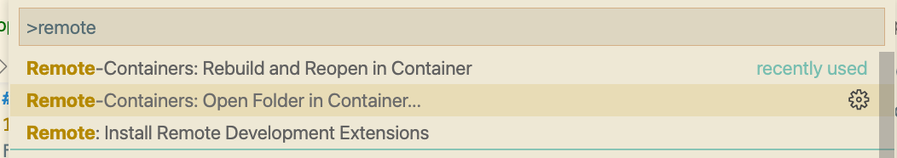
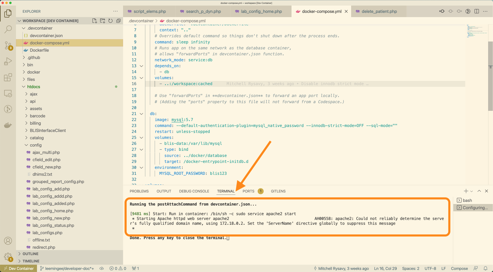
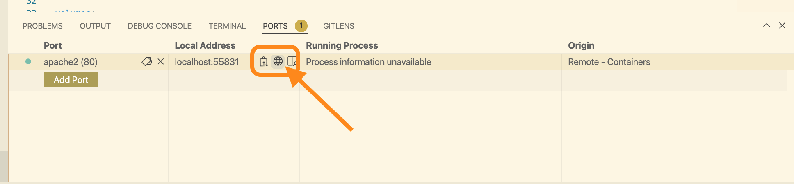

# C4G BLIS Developer Guide

C4G Basic Laboratory Information System is a collaboration between Computing-for-Good (C4G) at Georgia Tech, the CDC, and participating PEPFAR countries. This doc will works as a supplement to `BLIS_User_Guide.pdf`, mainly to help developers quick ramp up on this repo and list out tips when contribute to this project.

- [C4G BLIS Developer Guide](#c4g-blis-developer-guide)
  - [Welcome](#welcome)
  - [Set up the dev envs](#set-up-the-dev-envs)
    - [Tools](#tools)
    - [Test the envs](#test-the-envs)
  - [Running environment](#running-environment)
    - [Running on `devcontainer`](#running-on-devcontainer)
    - [Running on Windows](#running-on-windows)
  - [Code directory and organization](#code-directory-and-organization)
  - [Deployment](#deployment)


## Welcome
So welcome to this project! In this guide, we are going to go through the recommended tools, workflows and debug tips.

## Set up the dev envs
### Tools
1. git
Depending on your computer OS, there will be different step to setup git. You can refer to the official manual for [git installation](https://git-scm.com/book/en/v2/Getting-Started-Installing-Git).

??? tip "Tips on install git"
    On Windows, installing command-line tools can be done with a Windows package manager such as [Scoop](https://scoop.sh/).
    On MacOS or Linux systems, installing tools can be done with package manager [brew](https://brew.sh/).

1. VScode  
For IDE, we recommended using [VSCode](https://code.visualstudio.com/docs/setup/setup-overview), which is a lightweight, opensource IDE.   
VSCode-Extension recommended to install:      

    - [Remote-Containers](https://marketplace.visualstudio.com/items?itemName=ms-vscode-remote.remote-containers)
    - [Remote-WSL](https://marketplace.visualstudio.com/items?itemName=ms-vscode-remote.remote-wsl)
    - [Docker](https://marketplace.visualstudio.com/items?itemName=ms-azuretools.vscode-docker)
    - [Docker-compose](https://marketplace.visualstudio.com/items?itemName=p1c2u.docker-compose)

2. Docker  
We will need [Docker](https://www.docker.com/) as the major tool in the development cycle.  

With the Docker application running, after installing the `Remote-Containers` and related extensions, we will be able to start the [devcontainer](https://code.visualstudio.com/docs/remote/create-dev-container) which has been setup under `/root/.devcontainer` directory.

??? question "What's devcontainer and why do we use it here?"

    Devcontainers are a feature of Visual Studio Code that allow you to specify your development environment as a Docker container develop inside of it as if you were running the tools on your computer directly.

    The `c4g-blis-spr22/BLIS` repository has a `.devcontainer` configuration already specified, so you can develop BLIS on any computer that can run Docker and Visual Studio Code.

### Test the envs
A quick way to test the dependencies installed correctly is:
1. Clone the BLIS repository to your computer:
    ```
    $ git clone https://github.com/c4g-spr22-blis/BLIS.git
    ```
    <!---
    TODO: get the link up-to-date after the end of this semester.
    -->

1. Open the folder in Visual Studio Code

1. A pop-up that says something like "This folder contains a devcontainer configuration" will appear. Click the button to open the folder in a container.    
 
1. If that does not appear, open the command palette (Ctrl-Shift-P or Cmd-Shift-P) and find "Open folder in container" and select the BLIS folder.   
    

1. Once the container is started, the ports should forward automatically. You can see apache2 running if you click the "Ports" tab on the bottom (if the bottom panel is not open, use Ctrl-` (backtick) to open it)     

    In this plot, you can see the terminal output, where the apache servers starts.    
    

    In this plot, you can see the port, click the little earth button and then it will take you to the local hosted BLIS instance.    
    

1. You can then browse BLIS in your normal browser by visiting http://localhost:80 (substituting 80 for another port, depending on what port VS Code has mapped to apache2.)

7. Log into the BLIS and start your exploration.
??? tip "Read the [data structures site](./data-structure.md) for (username, password) pairs, as well as data structures stored in database before diving in"

## Running environment
### Running on `devcontainer`
You can see more details on the [Test the envs](#test-the-envs) section.

### Running on Windows

Aside by running BLIS on `devcontainer`, you can also try with running BLIS on Windows, where the BLIS was originally designed and developed on). This process will only require `git` to pull the code from github.

BLIS was originally developed to run on Windows using a discontinued project called Server2Go. This packages Apache2, MySQL, PHP, and Firefox together into a package that can be run all at once on a desktop computer.

!!! info "See Also"

    * [Design and Implementation of a Basic Laboratory Information System for Resource-Limited Settings](https://smartech.gatech.edu/bitstream/handle/1853/34792/monu_ruban_201005_mast.pdf)
    * [Server2Go - Portable Web Server](https://pendriveapps.com/server2go-portable-webserver/)

This is the primary way that end-users are still using BLIS. You can still run BLIS this way to develop it.

!!! warning
    These instructions are subject to change.

1. Clone the BLIS repository to your computer:

    ```
    $ git clone https://github.com/c4g-spr22-blis/BLIS.git
    ```

2. Download the latest version of [BLISRuntime.zip](https://github.com/c4g-spr22-blis/BLISRuntime/archive/refs/heads/main.zip) archive
3. Unzip BLISRuntime.zip into the BLIS repository directory
4. Run `BLIS.exe`

The bundled Firefox will start and you can use BLIS normally, or make changes to files in the `htdocs/` directory.


## Code directory and organization


## Deployment

After you are satisfied with your new changes and want to deploy a newer version BLIS on cloud. In this doc, we will use [DigitalOcean](https://www.digitalocean.com/) for the deployment platform as example. You will go through two main steps:

1. Push & merge your changes to github repo. Based on `./github/workflows/release-docker.yml`, the newest change will reflect in the `ghcr.io/c4g-spr22-blis/blis:latest` docker repo.
2. Use the docker image to deploy BLIS service as well as database service. An step-by-step detailed instruction can be seen [in this site](blis_cloud.md)
<!-- TODO, change the workflow file hyperlink after merging into the main -->
