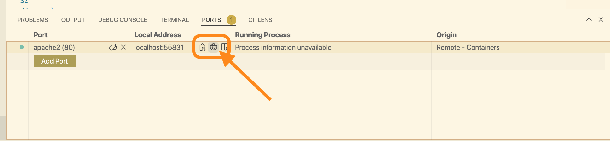

# Getting Started

C4G Basic Laboratory Information System is a collaboration between Computing-for-Good (C4G) at Georgia Tech, the CDC, and participating PEPFAR countries. This doc will works as a supplement to `BLIS_User_Guide.pdf`, mainly to help developers quick ramp up on this repo and list out tips when contribute to this project.

## Welcome

In this guide, we are going to go through the recommended tools, workflows and debug tips.

## Prerequisites

### `git`

Depending on your computer OS, there will be different step to setup git. You can refer to the official manual for [git installation](https://git-scm.com/book/en/v2/Getting-Started-Installing-Git).

??? tip "Tips for installing git"
    On Windows, installing command-line tools can be done with a Windows package manager such as [Scoop](https://scoop.sh/).
    On MacOS or Linux systems, installing tools can be done with package manager [brew](https://brew.sh/).

### VS Code

For an editor, we recommended using [VSCode](https://code.visualstudio.com/docs/setup/setup-overview), which is a lightweight, opensource IDE.

Some useful extensions that you can install are:

- [Remote-Containers](https://marketplace.visualstudio.com/items?itemName=ms-vscode-remote.remote-containers)
- [Remote-WSL](https://marketplace.visualstudio.com/items?itemName=ms-vscode-remote.remote-wsl)
- [Docker](https://marketplace.visualstudio.com/items?itemName=ms-azuretools.vscode-docker)
- [Docker-compose](https://marketplace.visualstudio.com/items?itemName=p1c2u.docker-compose)

### Docker

We will need [Docker](https://www.docker.com/) as the major tool in the development cycle.

On Linux, you can install `docker` as a regular system package using the [Docker Engine](https://docs.docker.com/engine/install/ubuntu/) setup instructions. On Windows and macOS, including Windows Subsystem for Linux, you can install [Docker Desktop](https://docs.docker.com/desktop/).

With Docker running, after installing the `Remote-Containers` and related extensions, we will be able to start the [devcontainer](https://code.visualstudio.com/docs/remote/create-dev-container) which has been setup under `/.devcontainer` directory.

??? question "What's a devcontainer and why do we use it here?"

    Devcontainers are a feature of Visual Studio Code that allow you to specify your development environment as a Docker container develop inside of it as if you were running the tools on your computer directly.

    The `C4G/BLIS` repository has a `.devcontainer` configuration already specified, so you can develop BLIS on any computer that can run Docker and Visual Studio Code.

## Clone the repository and run BLIS

A quick way to test the dependencies installed correctly is:

1. Clone the BLIS repository to your computer (**note for Windows users:** if you are using WSL, we recommend cloning BLIS _inside_ your WSL home directory):
    ```
    $ git clone https://github.com/C4G/BLIS.git
    ```

1. Open the folder in Visual Studio Code (you can run `code BLIS/` from the terminal to do this)

1. A pop-up that says something like "This folder contains a devcontainer configuration" will appear. Click the button to open the folder in a container.

1. If that does not appear, open the command palette (Ctrl-Shift-P or Cmd-Shift-P) and find "Open folder in container" and select the BLIS folder.
    

1. Once the container is started, the ports should forward automatically. You can see apache2 running if you click the "Ports" tab on the bottom (if the bottom panel is not open, use Ctrl-` (backtick) to open it)

    You can see Apache2 running here:
    

    Clicking the icon will open your browser and take you to BLIS:
    

1. You can then browse BLIS in your normal browser by visiting http://localhost:80 (substituting 80 for another port, depending on what port VS Code has mapped to apache2.)

7. Log into the BLIS and start your exploration.

??? tip "Read the [test accounts page](./test-accounts.md) for test credentials you can use to log in"

## Running BLIS for Windows (Legacy)

Besides running BLIS in a `devcontainer`, you can also try running BLIS on Windows, which is what BLIS was originally designed and developed on. This process will only require `git` to pull the code from GitHub.

BLIS was originally developed to run on Windows using a discontinued project called Server2Go. This packages Apache2, MySQL, PHP, and Firefox together into a package that can be run all at once on a desktop computer.

!!! info "See Also"

    * [Design and Implementation of a Basic Laboratory Information System for Resource-Limited Settings](https://smartech.gatech.edu/bitstream/handle/1853/34792/monu_ruban_201005_mast.pdf)
    * [Server2Go - Portable Web Server](https://pendriveapps.com/server2go-portable-webserver/)

This is the primary way that end-users are still using BLIS. You can still run BLIS this way to develop it.

!!! warning
    These instructions are subject to change.

1. Clone the BLIS repository to your computer:

    ```
    $ git clone https://github.com/C4G/BLIS.git
    ```

2. Download the latest version of [BLISRuntime.zip](https://github.com/C4G/BLISRuntime/archive/refs/heads/main.zip) archive
3. Unzip BLISRuntime.zip into the BLIS repository directory
4. Run `BLIS.exe`

The bundled Firefox will start and you can use BLIS normally, or make changes to files in the `htdocs/` directory.
