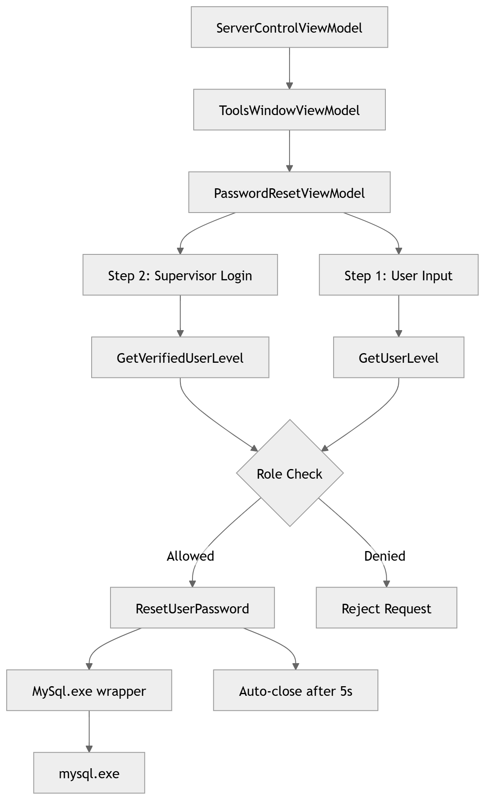

# Developer Guide: Password Reset Feature through BLIS Launcher

## How It Works

The password reset feature allows a supervisor-level user to reset the password of any user with a lower role. It is built into the BLIS-NG desktop launcher using Avalonia UI and wired entirely through .NET dependency injection.

## Authentication and Authorization

A superior level credential is required to use this functionality. The “RolePower” dictionary maps role level integers to a numeric power ranking. A supervisor can only reset a password if their power ranking is strictly greater than the target user's. Equal power is not sufficient: a supervisor cannot reset their own peer's password.

| Role        | Level | Power |
|-------------|------:|------:|
| TECH_RW      | 0     | 1     |
| TECH_RO      | 1     | 1     |
| CLERK        | 5     | 1     |
| ADMIN        | 2     | 2     |
| COUNTRYDIR   | 4     | 3     |
| SUPERADMIN   | 3     | 4     |

## Password security

Passwords are hashed with SHA-1 before being stored or compared. A static salt string is appended before hashing. The strength meter in the UI enforces a minimum of 20 characters and at least 2 character classes (uppercase, lowercase, digits, symbols), aligned with NIST SP 800-63B guidance on length-first password policies.

## Architecture



## Data Flow

Server/Mysql.cs is a process wrapper around mysql.exe. It exposes three methods used by the password reset flow: 
1.	GetVerifiedUserLevel (verifies supervisor credentials and returns their role level), 
2.	GetUserLevel (looks up the target user's role level by username alone), 
3.	ResetUserPassword (executes the UPDATE statement to set the new SHA-1 hashed password).

MysqlAdmin.cs is a separate wrapper for mysqladmin.exe. It was kept separate from Mysql.cs following the one-process-per-class pattern.
PasswordResetViewModel is the core of the feature. It owns a two-step form state machine: 
1.	step 1 collects the target username, new password, and confirmation. 
2.	step 2 collects supervisor credentials.

On confirmation it runs the full authorization check : verifies the supervisor's credentials against the database, fetches the target user's role, compares role power using a dictionary-based hierarchy, and only then it calls MySql.ResetUserPassword. On success it triggers an auto-close after 5 seconds via a RequestClose action.

ToolsWindowViewModel is a lightweight shell that holds PasswordResetViewModel as a property. ServerControlViewModel receives ToolsWindowViewModel via DI. When the user clicks the reset button, HandleOpenPasswordReset calls ResetForm() on the injected PasswordResetViewModel to clear any stale state from a previous session, then opens ToolsWindow as a modal dialog. All three classes are registered as singletons in ServiceCollectionExtensions: PasswordResetViewModel, ToolsWindowViewModel, ServerControlViewModel

## Code Layout

New Files added:

```
Server/
├── Mysql.cs

ViewModels/
├── PasswordResetViewModel.cs
├── ToolsWindowViewModel.cs

Views/
├── PasswordResetDialog.axaml
├── PasswordResetDialog.axaml.cs
├── ToolsWindow.axaml
├── ToolsWindow.axaml.cs
```

## Testing

To test the password reset feature, you would need:
•	The username that you wish to reset password for.
•	A new strong password
•	A supervisor level credential

1.	Click “More Options” from the launcher and choose “Password Reset”.
2.	Enter the username and the new password
3.	Enter the supervisor credentials and hit “Confirm Reset”
4.	You will see a success message in green, confirming the reset and dialog window will close automatically.
5.	Login to BLIS with the new password.


