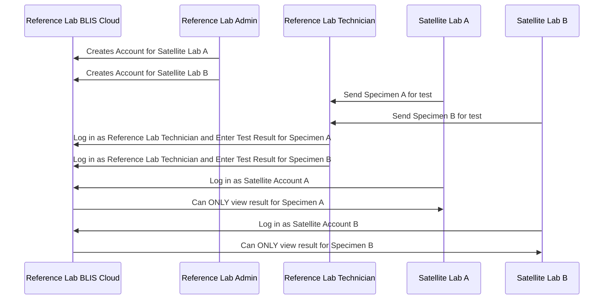
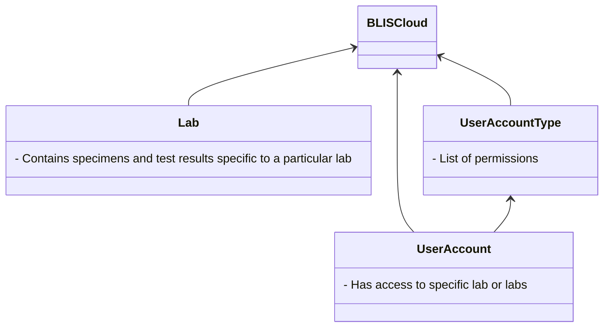

# Reference & Satellite Labs

_Last updated by [@mrysav](https://github.com/mrysav)_

# Use Case: 1 reference lab, 2 satellite labs

- The reference lab admin can create accounts for satellite lab users.
- The reference lab technician can enter results into the reference lab and tag those results as belonging to satellite labs.
- The satellite labs can log in to the reference lab cloud BLIS and view results only for their labs.

# Data Model (in progress)

