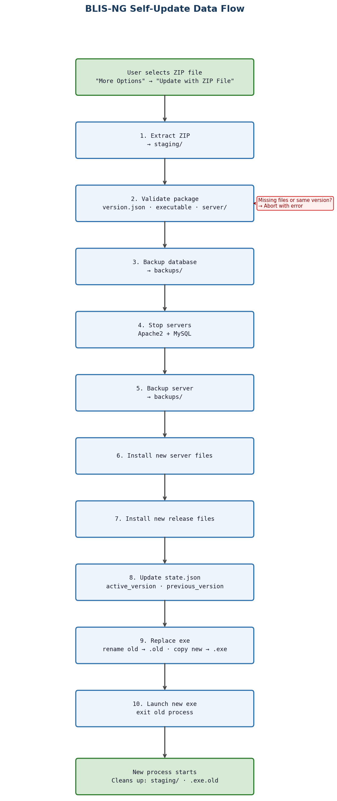

# Developer Guide: BLIS-NG Self-Update Feature

## How It Works

The self-update is a launcher based and user-initiated process. There is no auto-update or remote version check. The user manually selects a ZIP file containing a new release from their local storage (they can download the new release beforehand), and the app walks through a 10-stage pipeline to replace itself while preserving data.

## Directory Structure

The self-update feature introduced a new directory layout for BLIS standalone installations. Understanding this structure is important because the update pipeline depends on it directly.

```
BLIS-Standalone/
├── BLIS-NG.exe           # Launcher executable (root level)
├── state.json            # Tracks active_version and previous_version
├── releases/
│   └── <version>/        # One directory per installed version
│       ├── htdocs/
│       ├── db/
│       ├── vendor/
│       ├── local/
│       └── version.json
├── server/               # Apache2 + MySQL runtime binaries (from BLISRuntime)
├── dbdir/                # MySQL data directory
├── local/                # Working config (copy of defaults, may diverge over time)
├── storage/              # Runtime file writes from htdocs
├── data/
│   └── backups/          # Timestamped DB and server backups created during updates
├── log/                  # Launcher and server logs
└── staging/              # Temporary extraction target during an update (cleaned up on restart)
```

Key things to know:

- `releases/` is versioned. Each update adds a new subdirectory rather than overwriting the previous one. `state.json` tells the launcher which version is active. This is what makes rollback possible in the future.
- `server/` lives at the root, not inside a release directory, because the server runtime is updated independently and is shared across versions.
- `local/` at the root holds the working config. The copy inside each `releases/<version>/local/` is the default config shipped with that version and is not used directly at runtime.
- `storage/` exists because htdocs file writes were moved out of the versioned release directory to keep release directories read-only after installation.
- `staging/` is where update ZIPs are extracted before any files are moved. It is deleted on the next launcher startup, not during the update itself.

## Code Layout

The update feature is spread across a small number of files.

**ViewModels/ServerControlViewModel.cs** handles the UI trigger. It opens the file picker, creates the update window, and kicks off the update.

**ViewModels/UpdateProgressViewModel.cs** is where all the real work happens. The `StartUpdate()` method contains the entire 10-stage pipeline, and the class also has helper methods for ZIP extraction, backups, executable replacement, and cleanup. If you need to add more stages, here is where that would be.

**Views/MainWindow.axaml** has the "More Options" menu with the "Update with ZIP File" button.

**Views/UpdateProgressWindow.axaml** is the progress window that shows stage text, a progress bar, and a status message. Any new UI changes should go here.

**Config/StateFile.cs** contains both the `StateFile` class (reads and writes `state.json`) and the `VersionFile` class (reads `version.json` from inside the update ZIP). If any version check is being implemented that is different than the current schema, here is where you would need to add that.

**Config/ConfigurationFile.cs** has `ResolveBaseDirectory()`, which parses the `--WorkingDirectory` command line argument. This is how the new process knows where to find everything after a restart.

**Server/MainServer.cs** provides the `Stop()` method used in Stage 4 to shut down Apache2 and MySQL before replacing files.

**App.axaml.cs** calls `StartupCleanup()` on launch to remove leftover artifacts from the previous update.

## High Level Architecture Diagram:

### BLIS-NG Self-Update Data Flow



### Understanding the Flow

When the user clicks "Update with ZIP File", `ServerControlViewModel` opens a native file picker filtered to `.zip` files. Once a file is selected, it creates an `UpdateProgressViewModel` and an `UpdateProgressWindow`, then calls `StartUpdate()`.

`StartUpdate()` is a single async method that runs all 10 stages in order. Each stage calls `UpdateStage(n, text)` to update the progress bar and label. The stages are intentionally sequential because later stages depend on earlier ones (you can't install the new server before stopping the old one).

The update can't delete its own staging directory or the old executable while they're still in use. So instead, Stage 9 renames the running exe to `.old` (Windows allows renaming a running executable), Stage 10 launches the new exe and exits, and on the next startup `StartupCleanup()` removes both artifacts. This bypass works, and has been tested on lab devices.

### Key helper methods in UpdateProgressViewModel

| Method | What it does |
|---|---|
| `UnpackZip()` | Extracts the ZIP to a staging directory, handles ZIPs with a single root folder |
| `CreateAutomatedDatabaseBackup()` | Copies the database directory into backups |
| `ReplaceExecutable()` | Three-step file swap: delete old, rename current, copy new |
| `LaunchNewExecutable()` | Starts the new process with the `--WorkingDirectory` argument |
| `StartupCleanup()` | Static method called on app startup to delete the `.old` exe and staging directory |
| `CopyDirectoryRecursive()` | Simple recursive directory copy |
| `FindFileRecursive()` | Searches for a file by name in a directory tree |

## Making Changes

### Adding a new stage

Increment the `TotalStages` constant (currently 10), then add your logic in `StartUpdate()` at the right point in the sequence. Call `UpdateStage(n, "Your description...")` at the start of your stage. The progress bar math is automatic.

### Changing validation rules

Validation happens in Stage 2 of `StartUpdate()`. Right now it checks for `version.json`, `BLIS-NG.exe`, and a `server/` directory, and also rejects updates where the version matches the current one. To require a new file, follow the pattern of `FindFileRecursive()` and add it to the validation block.

### Changing the executable replacement strategy

The current approach in `ReplaceExecutable()` is a three-step swap that relies on Windows allowing you to rename a running binary. If you need to support other platforms, this is the method to change.

### Modifying what gets backed up

Database backup lives in `CreateAutomatedDatabaseBackup()`. Server backup is done inline in Stage 5 of `StartUpdate()` using `Directory.Move()`.

### Changing the restart mechanism

`LaunchNewExecutable()` passes `--WorkingDirectory` as a URI to the new process. `ConfigurationFile.ResolveBaseDirectory()` picks it up on the other side. If you change the argument format, update both.

## Testing

### What you need

- A `blis-update.zip` from the `Build Release` GitHub Actions workflow (build-release.yml), or a locally built equivalent. See the Build and Release Workflow section for how to run the workflow and which inputs to use.
- The ZIP must contain `version.json`, `BLIS-NG.exe`, and a `server/` directory
- The version in the ZIP must be different from the currently running version

### How to test

1. Build or grab an update ZIP from the BLIS project release
2. Launch BLIS-NG
    >If launching from an IDE or CLI rather than a packaged installation, pass --WorkingDirectory <path> pointing to your local BLIS-Standalone directory. Without this, the launcher won't know where to find state.json, releases/, or the other runtime directories, and the update will fail to locate required paths. ConfigurationFile.ResolveBaseDirectory() is what reads this argument on startup.
3. Click "More Options" in the main window
4. Click "Update with ZIP File"
5. Pick the ZIP in the file dialog
6. Watch the progress window walk through all 10 stages
7. It should finish with "Update Successful, Restarting..." in green
8. The app exits and relaunches on its own
9. Confirm the new version is running (if purely testing, introduce a UI change to launcher and another to the app and verify manually)

### What to check after a successful update

- The app starts cleanly with no errors
- `state.json` has the right `active_version` and `previous_version`
- `BLIS-NG.exe.old` and `staging/` are gone (they get cleaned up on relaunch)
- `backups/` has both a database backup and a server backup with timestamps
- `releases/{version}/` has the new release files
- Apache2 and MySQL start and reach healthy status
- Logs in `log/` show no errors from the update

### Error scenarios worth testing

- A ZIP missing `version.json` should show "Incompatible Update ZIP File"
- A ZIP with the same version as current should show "Update Version is Same as Current Version"
- A ZIP missing the `server/` directory should show "Incompatible Update ZIP File"
- A corrupt or invalid ZIP should show an error with the exception message

### Checking logs

Update activity goes to `{baseDir}/log/blis_ng_{date}.log`. Look for entries from `UpdateProgressViewModel` to trace the full update flow.

## Build and Release Workflow

Releases are produced by the `Build Release` GitHub Actions workflow (`build-release.yml`), triggered manually via `workflow_dispatch`. It pulls from three repositories (`C4G/BLIS`, `C4G/BLISRuntime`, and `C4G/BLIS-NG`) and produces two artifacts: `BLIS-Standalone.zip` (the full installation package) and `blis-update.zip` (the update payload used by the in-app updater).

For full details on inputs, artifact contents, and how to run the workflow, see the [BLIS Release Pipeline](blis_release_pipeline.md) document.