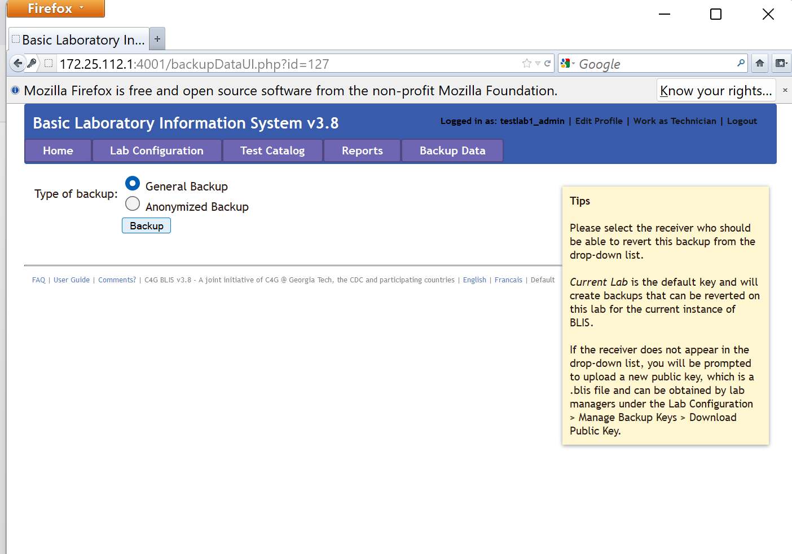
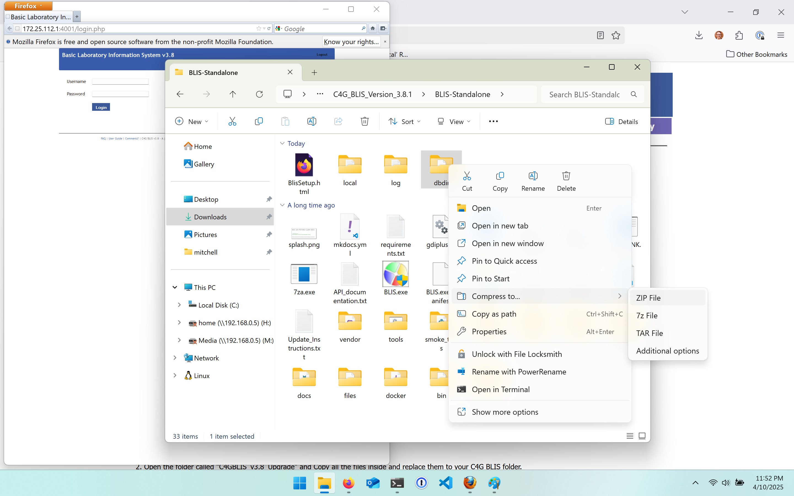
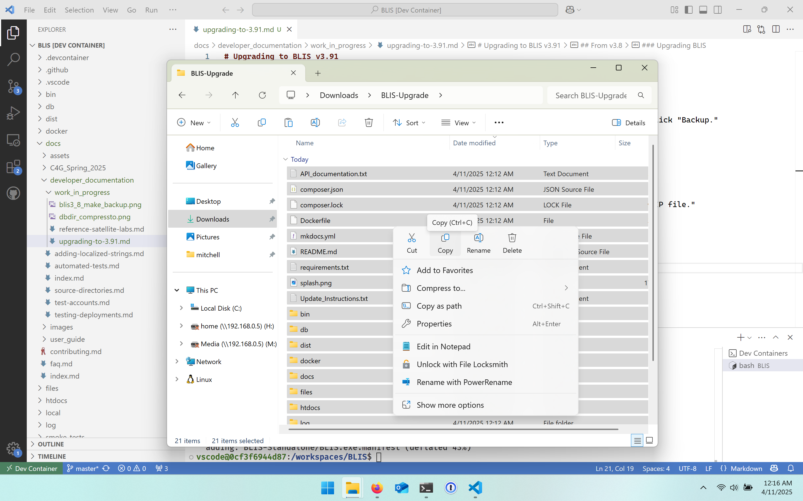

# Upgrading to BLIS v3.91

## From v3.8

### Making a backup

First, make a backup the usual way: log in as a lab admin, select the "Backup Data" tab, and click "Backup."

On the following screen, click "Download ZIP" and put the downloaded file in a safe place.

### Manually backing up the database

**Before upgrading,** right click the "`dbdir`" folder and select "Compress to..." and then "ZIP file."

Move this ZIP file somewhere safe. This is a backup of the database.

### Upgrading BLIS

Download the latest beta release upgrade package of BLIS 3.91 [by clicking here.](https://github.com/C4G/BLIS/releases/download/v3.91.beta.2/BLIS-Upgrade.zip).

1. Stop BLIS
1. Unzip the upgrade package from above
1. Copy all the files (all the files in `BLIS-Update` if you see that) to the BLIS v3.8 folder
1. Start BLIS
1. Log in as a lab admin or technician.
1. Click "Click here to complete upgrade to BLIS 3.91" banner on the home page.
1. Ensure everything works!