# Upgrading to BLIS 3.94 (Limbe Regional Hospital Test Edition)

## Before Upgrading

1. Please ensure **BLIS is stopped.**
1. Enter the **local** folder
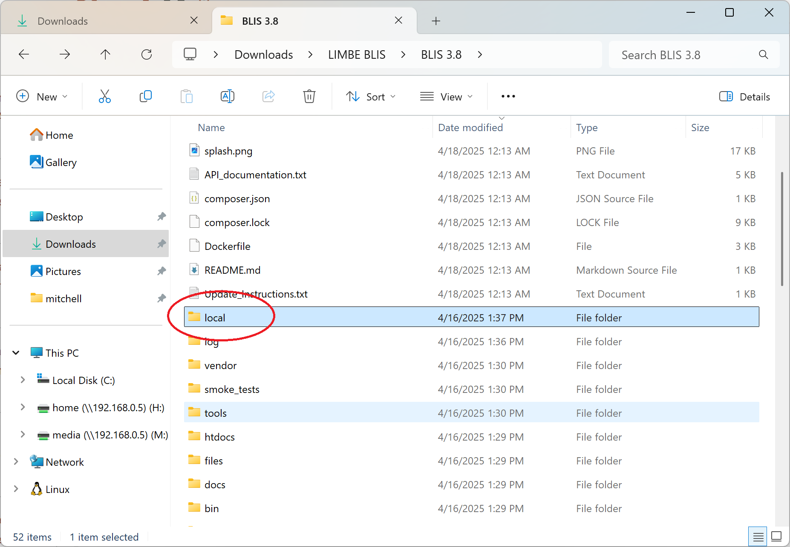
1. Right-click the **log_1.txt** file
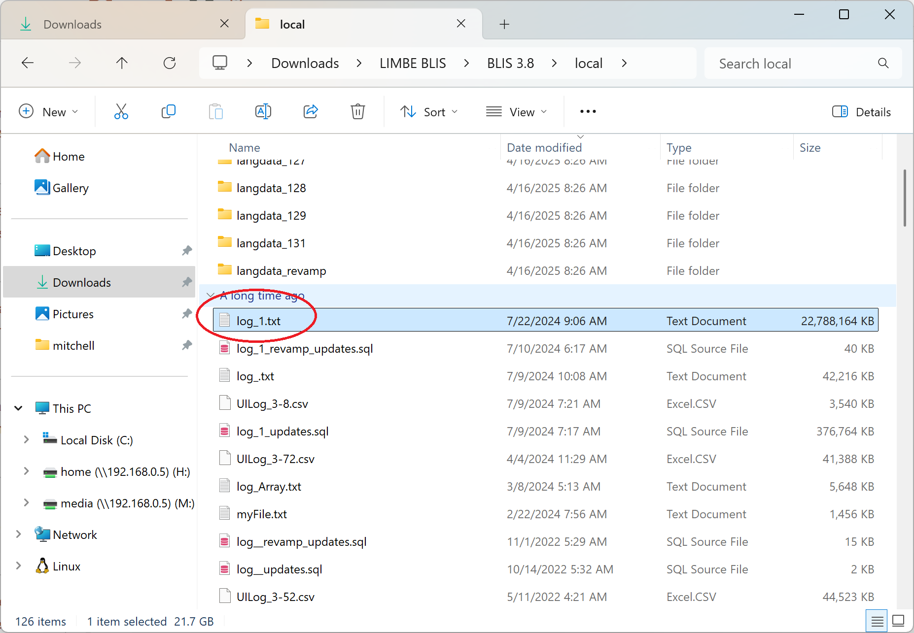
1. Rename the file to **log_1.2024.txt**
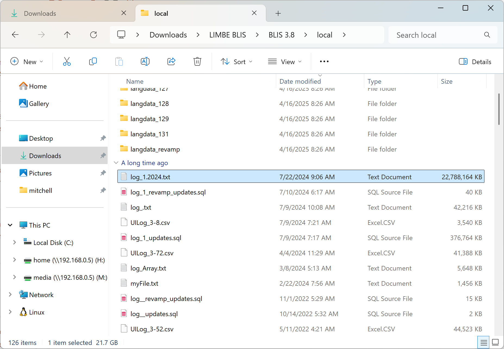

## Downloading Upgrade Package

1. Download the **3.94 upgrade package** from here: [BLIS_Upgrade_3.94.zip](https://github.com/C4G/BLIS/releases/download/v3.94.beta.1/BLIS-Upgrade-3.94.zip)
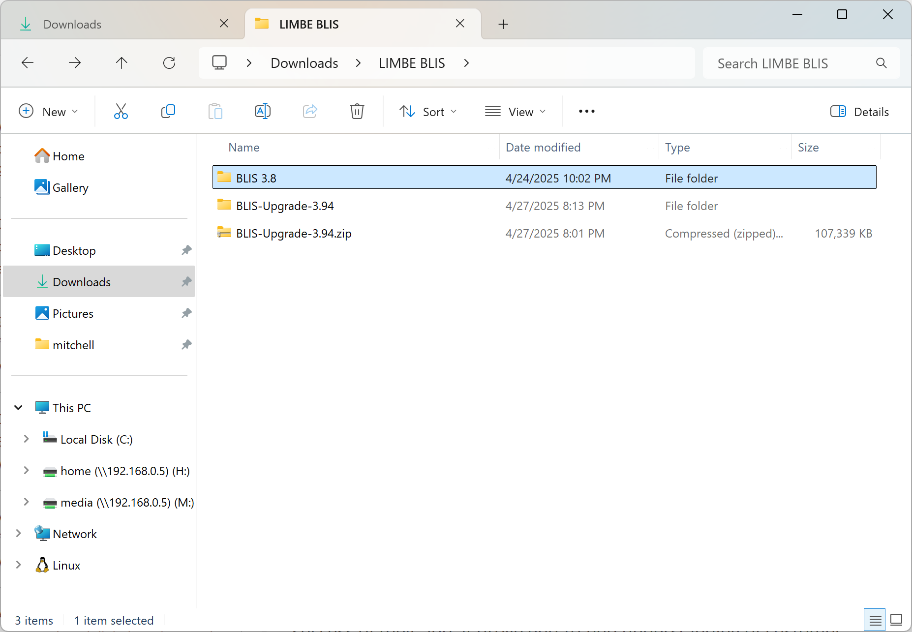

1. Apply the upgrade package by **copying all the files and folders inside BLIS-Upgrade** into the **main BLIS folder.**

## Applying the database hotfix

1. Enter the **bin** folder.
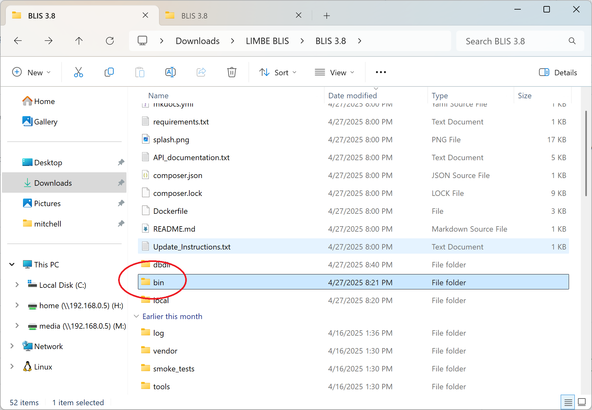

1. Double-click the **20250427_dhims2_hotfix.bat** file.
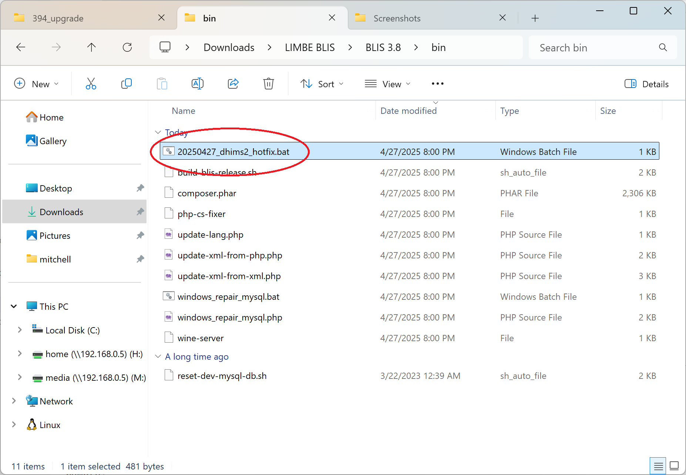

1. Press any key to continue.
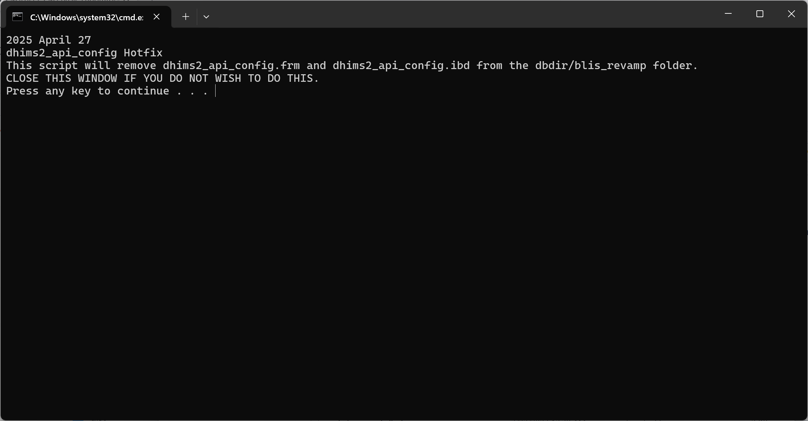

## Running the database repair tool

1. From the **bin** folder, double-click the **windows_repair_mysql.bat** file.
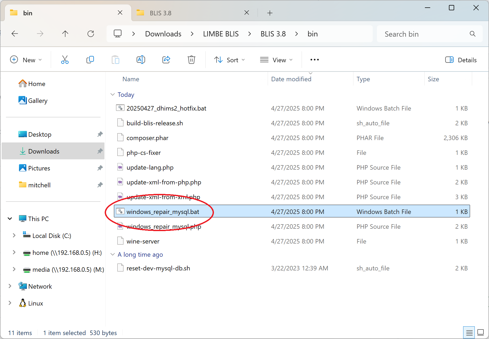

1. Press a key to continue.
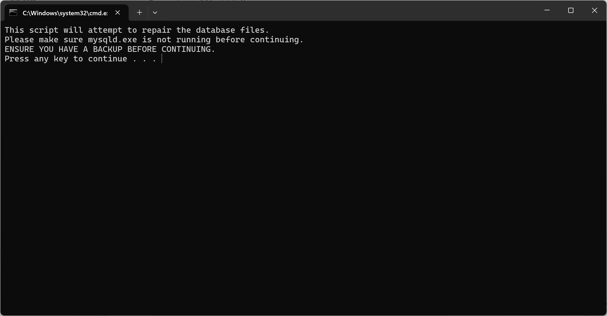

## Start BLIS

1. Start **BLIS.exe**
1. Login as the following user:
    - **Username:** `vempala`
    - **Password:** `admin123`
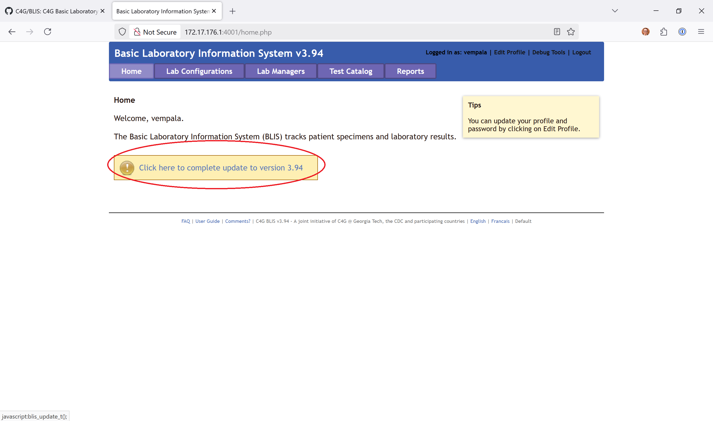
1. Click the upgrade link to upgrade BLIS
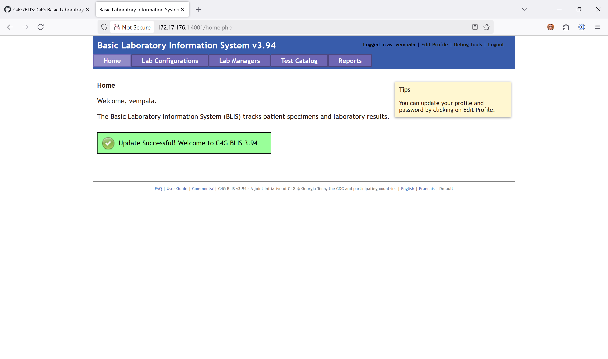
1. Click "Lab Configurations"
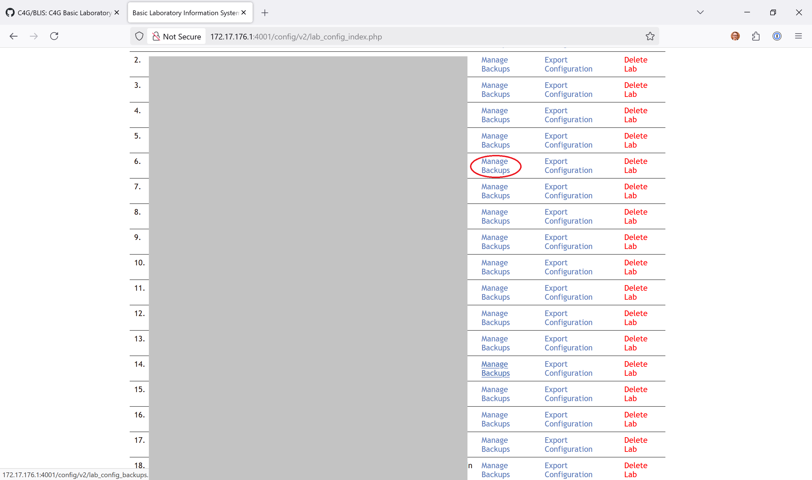
1. Click the lab that you want to see
1. The lab will have a "Migrations pending" link at the top. Click it.
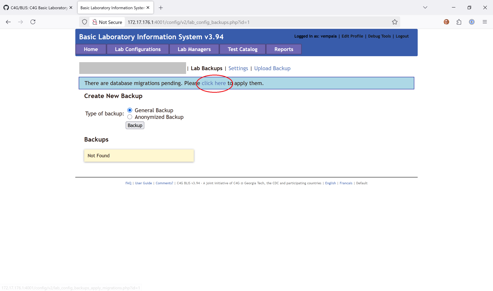
1. Once migrations are done, now you can make a backup.
