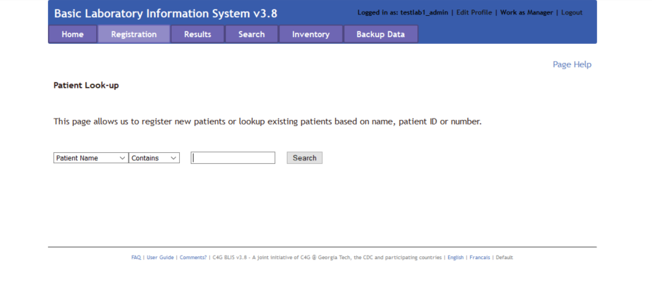
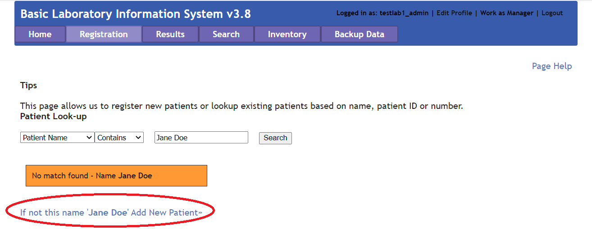
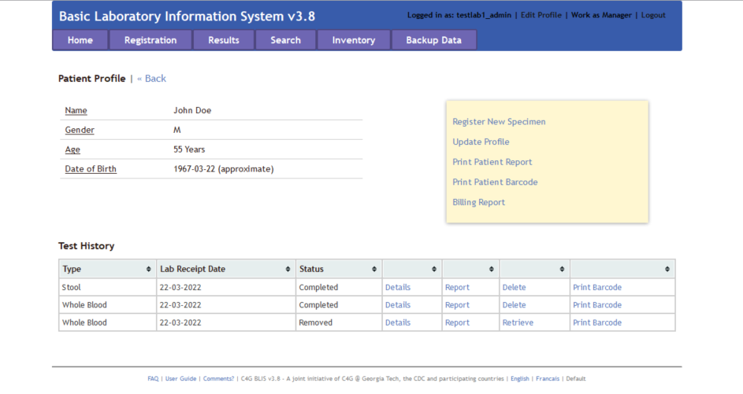
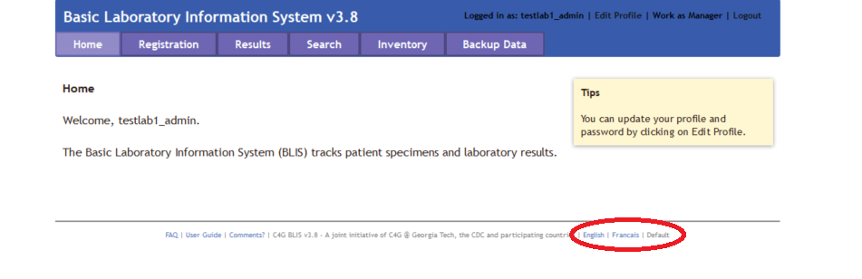
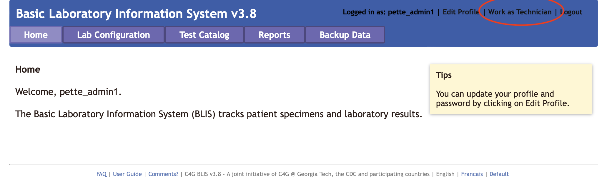
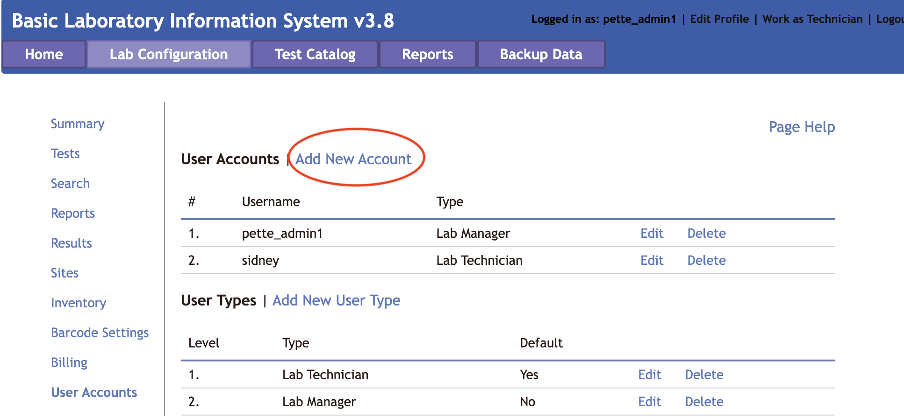
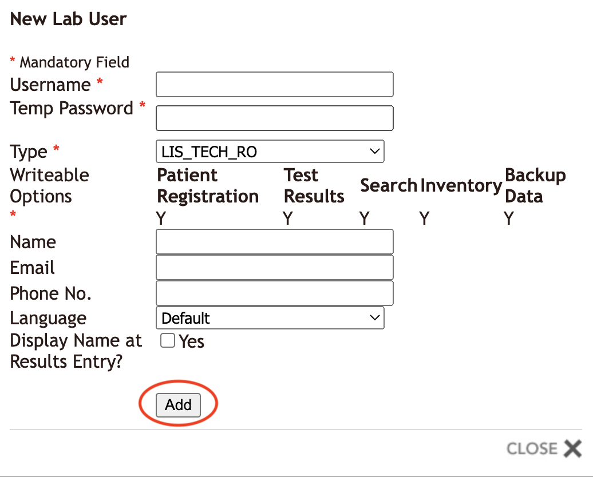

# Frequently Asked Questions

### Q: I'm using BLIS for Windows and everytime I try to run the executable, it crashes! What's going on?
<b>A</b>: Ensure that the zipped files from the Runtime.zip are extracted directly into the BLIS directory. They should not remain in a Runtime folder.

### Q: I am trying out BLIS. How do I login?
<b>A</b>: Please login using the credentials: testlab1_admin/admin123 (as admin) or testlab1_tech1, testlab1_tech2/tech123 (as lab technician).

### Q: How do I look up a patient in our system?
<b>A</b>: Navigate to the Registration tab and search for the patient by name, number, or ID.

### Q: How do I add a new patient?
<b>A</b>: To add a new patient, navigate to the Registration tab. Do not enter anything into the search bar and click 'Search'. You will see an option to add new patient appear. Click the link to proceed. 

### Q: How do I add a new Specimen to a patient?
<b>A</b>: After pulling open the patient's profile, click the 'Register New Specimen' hyperlink on the righthand side. 

### Q: How do I configure BLIS to upload data to the central web instance [Manager View Only]?
<b>A</b>: In the Manager view, naviate to the Lab Configuration Tab, and then BLIS Online. Enter in the IP address of the BLIS server.

### Q: How do I change the language of BLIS?

<b>A</b>: You can change the language to either the English or French version by clicking on the preferred language in the footer menu.

BLIS has several language options to cater to a diverse community, and we're still working to implement our changes in all of them! Thank you for your patience.

### Q: I'm logged in as an admin user but I want to work as a lab technician. How do I switch to the technician interface?

<b>A</b>: The <i>Work as Technician</i> option can be selected from the top right side of the header next to the logout button. 

### Q: What are the different lab tests that BLIS can be used for?

<b>A</b>: The lab tests that BLIS can be used for are configured by your administrator, so they vary from lab to lab. Check with you local adminstrator for more information. 

### Q: How do I add new BLIS users to the system?

<b>A</b>: An administrator can add new users. The types of users can also be configured. To add a new user, you must be logged in as an adminstrator. Go the the <i>Lab Configuration</i> tab and select the User Accounts option (from this page you can also add new user types, e.g. technicians or administrators. Click on <i>Add New Account</i> and fill out the form that pops up to add a new user. Be sure to click the Add button, not Close at the bottom of the form. permissions. 

