# C4G BLIS User Guide Version 3.8

C4G Basic Laboratory Information System is a collaboration between Computing-for-Good (C4G) at Georgia Tech, the Center for Disease Control (CDC), and participating PEPFAR countries.

## Table of contents
1. [Introduction to C4G BLIS](#introduction)
2. [BLIS Start-Up Guide](#startup)
    1. [Installing BLIS For Windows](#blis_windows)
    2. [Starting BLIS](#starting_blis)
    3. [Stopping BLIS](#stopping_blis)
3. [Overview of Roles in BLIS](#blis_roles)
4. [Director Overview](#director_overview)
    1. [Director Lab Configuration](#director_lab_configuration)
    2. [Lab Managers](#lab_managers)
    3. [Test Catalog](#director_test_catalog)
    4. [Reports](#director_reports)
5. [Manager Overview](#manager_overview)
    1. [Manager Lab Configuration](#manager_lab_configuration)
    2. [Test Catalog](#test_catalog)
    3. [Reports](#manager_reports)
    4. [Backup Data](#backup_data)
6. [Technician Overview](#technician_overview)
    1. [Registration](#registration)
    2. [Results](#results)
    3. [Search](#search)
    4. [Inventory](#inventory)
    5. [Backup Data](#tech_backup_data)
7. [Appendix](#appendix)
8. [Glossary](#glossary)

## Introduction to C4G BLIS 
The Basic Laboratory Information System (BLIS) is a freeware Web-based system that can be installed in a local, district, or national laboratory. It is a tool that can help to standardize data, which improves the ability to run useful reports and can both give a realistic picture of laboratory services and assist with staff and budget planning. With enough data, BLIS can be used to track disease prevalence over time.

??? tip "Features of BLIS"
    * One-time entry of each unique patient
    * Standardization of data collected (allowable entries for specimen type, test type, patient data, reagents are set at MOH level and then entered consistently throughout a country)
    * Customization to a country’s needs
    * Ability to track lab supplies such as test kits, reagents
    * Ability to run reports as specified by a country
    * Automatic alerting of data values that may be out of range(reference ranges and panic values are set at the regional or national level)
    * Daily logs to be reviewed for data verification
    * Simple data backup to a zipped file 
    * [NEW] BLIS running on a cloud provider
    * [NEW] Manual data backup to a version of BLIS running on a remote server

As with any properly implemented electronic record system, BLIS may be found over time to improve data accuracy and reduce costs in laboratories. 

??? tip "Benefits seen in labs using BLIS"
    * Reduced burden for technicians, as results are available soon after testing
    * Improved consistency of data entry
    * Ability to view patient history and track samples
    * Ability to aggregate data and analyze data patterns and trends at a regional or national level
    * Printed patient records in place of handwritten records
    * Printed daily logs that make the reports look like the paper forms used in the laboratory

## BLIS Start-Up Guide 
There are three versions of BLIS that currently exists. 

Firstly, **BLIS on Windows** was the original version developed for end-users. Stand-alone versions, updates, and packaged content are still publicly available on the C4G BLIS home page, [accessible here](http://blis.cc.gatech.edu/).

Secondly, **BLIS on the Cloud** is a newly deployed version of BLIS that is capable of running on a Cloud Provider, and was originally intended to be used as an online backup database for aggregating country-wide data for analysis. 

!!! info "Installation Instructions for **BLIS on the Cloud**"

    For instructions on installing **BLIS on the Cloud**, please see the [article on Running BLIS on a Cloud Provider.](https://c4g.github.io/BLIS/developer_documentation/blis_cloud//)

Thirdly, **BLIS in a Devcontainer** is an instantiation of BLIS that allows for developers to specify the development environment, and is intended to be used by developers only. 

!!! info "Installation Instructions for **BLIS in a Devcontainer**"

    For instructions on installing **BLIS in a Devcontainer**, please see the [Developer's Documentation.](https://c4g.github.io/BLIS/developer_documentation/developer_guide_v0.1/)

### BLIS For Windows 
BLIS was originally developed to run on Windows using a discontinued project called Server2Go. This packages Apache2, MySQL, PHP, and Firefox together into a package that can be run all at once on a desktop computer. BLIS on Windows is the primary way that end-users are using BLIS, but can and should be used by developers to test updates.

#### Prerequisites
Installing command-line tools can be done with a Windows package manager such as [Scoop](https://scoop.sh/).

* `git`

#### Instructions for Installation
1. Navigate to the [C4G BLIS home page](http://blis.cc.gatech.edu/). 
2. Click on the **Download** tab in the top menu bar, then click **Download BLIS v3.8 Complete**.
3. Follow all instructions on the Download page.

### Starting BLIS 

1. Double-click on the BLIS.exe file.
2. A page requesting login information will appear. Enter in the user's login credentials.

 

### Stopping BLIS 
1. After the session is complete, click the **Logout** button in the top right pane of the screen.
2. A popup window will appear where the user can rate their experience with C4G BLIS and write any comments they may have. After entering any feedback, press the **Submit** button to fully logout. Alternatively, press **Skip** to logout immediately without providing any feedback. Press **CLOSE** to cease logging out.

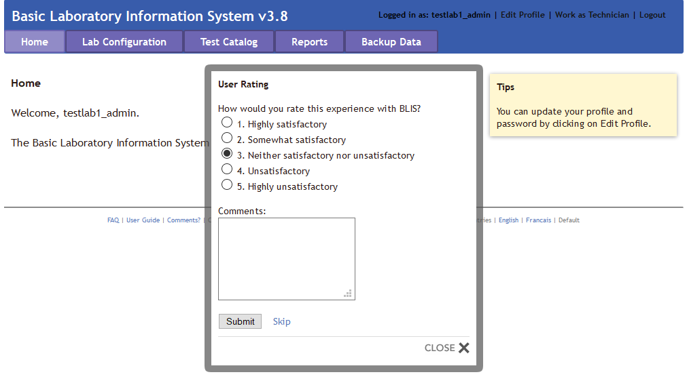 

## Overview of Roles in BLIS 
There are three roles in BLIS. 

Firstly, **Directors** (also referenced to as country directors) are a role held by a single individual at the management level of each country. The roles of Directors are to oversee many laboratories using BLIS, summarize data trends from uploaded patient data from across the country, and work with C4G developers to provide user feedback for future versions of BLIS.

Secondly, **Managers** (also referenced as admin users) are the managerial supervisors of laboratories. The roles of Managers are to maintain the user permissions to individual labs and alter individual lab configurations as needed.

Thirdly, **Technicians** are the majority of BLIS users. The role of Technicians is to enter in and verify patient data.

## Director Overview 
The Director role allows a user to control some components at a country level. This is organized into tabs, as with the other interfaces. 

### Lab Configurations 
In the **Lab Configurations** tab, the Director can view lab backups that have been imported. A list of the different lab configurations is also displayed, along with links to export each of these lab configurations. This allows a Director to setup a lab configuration in advance and then export it for a new lab to import to streamline the process. 

To setup a new lab configuration, click the button to add a new lab. This walks the user through four steps to setup site information, technicians, base configuation, and test types. 

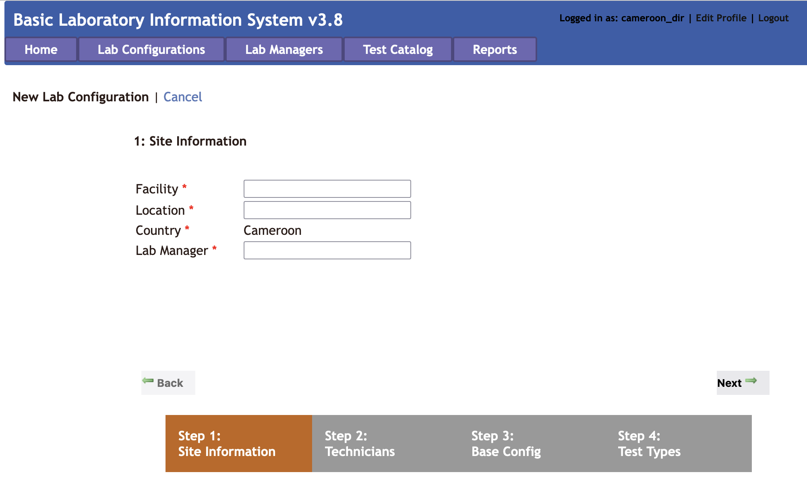

It is possible to add Technicians during this setup process, but note that additional Technicians can be added later. During setup of the base configuration, an existing lab configuration can be selected from the dropdown menu to use as a base. During the next step, test can be imported from an existing facility by selecting it from the dropdown menu. As with the other steps, the configuation can be further customized later from the **Lab Configuration** tab when logged in and work as a Manager. 

Clicking on the name of a facility takes the user to the **Lab Configuration** view, with all the same options available in the Manager view, plus three additional menu options: **General Settings**, **Change Manager**, **Delete Configuration**, and **Import Configuration**. For information on the other menu options and how they work, please go to the [Manager Lab Configuration](#manager_lab_configuration) section. Each of the additional options are covered here.

The **General Settings** option allows the Director to change the name or location of a facility. Additionally, the user can populate the database with random data or clear randomly populated data. The **Change Manager** option is self-explanatory. This option allows the Director to select a user from the dropdown menu as the new Lab Manager. The **Delete Configuration** menu option should be used with caution. This allows the Director to delete an entire lab configuation. Please use this with caution! 

!!! warning 
    After a Lab Configuration is deleted, it cannot be recovered. Please take caution when proceeding with deleting a lab configuration.

Another functionality available on the **Lab Configuration** tab is importing lab backups. Lab Managers can perform backups and send the backups to the Director. To import a lab backup from the **Lab Configuration** tab, select **Import Lab Data**. Browse to find the zipped backup provided by the lab, and click the import button. A confirmation message will display indicating that the backup was successful or an error message if there is something wrong with the backup. 

If the backup is encrypted, it can only be unencrypted with the correct key. If an encrypted backup is desired, first download the public key and share it with the lab. To do this, click the button to download a public key. It will get saved in the local computer's downloads folder by default. Send this file to the lab that is going to perform the backup. The Lab Manager can use the public key to export an encrypted backup from the Backup Data tab, and then share the zipped backup folder with the user, which can be imported as described above. 

??? question "Who else can edit Lab Configurations?"
    Lab Configurations can also be set by Lab Managers. [Click here for more details.](#manager_lab_configuration) 

### Lab Managers 
Under the **Lab Managers** tab, the Director can add, edit, or delete Lab Managers. Click **Edit** on an existing manager to change the name, email address, phone number, or language of a manager, or to reset the managers password. 

!!! info "Note"
    Directors cannot edit/reset passwords for Technicians. Navigate to the **User Accounts** menu option in the **Lab Configurations** tab from the Manager view to edit/reset passwords for Technician accounts. 

### Test Catalog 
The **Test Catalog** tab allows the Director to add country-wide specimens and tests. 

### Reports 
The **Reports** tab allows the Director to build reports for some or all of the labs that are under the country's management. The aggregate reports work much as the aggegrate reports do within the Manager view, with two additional options to select a specific test and select which facilities should be included in the report. There is also a menu option to configure some of the aggregation settings (e.g. age ranges) for the reports. 

## Manager Overview 
The manager interface allows the Manager to do the following:

1. Add, edit, and delete users
2. Change the laboratory configuration settings in the **Lab Configuration** tab in the top menu bar
3. Generate and print reports in the **Reports** tab in the top menu bar

### Manager Lab Configuration 
The laboratory configuration can be changed by Managers or admin users of BLIS. Here, Lab Managers can change how reports are generated, what patient data is collected, as well as various other settings. In general, laboratory settings are usually initialized by the Country Director, but can be modified to suit individual labs' needs.

The menu selection for the **Lab Configuration** tab - accessible in the top menu bar - is as follows:

1. [Summary](#summary)
2. [Tests](#tests_config)
3. [Search](#search_config)
4. [Reports](#lab_config_reports)
5. [Results](#results_config)
6. [Sites](#sites_config)
7. [Inventory](#inventory_config)
8. [Barcode Settings](#barcode_settings)
9. [Billing](#billing)
10. [User Accounts](#user_accounts)
11. [Registration Fields](#registration_fields)
12. [Doctor Registration Fields](#doctor_registration_fields)
13. [Modify Language](#modify_language)
14. [Setup Local Network](#setup_local_network)
15. [BLIS Online](#blis_online)
16. [External Interface](#external_interface)
17. [Revert to Backup](#revert_to_backup)
18. [Manage Backup Keys](#manage_backup_keys)
19. [Export Configuration](#export_configuration)

#### Summary 
The **Summary** page displays information about the laboratory. Specific information includes the Facility Name, Location, Lab Manager, available Specimen Types, available Test Types, and Technician Accounts allocated to the specific laboratory.

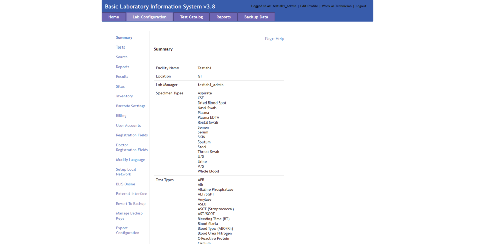

#### Tests 
The **Tests** page has a drop down menu that opens up to reveal three different options: **Specimen/Test Types**, **Target TAT**, and **Results Interpretation**.

##### Specimen/Test Types
The **Specimen/Test Types** page allows the Lab Manager to set the specimen and test types as appropriate for their country. Click **Show** to reveal hidden panes and **Hide** to close the panes. Check the box for each specimen type collected or test done at this facility, and click **Submit** to save.

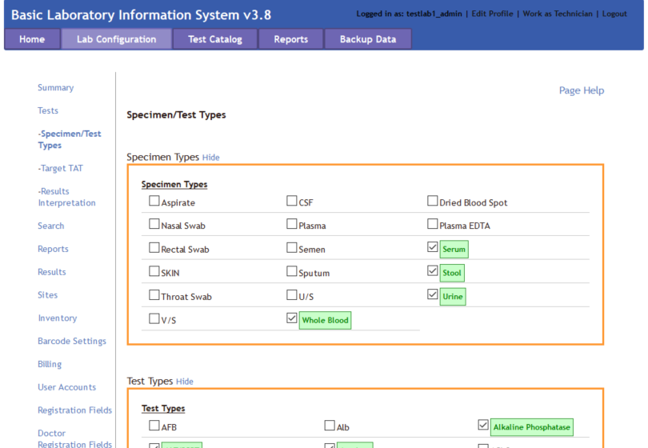

##### Target TAT
The **Target TAT** page displays turnaround times for tests. To enter or change turnaround time, click **Edit**. The number and unit (such as “24 hours”) change to a text field and a drop-down list. Enter the desired number and choose **Hours** or **Days**. When finished, click the **Submit** button to save changes, or **Cancel** to discard changes. These options are below the list.

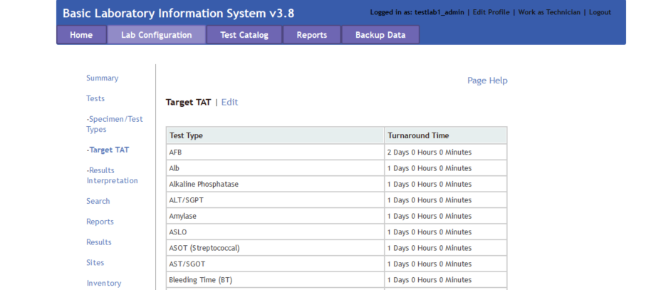

##### Results Interpretation

The **Results Interpretation** page allows the Lab Manager to specify the interpretation for multiple ranges of values for each test type. To view or edit an existing test’s result, choose the test type from the drop-down list and click the **Search** button. The current interpretation appears. Edit using the text boxes.

To add a new range to the list, click the **Add Another** link and enter data in the text boxes. Click the **Submit** button to save changes, or **Cancel** to discard them.

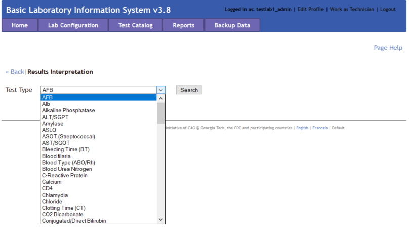

#### Search 
The **Search** page allows the Lab Manager to configure what results are displayed for each patient when a search is executed. It also permits changing how many results are displayed on each page.

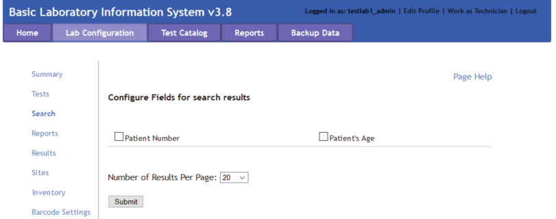

#### Reports 
The **Reports** page has a drop down menu that opens up to reveal seven different options: **Infection Report**, **Test/Specimen Grouped Reports**, **Daily Report Settings**, **Enable/Disable Test Reports**, **Test Report Configuration**, **Worksheet**, and **Order Patient Fields**.

??? question "Which users can create reports?"
    Previous functionality of BLIS permitted Technicians to create reports. Currently, creating reports is a functionality only available to Managers and Directors.

##### Infection Report
The **Infection Report** page generates an aggregate report of laboratory test results for a particular period for one or all lab sections. The tests listed in the report are the ones checked to include on the **Specimen/Test Types** page. Click **Edit** to make changes to the details reported. When finished, click **Submit** button to save changes, **Preview** to view the report, or **Cancel** to discard changes.

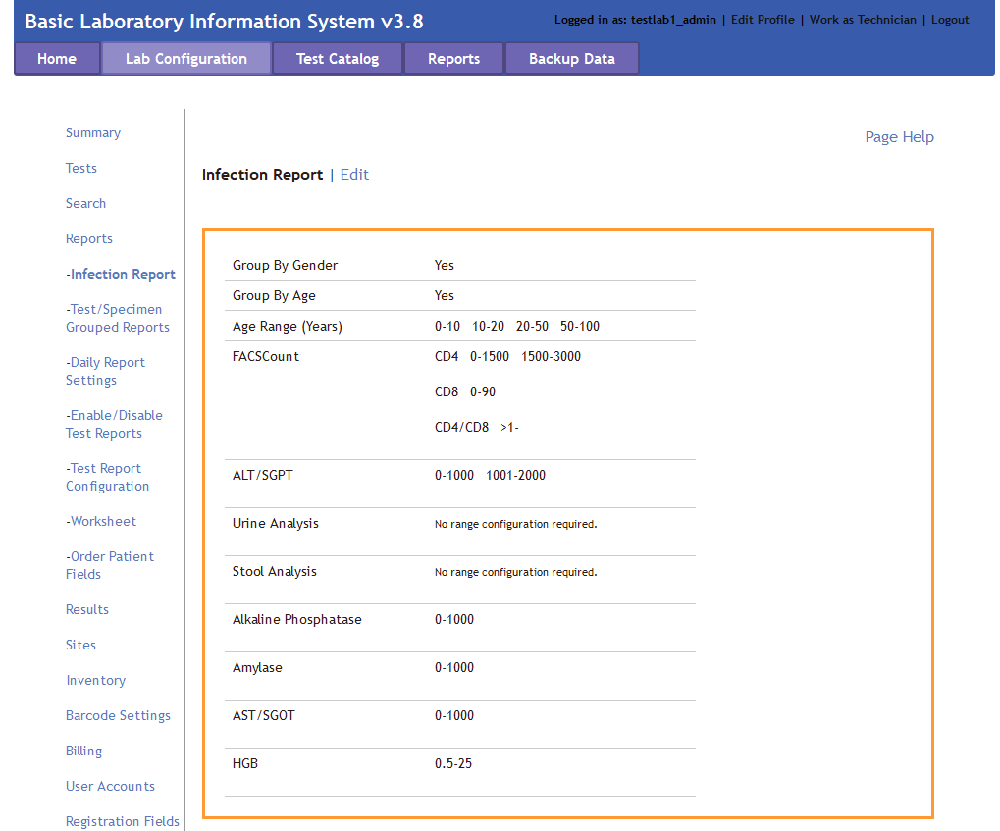

##### Test/Specimen Grouped Reports
The **Test/Specimen Grouped Reports** page allows the Lab Manager to set the **Test Count (Grouped) Report** settings and the **Specimen Count (Grouped) Report** settings. Click **Edit** to change settings. When finished, click the **Submit** button to save changes, or **Cancel** to discard changes. 

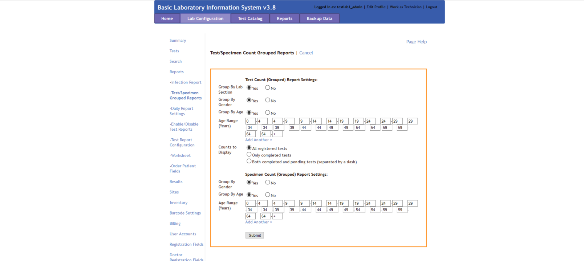

##### Daily Report Settings
The **Daily Report Settings** page sets the layout of the **Patient Report**, **Daily Log - Specimens**, and **Daily Log - Patients**. Use the drop-down to select the report type, then click **Search**. Check or un-check boxes to show or hide patient, specimen, and test information. If desired, the Lab Manager can upload a .jpg logo file to appear on the report. When finished, click the **Submit** button to save changes, or **Cancel** to discard changes. These options are below the list.

##### Enable/Disable Test Results
The **Enable/Disable Test Results** page allows the Lab Manager to enable or disable specific tests. Items on the left side are disabled; move the test items to the right side to enable them. When finished, click the **Submit** button to save changes, or **Cancel** to discard changes.

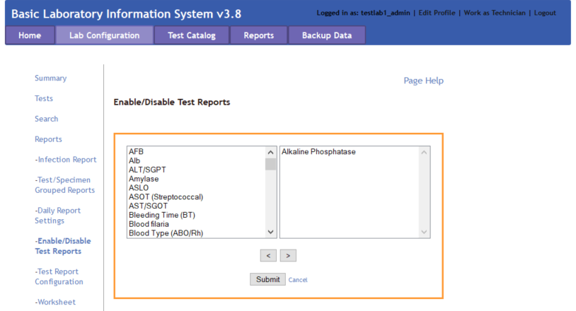

##### Test Report Configuration
The **Test Report Configuration** page allows the Lab Manager to visualize the enabled test configurations. Use the drop-down to select the test type from the enabled test list, then click **Search**. Click **Edit** to edit the configuration of the reported test data. Check or un-check boxes to show or hide patient, specimen, and test information. When finished, click the **Submit** button to save changes, or **Cancel** to discard changes.

##### Worksheet
The **Worksheet** page allows the Lab Manager to create templates for gather patient data in the lab. In lab settings where data are not entered at the point of service, the data entry staff can enter the laboratory's patient information and ordered tests, then print the worksheet so that lab technicians can write test results and other data to be entered into BLIS. 

Select the **Lab Section** and **Test Type** and click **Search** to edit the report format. To edit a custom report, click **Edit** to the right of the report. To create a new custom worksheet, click the **Add Custom Worksheet** link at the bottom of the list.

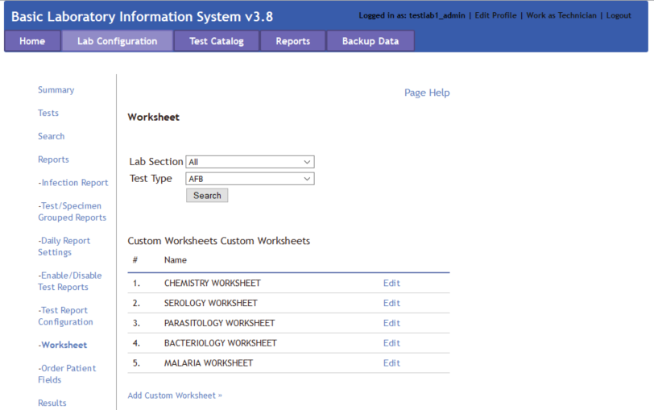

#### Results 
The **Results** page allows the Lab Manager to edit the parameters displayed in the batch results page. Currently, the editable data is limited to Patient information.

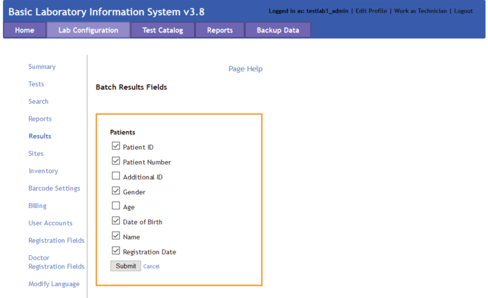

#### Sites 
The **Sites** page allows the Lab Manager to add, modify, or remove specimen collection sites to the laboratory records. When first spawning a laboratory, only one site - the default site - will exist. 

Additional information about the site can be provided in the textboxes - currently, BLIS supports adding in District and Region information. To add another site, click on the **Add Another** hyperlink at the top and fill in textbox with the new site name, then click **Submit**. To go back, click **Cancel**. 

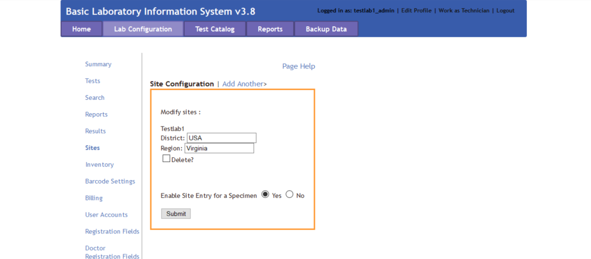

#### Inventory 
The **Inventory** page is a list of any existing reagents being tracked in BLIS. To add another, click the **Add Item** link above the list and input the name, unit of measurement associated with the reagent, and any miscellaneous remarks about the reagent. After pressing **Submit**, don't forget to add the item's stock. On the **Current Inventory** page, other features include **Log Stock Usage**, **Add Stock**, or **Edit Details**.

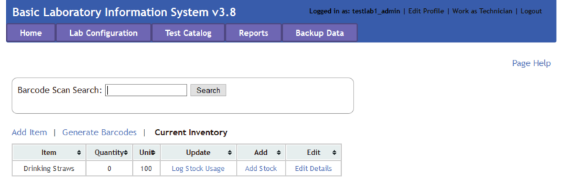

#### Barcode Settings 
The **Barcode Settings** page configures the settings for barcode formats. Click on the **Page Help** for more details. After changing the settings, click **Submit** to save any edits.

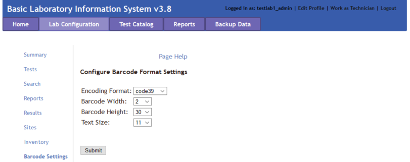

#### User Accounts 
The **User Accounts** page shows all the users with access to the system. Here, a Lab Manager can create new user accounts, edit account settings, delete accounts, and monitor account activity.

Click **Add New Account** to enter a new user.

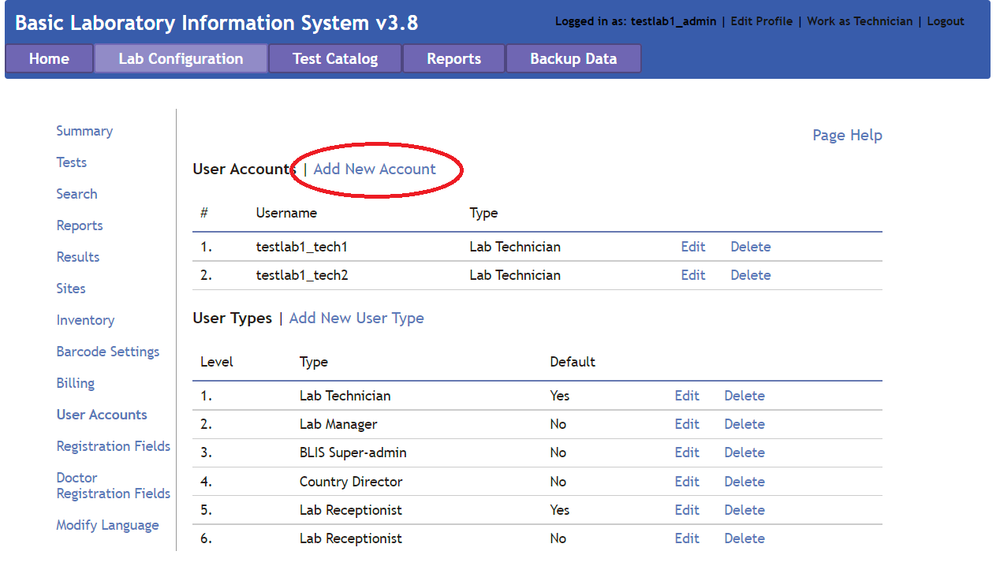

Click **Edit** on a user to edit the user account details or to reset password. User Type dictates the access the user has in the system. **Reset Password** allows the Lab Manager or admin user to enter a new password for this user. Click the **Submit** button to save changes, or **Cancel** to discard.

To remove a user account, click the **Delete** link for that user. A confirmation box appears. Click **OK** to complete the deletion, or **Cancel** to keep that user’s information.

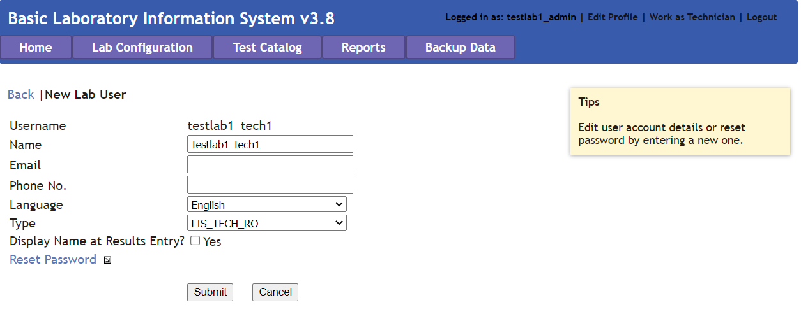

#### Registration Fields 
The **Registration Fields** page shows the configuration of the patient registration page. It allows the Lab Manager to create mandatory fields and hide the fields that are not used, per the country’s protocols. It also allows for creation of certain custom fields for patient registration and new Specimen addition which may be needed by certain labs only.

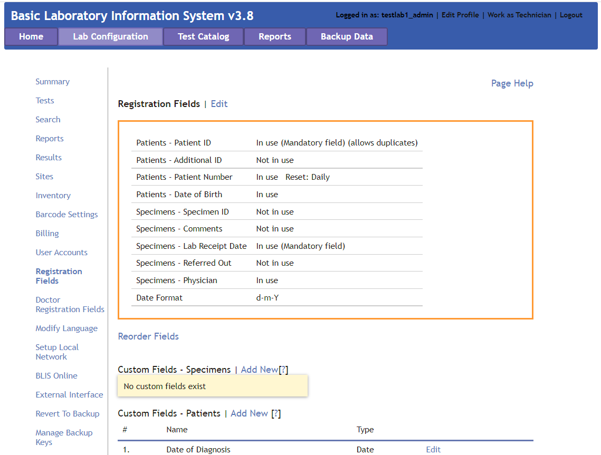

To customize fields, click **Edit** to make changes: check the box to display a field, uncheck to hide. Set fields as required. After editing, click **Update** button below the fields to save changes, Cancel to discard.

To create new fields, choose the **Add New** link for which to add, and enter field name and type. Click **Submit** button to save changes, **Cancel** to discard.

Also, the Lab Manager can customize the order of the registration fields for Patient and Specimen Registration forms.

#### Doctor Registration Fields 
The **Registration Fields** page shows the configuration of the patient registration page. There is currently an issue opened to address the duplicity of the previous **Registration Fields** page.

#### Modify Language 
One of the features of BLIS is the ability to toggle between languages. The **Modify Language** page allows the Lab Manager to change the language for a few pages using this option. The pages are listed as a drop-down menu.

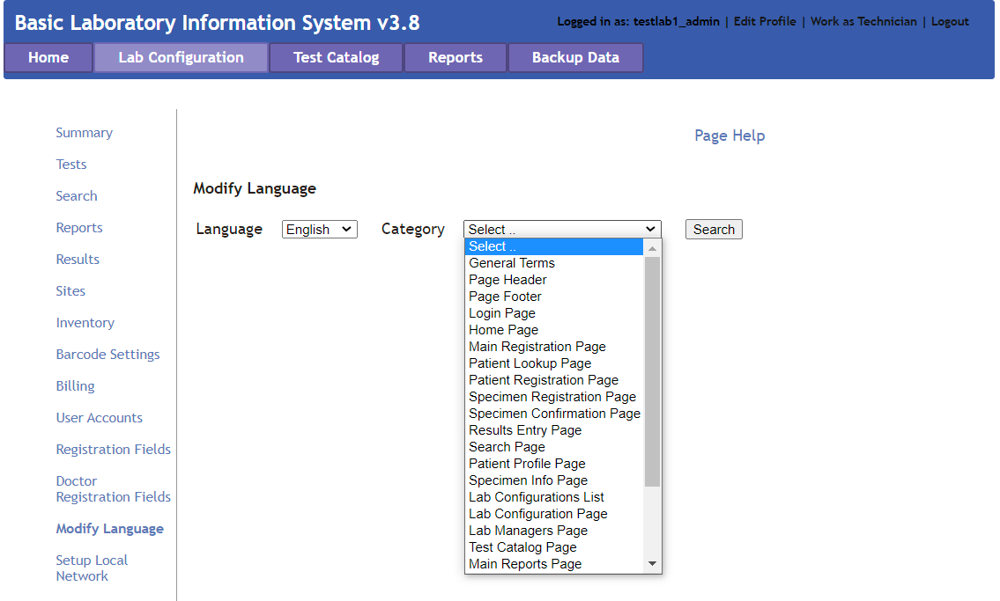

Select the language and category (type of page or section). Select **Search** button to view or edit the text. When finished, click **Submit** button to save changes, or **Cancel** to discard.

#### Setup Local Network 
The **Setup Local Page** is an instructional page on how to set up a local network for a hospital or laboratory. Please access it from BlisSetup.html in the main folder, then enter login credentials (username and password). 

#### BLIS Online 
The **BLIS Online** page allows the Lab Manager to enter an IP address of a **BLIS on the Cloud** server. For more details about **BLIS on the Cloud** and how to create a new instantiation, please read the Developer's Documentation.

Please enter the IP address into the text box and click **Submit**. A message stating "BLIS Cloud hostname updated successfully!" will pop up if submitted correctly. 

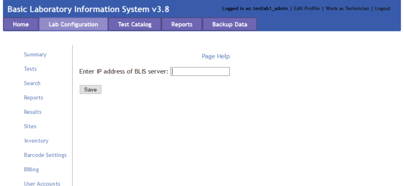

#### External Interface 
The **External Interface** Laboratory settings allows the Lab Manager to set up an interface with external devices or websites. The currently featured interface for alternative patient registration system is DHIMS 2. Others may be added upon request.

The **Interfaced Equipment** page allows the Lab Manager to select the equipment to be interfaced through BLISIntterfaceClient. Configurations may be set in the *BLISInterfaceClient.ini* file.

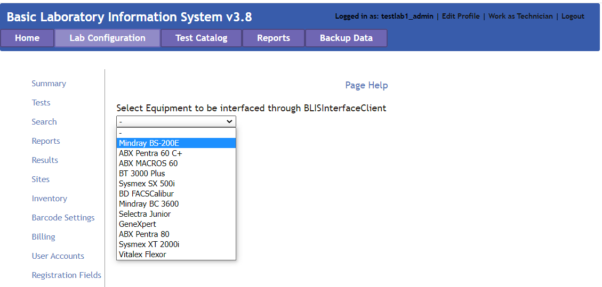

#### Revert to Backup 
In case of system failure, the **Revert to Backup** page allows the Lab manager to revert to a previously backed-up copy of the data. Clicking the link presents the dates of the previous backups, click one to select which data set to load.

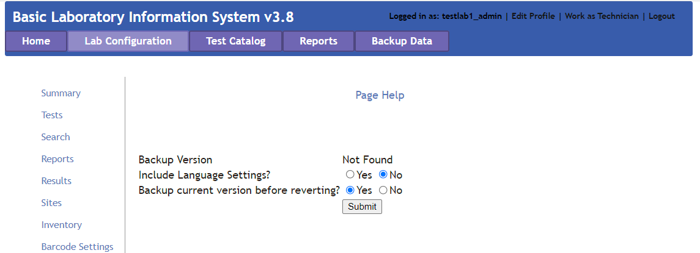

#### Manage Backup Keys 
The **Manage Backup Keys** page creates, manages, or deletes key pairs in order to encrypt laboratory backup data. Encrypting laboratory backup data with a unique key-pair ensures that only the personnel with the correct private key will be able to successfully decrypt the encrypted data with the correlated public key.

The home screen of the **Manage Backup Keys** page displays the list of currently active public keys. In the example image below, only one public key is available for use, with a key alias of "my_pubkey".

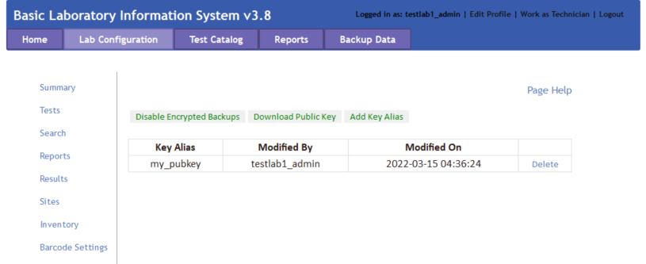

##### Disable Encrypted Backups
Toggle this button to disable or enable encrypted backups. It is recommended to enable encrypted backups to protect private patient information.

##### Download Public Key
This button opens a popup window prompting the user to download a public key. This key should be saved onto the computer.

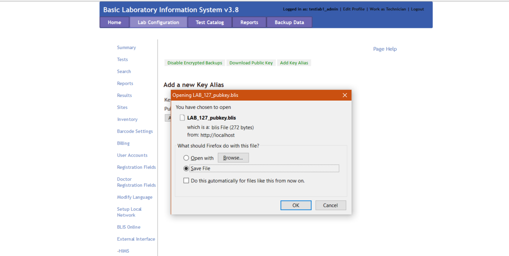

##### Add Key Alias
To add a new public key, click **Add Key Alias**. Fill free to enter in any key alias names here. We recommend entering in some identifying information that describes the origin of the public key. For example, if the public key was provided by the country director, the key alias name could be "country_director_pubkey".

To upload the public key, click **Browse** and use the File Upload navigational controls to select the desired public key (ending in a .blis file extension). After selecting the correct public key, click **Add** to add the public key to the list of currently active public keys, or **Cancel** to discard changes.

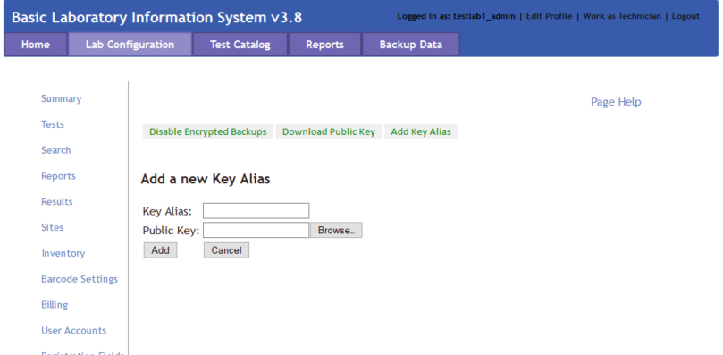

#### Export Configuration 
The **Export Configuration** page exports all configuration settings to Microsoft Word. Clicking this link opens a new browser tab with a preview showing all preset and custom fields as well as report settings. The preview has three buttons at the top: Print, Export as Word document, and Close.
Click the **Print** button to open the print dialog box; **Export as Word document** to create a file named **blisreport_[date of report].doc**, which may be opened or saved, or **Close** to close this browser tab.

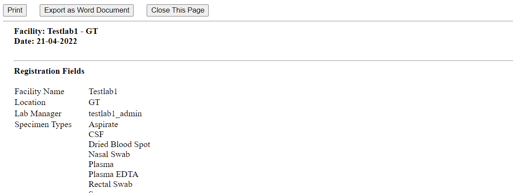

### Test Catalog 
The **Test Catalog** page allows the Manager to add or edit specimen or test types used in their laboratory.

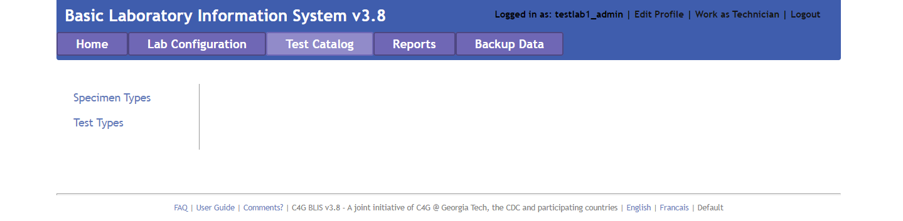

#### Specimen Type
The **Specimen Type** page allows for adding or editing specimen types used in the laboratory.

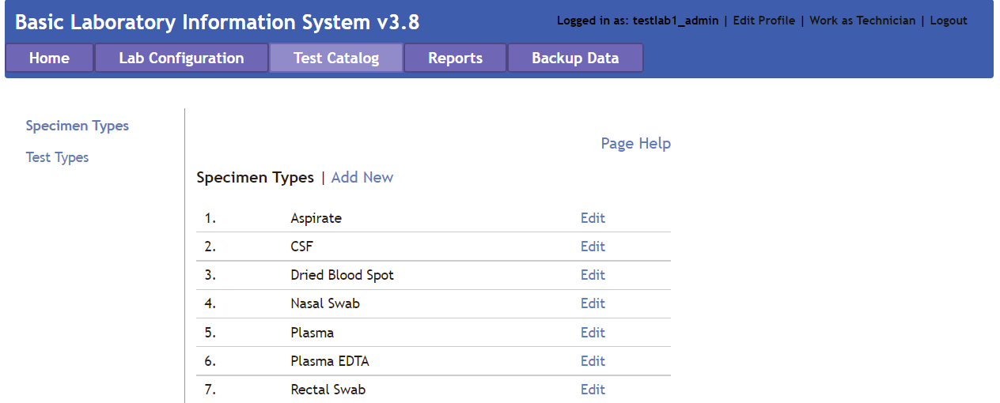

Click **Add New** to enter a new specimen type. Required fields are **Name**, which is a text box for entering the name of the specimen, and **Compatible Tests**, which allows the user to check the tests that can be performed using that specimen. **Ctrl-F** opens the Find function to search for a test. Another feature is a **Description** of the specimen type, which is optional.

To edit the information about a specimen type, find the editable specimen type and then click the **Edit** link in the far-right column.

Click **Submit** button to save changes, **Cancel** to discard.

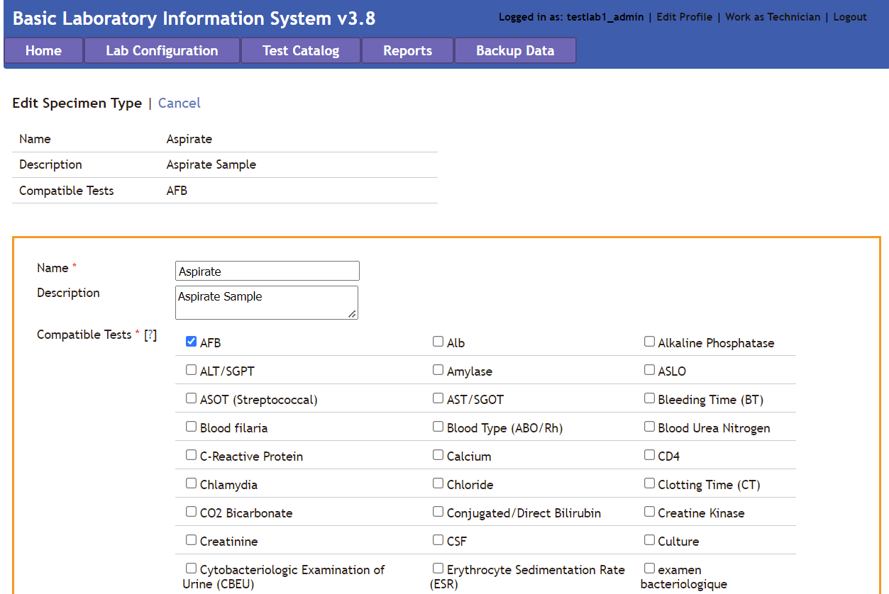

#### Test Type
The **Test Type** page allows for adding or editing test types used in the laboratory. It is controlled the same way as Specimen Types.

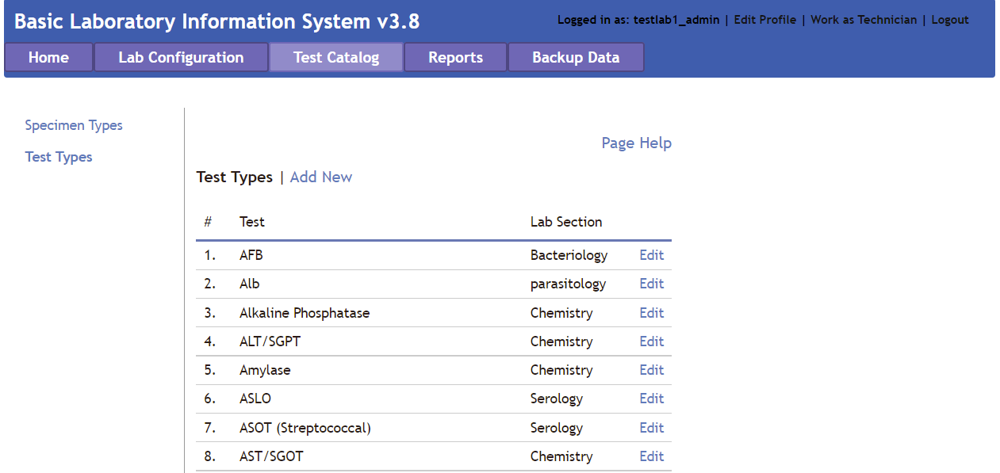

Click **Add New** to enter a new test type. Required fields are **Name**, which is a text box; **Lab Section**, a drop-down list that includes an option to add a new section; **Measures**, which are editable; and **Compatible Specimens**, which allows the user to check one or more specimens that can be used for this test.

Optional fields include **Description** (text box), **Clinical Data**, **Panel Test** (a check-box, checked for Yes), **Hide Patient’s Name** (drop-down Yes/No), **Prevalence Threshold** (text box), and **Target TAT** (text box).

To edit the information about a test type, select the editable test type and then click the **Edit** link in the far-right column.

Click **Submit** button to save changes, or **Cancel** to discard.

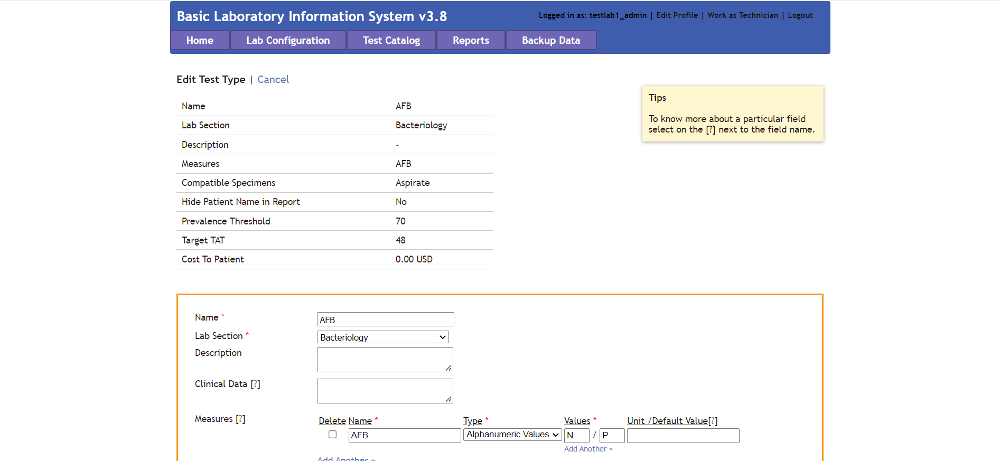

### Reports 
The **Reports** page is used to generate reports ranging from **Daily Reports** to **Aggregate Reports**.

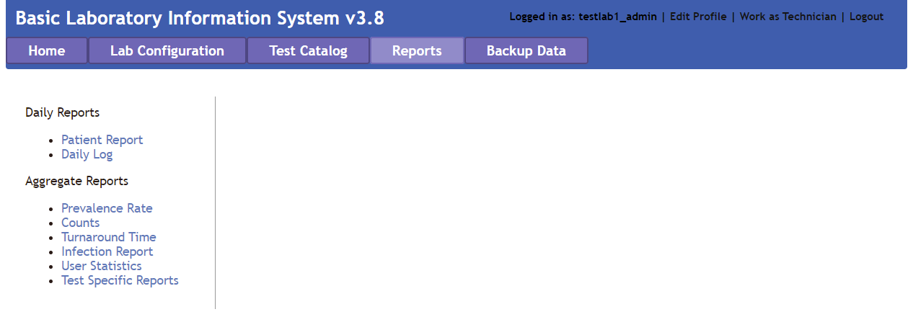

#### Daily Reports
The **Daily Reports** should be generated each day for both the Patient Report and also Daily Log.

##### Patient Report
The **Patient Reports** page generates reports for each searchable patient. 

Search for the patient by Patient Name, Patient Number, or Patient ID and Lab Section to which the patients' specimen are registered against. Click the **Search** button to start search. Select the desired patient from the list if more than one patient matches the search criteria. Click **View Report** to see all data for that patient, or **Select Tests** to see tests ordered and the results for that patient.

Additionally, the user can edit the report to show activity within a date range, include pending tests for which results are not available, set printing information, or export to Word using the controls at the top of the page.

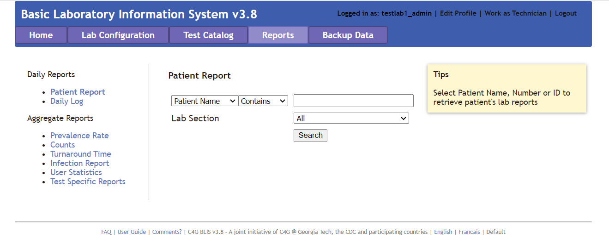

##### Daily Log
The **Daily Log** creats a report of the day's activity.

Set the date range to reflect the log to print. The Lab Manager can run a report of the day’s activity by patients seen (by clicking **Patient Records**), or by tests run (by clicking **Test Records**). If **Test Records** is selected, logs can be generated for one lab section or for one type of test. The default settings are test records, all sections, and all tests. The report opens in a new browser tab and has **Print** and **Export** controls at the top of the page.

Also patient barcodes for each patient with the number of specimens they have handed over can also be printed over a given a range of time by selecting the **Patient Barcode** option.

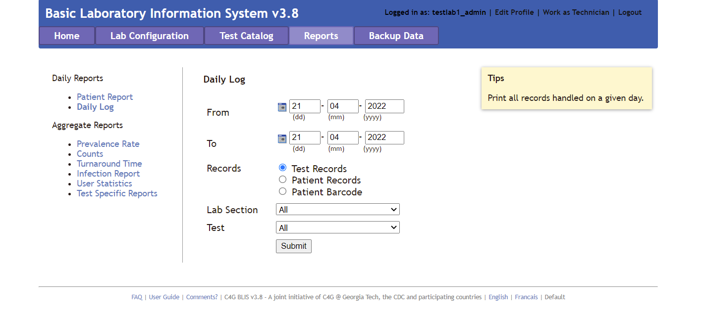

#### Aggregate Reports
Aggregate Reports generates reports for specific data selected by the user. There are currently six types of reports to generate:

1. **Prevalence Rate** which opens an infection graph and prevalence rates. It gives the prevalence of a particular laboratory test result based on the number of testsdone and the results.
2. **Counts** which can open a specified kind of ungrouped or grouped, test/specimen/doctor statistics. It generates a report for a particular time period of the number of tests, specimens, or doctor statistics.
3. **Turnaround Time** which opens the average test-wise turnaround times for the lab test reports, either for all or specific tests.
4. **Infection Report** which opens an Infection Report for a specified laboratory. It generates reports of infections by patient age and gender.
5. **User Statistics** which displays user specific statistics and user activity logs.
6. **Test Specific Reports** which provides information on specific tests, and can be specified to an individual site.

### Backup Data 
The **Backup Data** feature was created for two reasons - to revert to a previously backed-up copy in cases of system failure, but also to create a backup file of the current laboratory patient data for uploading to a **BLIS on Cloud** version. 

For example, one intended use of the second scenario would be to upload the current laboratory data to the director's instantiation of BLIS. A conglomeration of multiple labs' data would permit the director to visualize larger trends in the healthcare data across several laboratories. This would aid the director in understanding the needs of individual labs, and permit them to mobilize aid catered to the specific needs of each laboratories.

The below image is the default view of the **Backup Data** page.

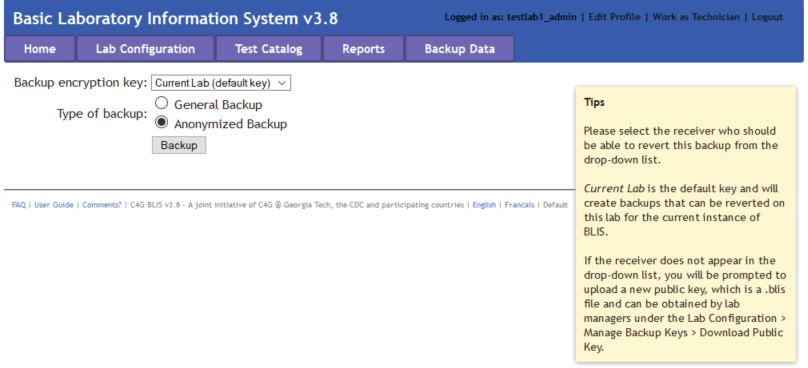

#### Backup Data with Pre-Existing Key
If a public key has already been registered to the personnel account through the **Lab Configuration** > **Manage Backup Keys** functionality, then the key should appear in the drop-down menu. In the image below, *my_pubkey* is a pre-existing public key that had been previously registered. Please select the key from the drop-down menu.

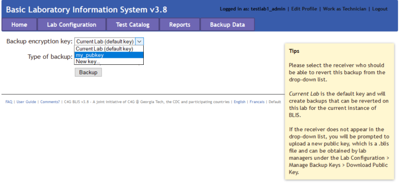

#### Backup Data without Pre-Existing Key
If the desired public key has not already been registered to the account, then please select *New Key...* from the drop-down menu. Two new boxes should appear. Give the key a name (recommend either the lab name or lab ID), and click on the **Browse** button. Find the public key that was previously downloaded onto the user's computer and select it to upload.

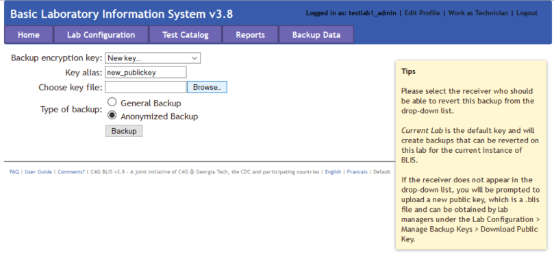

After selecting the public key of choice, please choose the desired backup (General or Anonymized) and then click **Backup** to trigger the data backup. A new page should pop up, confirming that the backup was successful. Please click the **Download Zip** hyperlink to download the zipped file to the user's Desktop. 

Additionally, if a Backup IP Address was previously set in **Lab Configuration** > **BLIS Online** page, a copy of the backup will be sent to the BLIS version hosted on the specified IP Address.

## Technician Overview 
The technician interface allows the Technician to do the following:

1. [Register new patients](#add_new_patient) and [look up existing patients.](#patient_lookup)
2. [Add results for a patient based on the specimens provided.](#add_specimen)
3. [Manage existing reagents currently being tracked in BLIS.](#results)

Users with Admin rights can click the **Work as Manager** link in the top right corner to switch to the Lab Manager view.

Users with only Technician rights can access their profile page by clicking **Edit Profile**. Users can edit their profile to add or change email, phone, and language. Click on the **Change Password** link to change the user's password.

!!! warning "Note"
    The Username cannot be changed after creation.

### Registration 
The **Registration** page allows the Technician to register new patients or lookup existing patients based on name, patient ID or number.

#### Add New Patient 
To add a new patient: Click the **Search** button without entering any search criteria. The **Add New Patient** link appears, illustrated in the red circle in the image below.

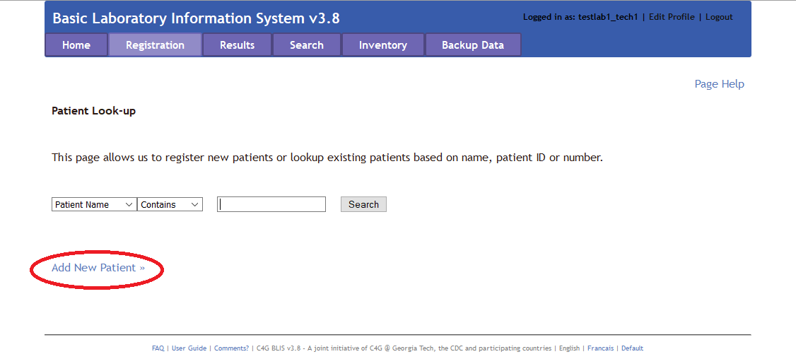

Also, if no results are found for the desired patient, an option to create a new patient will be presented and the searched name will automatically be filled into the new patient form. Click the link and wait for a dialog box to appear on the screen. Fill in the blank fields and check the appropriate elements. Elements with asterisks * are mandatory. 

Click on **Submit** to save, or **Cancel** to discard changes and return to patient look-up page.

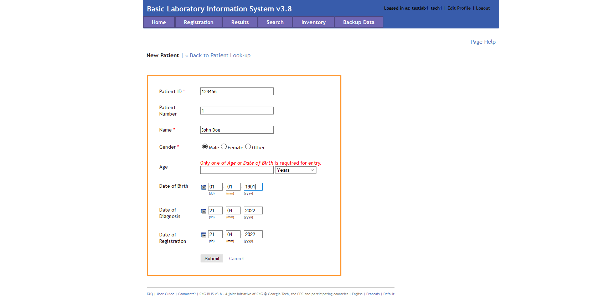

#### Patient Look-Up 
Once a patient has been registered, the Technician can use the **Registration** page to view or edit patient profiles. Additionally, a specimen the patient has provided for a particular test can also be registered.

Click on the drop-down list and select patient name, ID, or number. Type in the blank space the patient name, ID, or number. Enter all available patient information for the best search results.

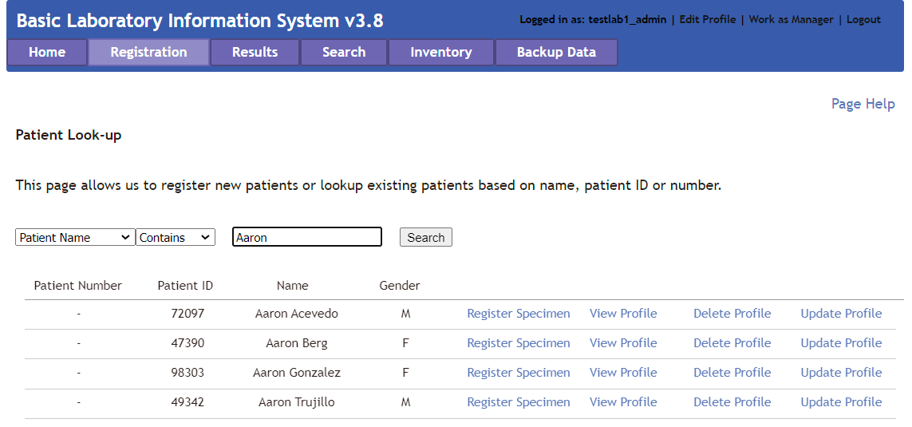

#### Add or Edit a Specimen Record 
To add or edit a specimen record, first begin by finding the patient to whom the specimen belongs to. Then, click the **Register Specimen** link to the right of the patient name. 

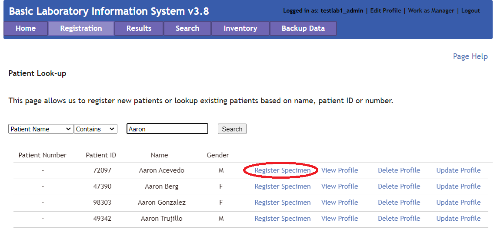

Fill in the blank fields and check the appropriate elements. Elements with asterisks * are mandatory. 

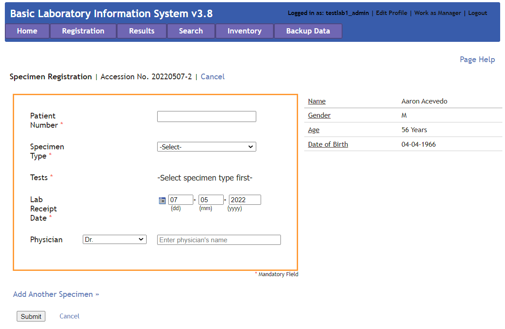

Click on **Submit** to save, or **Cancel** to discard changes and return to patient look-up page. Click **Add Another Specimen**  to add another specimen for this patient.

### Results 
The **Results** page allows the Technician to see, evaluate, and verify results for collected specimens.

#### Single Specimen Results 
This option allows the Technician to add results for a patient based on the specimens provided and Lab sections to which the specimen tests are registered. Click on the drop-down list and select patient name, ID, or number. Type in the field at least 2 characters to
search.

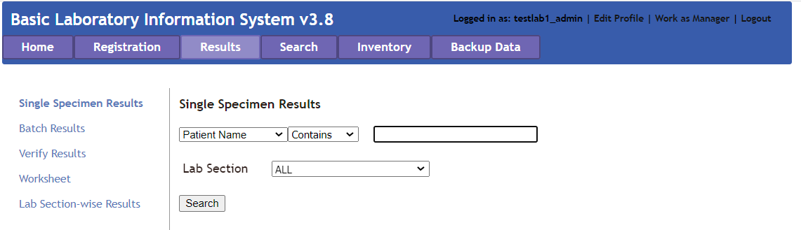

To add or edit a specimen record: Find the patient as above and then click the **Enter Results** link to the right of the patient name. Fill in the blank fields and check the appropriate elements.

 Click on **Submit** to save, or **Cancel** to discard changes.

#### Batch Results
This option allows the Technician to add results for a particular Test Type.

Select a test for which to find results. Set a date range, then click Search. The results appear without patient names. Click on **Submit** to save, or **Cancel** to discard changes.

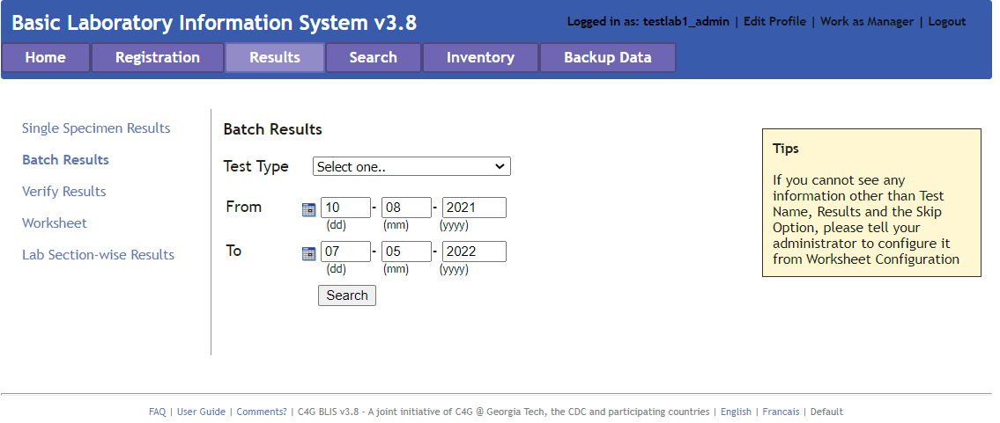

#### Verify Results
This option allows the Technician to verify the result based on the test type. It shows the list of results for all patients whose results have not been verified. Here, results can be modified and entered prior to verifying.

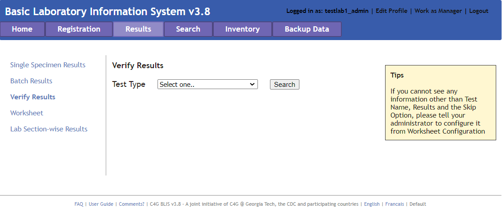

Select a **Test Type** and click **Search**. All test results for that test appear. Look over the test results for accuracy. Edit the results as appropriate. When finished, click on **Verify**, or **Cancel** to discard changes. Choosing **Verify** opens a confirmation dialog box.

Click **OK** to mark results as verified, **Cancel** to discard changes.

#### Worksheet
This option generates a worksheet based on the Lab Section and Test Type. In lab settings where data are not entered at the point of service, the data entry staff enter patient information and the tests ordered, then print the worksheet so that lab technicians can write test results and other data to be entered into BLIS. Custom worksheet which can be created by Admins using Lab Configuration > Tests > Reports > Worksheet.

Create a blank worksheet by choosing the **Keep Blank** option and specifying the number of rows needed. Click **Submit** to create the worksheet.

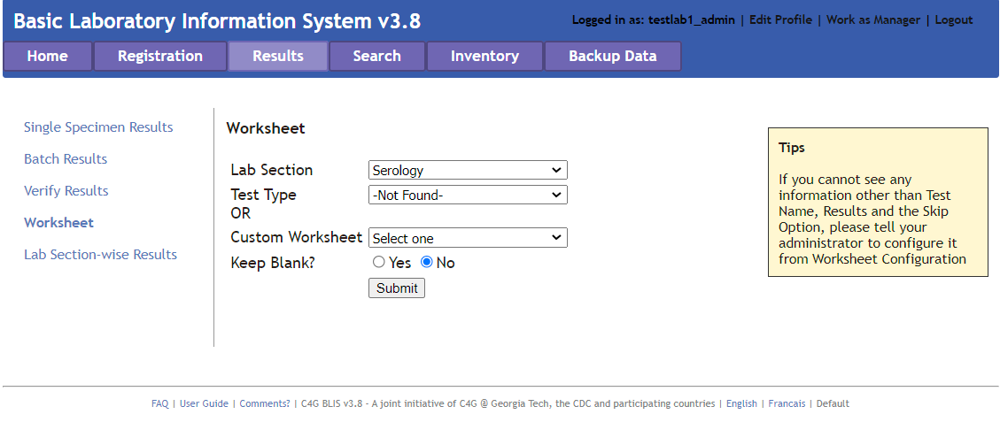

After generating the worksheet, click on a column heading to sort the table by that field. Other features include **Print** in portrait (default) or landscape view, **Export as a Word Document**, or **Close** the page. If **Export** is selected, the default option is to open the Word document. The document can be printed or saved from Word.

### Search 
This page allows the Technician to search for a patient by name, number, or ID. Enter a partial name or ID (at least 2 characters) to generates a list of matches.

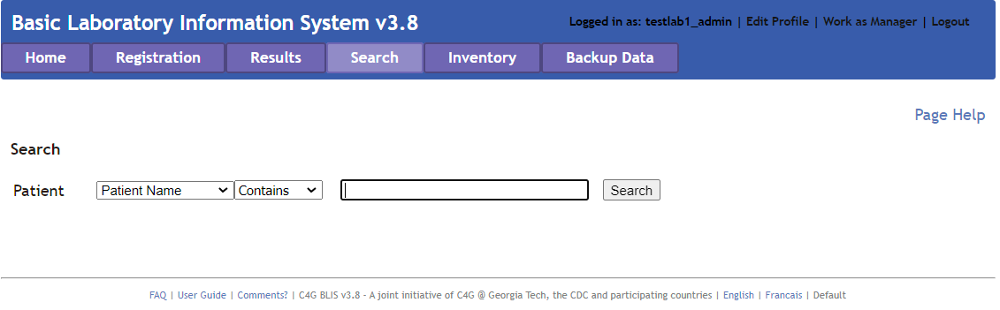

Click **View Profile** to view the patient’s profile and test history.

From the test history section, click **Details** for specimen information. Then, choose **Get Report** for a specimen report; **Track Actions** to view a log of actions on that specimen, or **Enter Results** to enter the specimen analysis results. A report can be generated from the test history section on the profile page by clicking the **Report** link.

From the profile page, other features include can also **Register New Specimen**, **Update Profile**, or **Print Patient Report**.

### Inventory 

#### Current Inventory
This link displays the reagent quantities currently in stock. It is not editable. To edit the list, click **Add Reagent**.

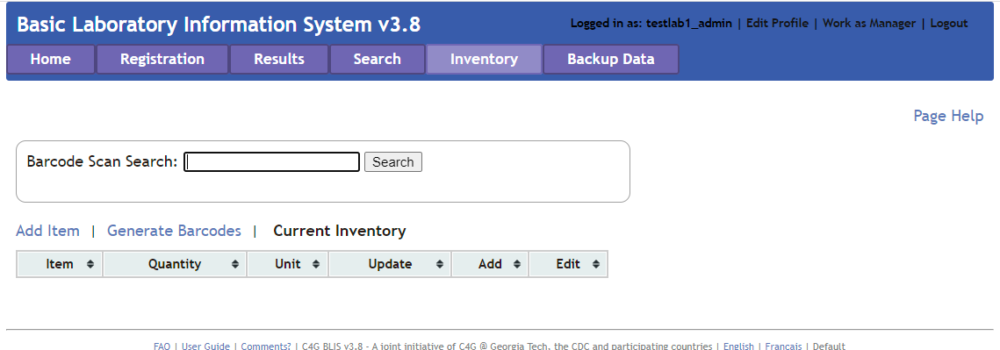

#### Add Item
Click **Add Item** to add a new item to the list. Update the stock as more reagents are acquired by adding the reagent name, quantity received, receiver name, and remarks.

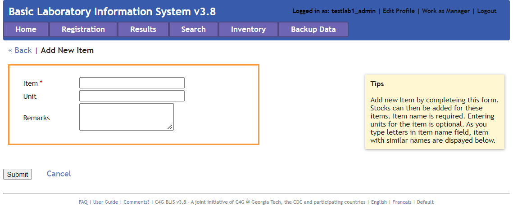

Click **Submit** to save changes.

#### Generate Barcodes
Clicking **Generate Barcodes** allows the Technician to generate a unique barcode. To do so, enter text into the field on the page, and press **Generate**. After generating the barcode, print them by pressing the **Print** button.

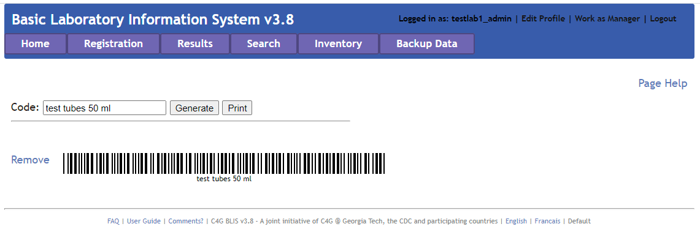

### Backup Data 
The Backup Page is similarly designed to the Backup Data feature available for Lab Managers. 

!!! tip "See Also"
    The Backup Data functionality can be found in the [Lab Manager section on Backup Data.](#backup_data)

## Appendix 

### Notes on Installation
If using a server and router, plug in the router first.

* Set up and turn on the server PC and its monitor.
* Navigate to the BLIS home page and select Download
* Save the files to a hard drive.
* Open the BLIS folder on the desktop and double click on BLIS.exe. Wait for a dialog box to appear on the screen. Choose Yes from the two options. The application will be installed automatically and the full login screen will appear.
* This completes installation for a single computer. For networked computers, we recommend setting a static IP address for the network.
* Ensure that the computer is on the network.
* Copy the file *BlisSetup.html* to the computer
* Double click *BlisSetup.html* to install BLIS on the networked computer.
* Wait for the login screen. If the full screen with username, password, and login does not appear, check the URL on the server and make sure they are the same.

## Glossary 

**Admin** - Designation for a user that has control over lab configuration settings. Also known as a Lab Manager.

**Aggregate** - Type of report that collects data over a period of time and presents it to the user.

**Barcodes** - Used in inventory management to create printable 'barcode' labels for reagents.

**Director** - Designation for a user that oversees many laboratories, typically at the country level. Manages lab configuration standardization.

**Grouped Reports** - Reports that cover multiple types of information.

**Inventory** - Interface for managing reagents and supplies.

**Lab Configuration** - Collection of customizable settings relating to the collection and storage of data.

**Manager** - Another name for an Admin user. Also known as a Lab Manager.

**Patient** - Entry for a ptient whose specimen tests are performed on.

**Prevalence Rate** - The percentage of rate occurrence of a particular result of tests.

**Reagent** - Term used in inventory control in BLIS. Denotes any physical supply that requires tracking in the inventory system. 

**Registration** - The act of entering a patient into the BLIS program. Creates a unique
patient entry that can be associated with specimens and tests.

**Reports** - Pages that collect metrics for various types of data. The scope of these reports varies from individual patients to entire groups of laboratories.

**Results** - The recorded outcome of tests performed on specimens.

**Specimen** - An entry representing a physical specimen or reading taken from a patient.

**Specimen Type** - Classification for different types of specimens.

**Technician** - A designation for a user who is tasked with entering data into BLIS.

**Test** - An entry representing a test or reading taken from a specimen.

**Test Type** - Classification for different types of tests.

**Turnaround Time** - A measurement of the time it takes to receive a result, once a specimen is collected.

**User** - Any person or entity that logs into the BLIS program.

**Verify** - An action performed on test entries that validates the results for further use.

**Worksheet** - Customizable, printable sheets for improving the speed at which information is recorded in a physical sense (i.e. not entered *directly* into the BLIS program.)