# C4G BLIS User Guide Version 3.8

## User Instruction Manual Rev 3.8

C4G Basic Laboratory Information System is a collaboration between Computing-for-Good (C4G) at Georgia Tech, the CDC, and participating PEPFAR countries.

# Table of contents
1. [Introduction to C4G BLIS](#introduction)
2. [BLIS Start-Up Guide](#startup)
    1. [Installing BLIS For Windows](#blis_windows)
    2. [Starting BLIS](#starting_blis)
    3. [Stopping BLIS](#stopping_blis)

3. [Roles in BLIS](#blis_roles)
    1. [Director Overview](#director_overview)
    2. [Manager Overview](#manager_overview)
        1. [Lab Configuration](#lab_configuration)
        2. [Test Catalog](#test_catalog)
        3. [Reports](#reports)
        4. [Backup Data](#backup_data)

    3. [Technician Overview](#technician_overview)
4. [Glossary](#glossary)

# Introduction to C4G BLIS 
The Basic Laboratory Information System, BLIS, is a freeware Web-based system that can be installed in a local, district, or national laboratory. It is a tool that can help to standardize data, which improves the ability to run useful reports and can both give a realistic picture of laboratory services and assist with staff and budget planning. With enough data, BLIS can be used to track disease prevalence over time.

Features of BLIS include:
- One-time entry of each unique patient
- Standardization of data collected (allowable entries for specimen type, test type, patient data, reagents are set at MOH level and then entered consistently throughout a country)
- Customization to a country’s needs
- Ability to track lab supplies such as test kits, reagents
- Ability to run reports as specified by a country
- Automatic alerting of data values that may be out of range(reference ranges and panic values are set at the regional or national level)
- Daily logs to be reviewed for data verification
- Simple data backup to a zipped file 
- [NEW] BLIS running on a cloud provider
- [NEW] Manual data backup to a version of BLIS running on a remote server

As with any properly implemented electronic record system, BLIS may be found over time to improve data accuracy and reduce costs in laboratories. Benefits already seen in labs using BLIS:
- Reduced burden for technicians, as results are available soon after testing
- Improved consistency of data entry
- Ability to view patient history and track samples
- Ability to aggregate data and analyze data patterns and trends at a regional or national level
- Printed patient records in place of handwritten records
- Printed daily logs that make the reports look like the paper forms used in the laboratory

# BLIS Start-Up Guide 
There are three versions of BLIS that currently exists. 

Firstly, **BLIS on Windows** was the original version developed for end-users. Stand-alone versions, updates, and packaged content are still publicly available on the C4G BLIS home page, [accessible here](http://blis.cc.gatech.edu/).

Secondly, **BLIS on the Cloud** is a newly deployed version of BLIS that is capable of running on a Cloud Provider, and was originally intended to be used as an online backup database for aggregating country-wide data for analysis. For instructions on installing **BLIS on the Cloud**, please see the Developer's Documentation.

Thirdly, **BLIS in a Devcontainer** is an instantiation of BLIS that allows for developers to specify the development environment, and is intended to be used by developers only. For instructions on installing **BLIS in a Devcontainer**, please see the Developer's Documentation.

## BLIS For Windows 
BLIS was originally developed to run on Windows using a discontinued project called Server2Go. This packages Apache2, MySQL, PHP, and Firefox together into a package that can be run all at once on a desktop computer. BLIS on Windows is the primary way that end-users are using BLIS, but can and should be used by developers to test updates.

### Prerequisites
Installing command-line tools can be done with a Windows package manager such as [Scoop](https://scoop.sh/).

* `git`

### Instructions for Installation
1. Navigate to the [C4G BLIS home page](http://blis.cc.gatech.edu/). 
B. Click on the **Download** tab in the top menu bar, then click **Download BLIS v3.8 Complete**.
3. Follow all instructions on the Download page.

## Starting BLIS 

1. Double-click on the BLIS.exe file.
2. A page requesting login information will appear. Enter in your login credentials.

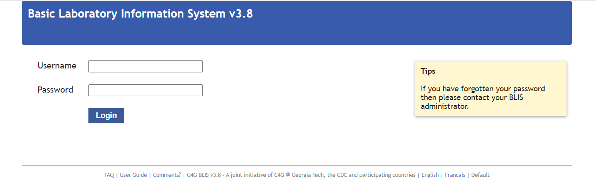 

## Stopping BLIS 
1. After your session is complete, click the **Logout** button in the top right pane of the screen.
2. A popup window will appear where you can rate your experience with C4G BLIS and write any comments you may have. After entering your feedback, press the **Submit** button to fully logout. Alternatively, you may press **Skip** to logout immediately without providing any feedback. If you do not wish to logout, press **CLOSE**.

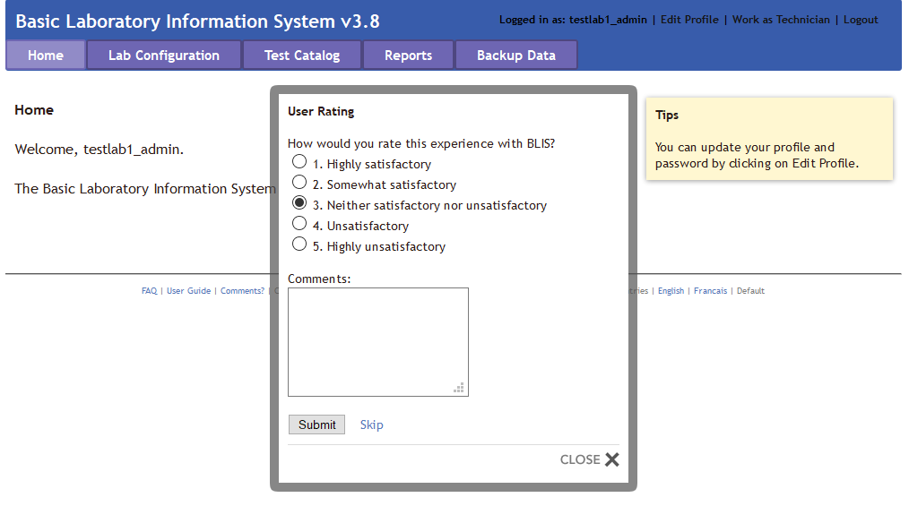 

# Roles in BLIS 
There are three roles in BLIS. 

Firstly, **Directors** (also referenced to as country directors) are a role held by a single individual at the management level of each country. The roles of Directors are to oversee many laboratories using BLIS, summarize data trends from uploaded patient data from across the country, and work with C4G developers to provide user feedback for future versions of BLIS.

Secondly, **Managers** (also referenced as admin users) are the managerial supervisors of laboratories. The roles of Managers are to maintain the user permissions to individual labs and alter individual lab configurations as needed.

Thirdly, **Technicians** are the majority of BLIS users. The role of Technicians is to enter in and verify patient data.

# Director Overview 
The director role allows a user to control some components at a country level. This is organized into tabs, as with the other interfaces. 

## Lab Configurations
In the Lab Configurations tab, the director can view lab backups that have been imported. A list of the different lab configurations is also displayed, along with links to export each of these lab configurations. This allows a director to setup a lab configuration in advance and then export it for a new lab to import to streamline the process. 

To setup a new lab configuration, click the button to add a new lab. This walks the user through four steps to setup site information, technicians, base configuation, and test types. 

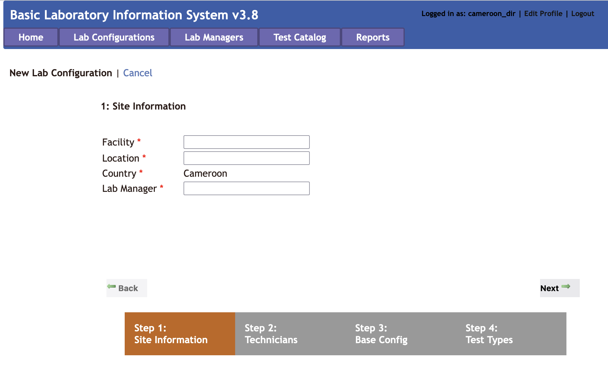

It is possible to add technicians during this setup process, but note that additional technicians can be added later. During setup of the base configuration, an existing lab configuration can be selected from the dropdown menu to use as a base. During the next step, test can be imported from an existing facility by selecting it from the dropdown menu. As with the other steps, the configuation can be further customized later from the Lab Configuration tab when logged in and work as a Manager. 

Clicking on the name of a facility takes the user to the Lab Configuration view, with all the same options available in the Manager view, plus three additional menu options: General Settings, Change Manager, Delete Configuration, and Import Configuration. For information on the other menu options and how they work, please go to the [Lab Configuration](#lab-configuration-a-name"labconfiguration") section. Each of the additional options are covered here.

The General Settings option allows the director to change the name or location of a facility. Additionally, the user can populate the database with random data or clear randomly populated data. The Change Manager option is self-explanatory. This option allows the director to select a user from the dropdown menu as the new lab manager. The Delete Configuration menu option should be used with caution. This allows the director to delete an entire lab configuation. Please use this with caution! 

Another functionality available on the Lab Configuration tab is importing lab backups. Lab managers can perform backups and send the backups to the director. To import a lab backup, from the Lab Configuration tab, select Import Lab Data. Browse to find the zipped backup provided by the lab, and click the import button. You will receive a confirmation message that the backup was successful or an error message if there is something wrong with the backup. 

If the backup is encrypted, it can only be unencrypted with the correct key. If you want the lab to send you an encrypted backup, you must first download the public key and share it with the lab. To do this, click the button to download a public key. It will get saved in your downloads folder by default. Send this file to the lab that is going to perform the backup. The lab manager can use the public key to export an encrypted backup from the Backup Data tab, and then share the zipped backup folder with you, which can be imported as described above. 

## Lab Managers
Under the Lab Managers tab, the director can add, edit, or delete lab managers. Click "edit" on an existing manager to change the name, email address, phone number, or language of a manager, or to reset the managers password. Note that you must go to the User Accounts menu option in the Lab Configurations tab from the Manager view to edit/reset passwords for Technician accounts (as opposed to manager accounts). 

## Test Catalog
The test catalog tab allows the director to add country-wide specimens and tests. 

## Reports 
The reports tab allows the director to build reports for some or all of the labs that are under the country's management. The aggregate reports work much as the aggegrate reports do within the Manager view, with two additional options to select a specific test and select which facilities should be included in the report. There is also a menu option to configure some of the aggregation settings (e.g. age ranges) for the reports. 

 
# Manager Overview 
The manager interface allows the Manager to do the following:
1. Add, edit, and delete users
2. Change the laboratory configuration settings in the **Lab Configuration** tab in the top menu bar
3. Generate and print reports in the **Reports** tab in the top menu bar

## Lab Configuration 
The laboratory configuration can be changed by Managers or admin users of BLIS. Here, you can change how reports are generated, what patient data is collected, as well as various other settings. In general, laboratory settings are usually initialized by the Country Director, but can be modified to suit individual labs' needs.

The menu selection for the **Lab Configuration** tab - accessible in the top menu bar - is as follows:
1. [Summary](#summary)
2. [Tests](#tests)
3. [Search](#search)
4. [Reports](#reports)
5. [Results](#results)
6. [Sites](#sites)
7. [Inventory](#inventory)
8. [Barcode Settings](#barcode_settings)
9. [Billing](#billing)
10. [User Accounts](#user_accounts)
11. [Registration Fields](#registration_fields)
12. [Doctor Registration Fields](#doctor_registration_fields)
13. [Modify Language](#modify_language)
14. [Setup Local Network](#setup_local_network)
15. [BLIS Online](#blis_online)
16. [External Interface](#external_interface)
17. [Revert to Backup](#revert_to_backup)
18. [Manage Backup Keys](#manage_backup_keys)
19. [Export Configuration](#export_configuration)

### Summary 
The **Summary** page displays information about the laboratory. Specific information includes the Facility Name, Location, Lab Manager, available Specimen Types, available Test Types, and Technician Accounts allocated to the specific laboratory.

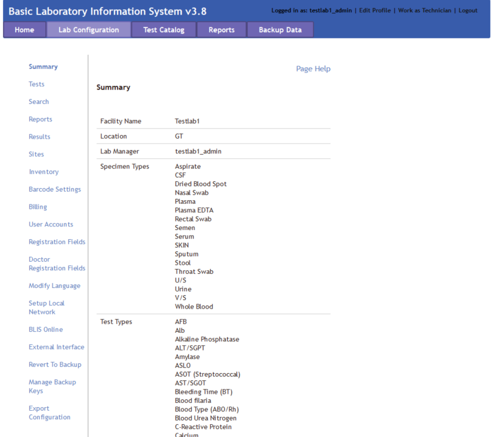

### Tests 
The **Tests** page has a drop down menu that opens up to reveal three different options: **Specimen/Test Types**, **Target TAT**, and **Results Interpretation**.

#### Specimen/Test Types
The **Specimen/Test Types** page allows you to set the specimen and test types as appropriate for your country. Click **Show** to reveal hidden panes and **Hide** to close the panes. Check the box for each specimen type collected or test done at this facility, and click **Submit** to save.

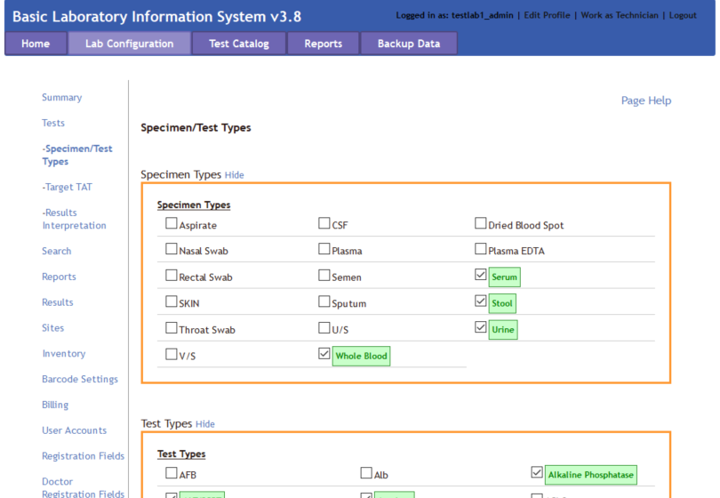

#### Target TAT
The **Target TAT** page displays turnaround times for tests. To enter or change turnaround time, click **Edit**. The number and unit (such as “24 hours”) change to a text field and a drop-down list. Enter the desired number and choose **Hours** or **Days**. When finished, click the **Submit** button to save changes, or **Cancel** to discard changes. These options are below the list.

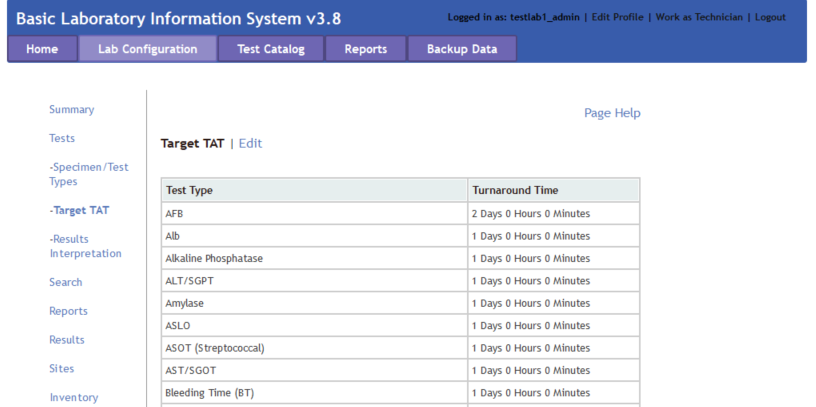

### Results Interpretation

The **Results Interpretation** page allows you to specify the interpretation for multiple ranges of values for each test type. To view or edit an existing test’s result, choose the test type from the drop-down list and click the **Search** button. The current interpretation appears. Edit using the text boxes.

To add a new range to the list, click the **Add Another** link and enter data in the text boxes. Click the **Submit** button to save changes, or **Cancel** to discard them.

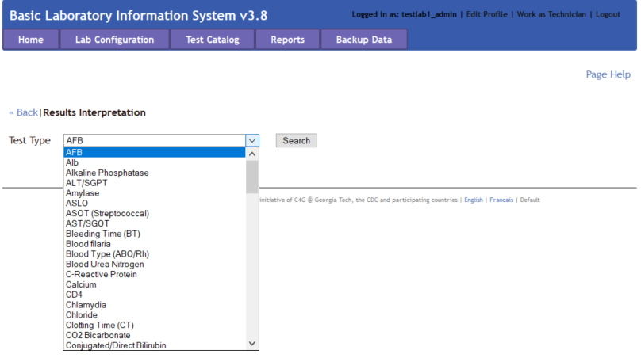

### Search 
The **Search** page allows you to configure what results are displayed for each patient when a search is executed. It also allows you to change how many results are displayed on each page.

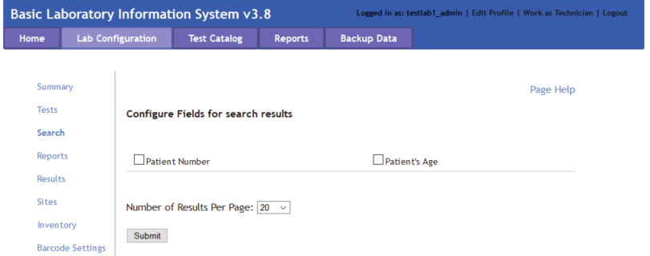

### Reports 
The **Reports** page has a drop down menu that opens up to reveal seven different options: **Infection Report**, **Test/Specimen Grouped Reports**, **Daily Report Settings**, **Enable/Disable Test Reports**, **Test Report Configuration**, **Worksheet**, and **Order Patient Fields**.

### Infection Report
The **Infection Report** page generates an aggregate report of laboratory test results for a particular period for one or all lab sections. The tests listed in the report are the ones checked to include on the **Specimen/Test Types** page. Click **Edit** to make changes to the details reported. When finished, click **Submit** button to save changes, **Preview** to view the report, or **Cancel** to discard changes.

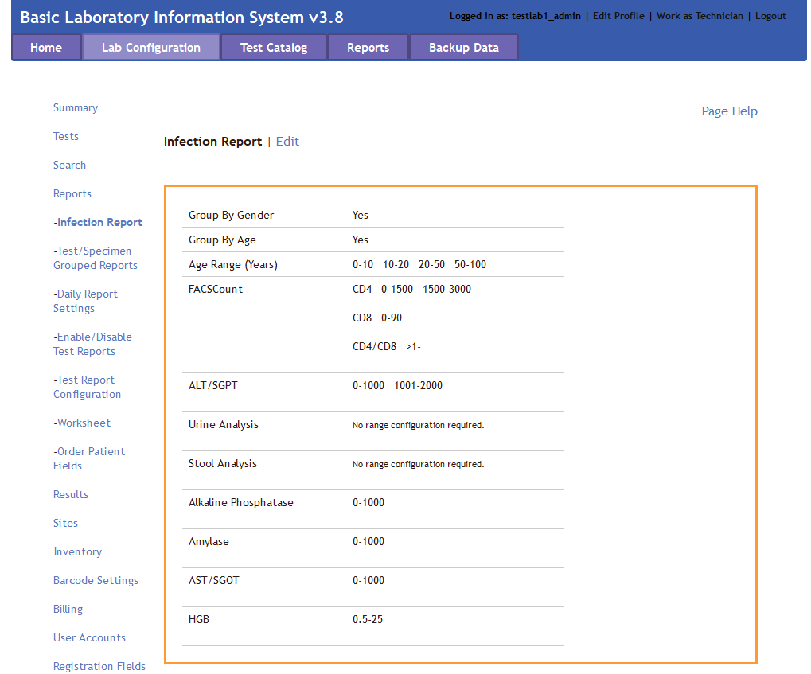

### Test/Specimen Grouped Reports
The **Test/Specimen Grouped Reports** page allows you to set the **Test Count (Grouped) Report** settings and the **Specimen Count (Grouped) Report** settings. Click **Edit** to change settings. When finished, click the **Submit** button to save changes, or **Cancel** to discard changes. 

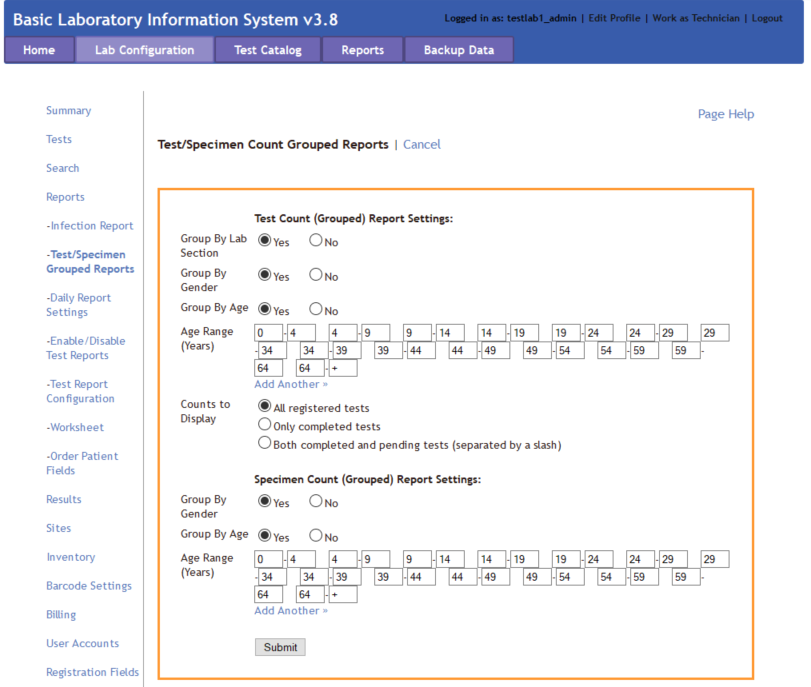

### Daily Report Settings
The **Daily Report Settings** page allows you to set the layout of the **Patient Report**, **Daily Log - Specimens**, and **Daily Log - Patients**. Use the drop-down to select the report type, then click **Search**. Check or un-check boxes to show or hide patient, specimen, and test information. If desired, you can upload a .jpg logo file to appear on the report. When finished, click the **Submit** button to save changes, or **Cancel** to discard changes. These options are below the list.

### Enable/Disable Test Results
The **Enable/Disable Test Results** page allows you to enable or disable specific tests. Items on the left side are disabled; move the test items to the right side to enable them. When finished, click the **Submit** button to save changes, or **Cancel** to discard changes.

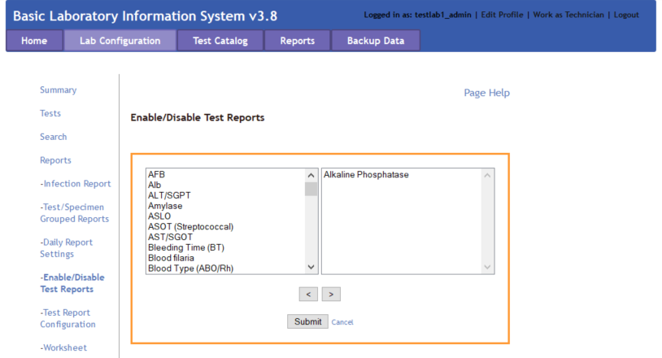

### Test Report Configuration
The **Test Report Configuration** page allows you to visualize your enabled test configurations. Use the drop-down to select the test type from the enabled test list, then click **Search**. Click **Edit** to edit the configuration of the reported test data. Check or un-check boxes to show or hide patient, specimen, and test information. When finished, click the **Submit** button to save changes, or **Cancel** to discard changes

### Worksheet
The **Worksheet** page allows you to create templates for gather patient data in the lab. In lab settings where data are not entered at the point of service, the data entry staff can enter the laboratory's patient information and ordered tests, then print the worksheet so that lab technicians can write test results and other data to be entered into BLIS. 

Select the **Lab Section** and **Test Type** and click **Search** to edit the report format. To edit a custom report, click **Edit** to the right of the report. To create a new custom worksheet, click the **Add Custom Worksheet** link at the bottom of the list.

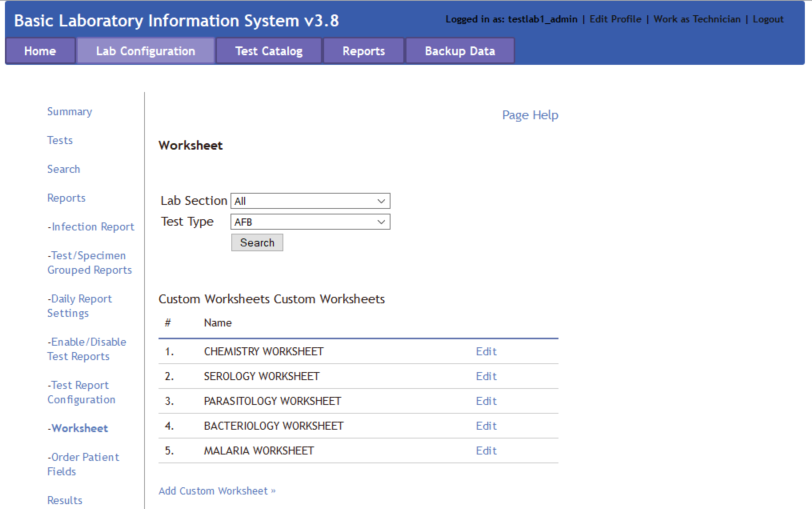

### Results 
The **Results** page allows you to edit the parameters displayed in the batch results page. Currently, the editable data is limited to Patient information.

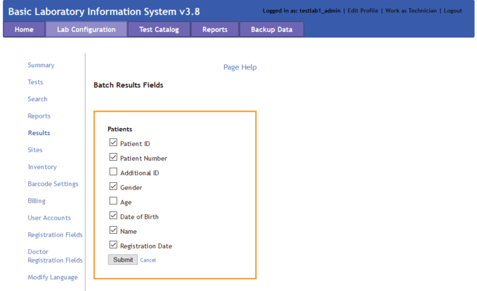

### Sites 
The **Sites** page allows you to add, modify, or remove specimen collection sites to the laboratory records. When first spawning a laboratory, only one site - the default site - will exist. 

Additional information about the site can be provided in the textboxes - currently, BLIS supports adding in District and Region information. To add another site, click on the **Add Another** hyperlink at the top and fill in textbox with the new site name, then click **Submit**. To go back, click **Cancel**. 

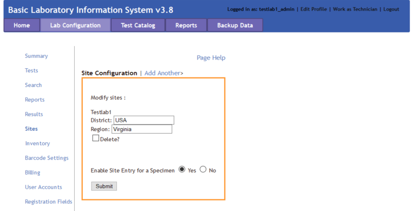

### Inventory 
The **Inventory** page is a list of any existing reagents being tracked in BLIS. To add another, click the
**Add Item** link above the list and input the name, unit of measurement associated with the reagent, and any miscellaneous remarks about the reagent. After pressing **Submit**, don't forget to add the item's stock. On the **Current Inventory** page, you can **Log Stock Usage**, **Add Stock**, or **Edit Details**.

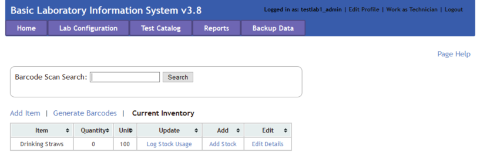

### Barcode Settings 
The **Barcode Settings** page allows you to configure the settings for barcode formats. Click on the **Page Help** for more details. After changing the settings, click **Submit** to save your edits.

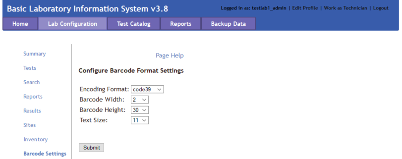

### User Accounts 

### Registration Fields 

### Doctor Registration Fields 

### Modify Language 

### Setup Local Network 

### BLIS Online 
The **BLIS Online** page allows you to enter an IP address of a **BLIS on the Cloud** server. For more details about **BLIS on the Cloud** and how to create your own instantiation, please read the Developer's Documentation.

Please enter the IP address into the text box and click **Submit**. A message stating "BLIS Cloud hostname updated successfully!" will pop up if submitted correctly. 

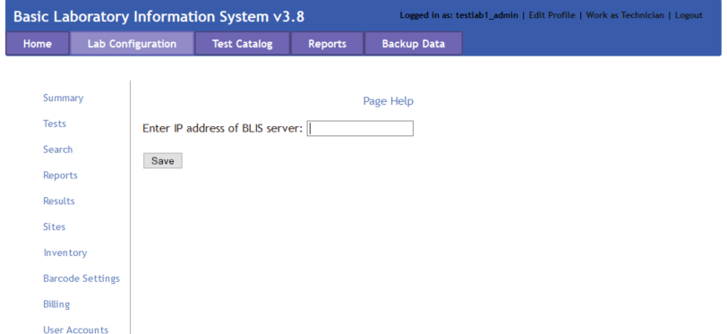

### External Interface 

### Revert to Backup 

### Manage Backup Keys 
The **Manage Backup Keys** page allows you to create, manage, or delete key pairs in order to encrypt laboratory backup data. Encrypting laboratory backup data with a unique key-pair ensures that only the personnel with the correct private key will be able to successfully decrypt the encrypted data with the correlated public key.

The home screen of the **Manage Backup Keys** page displays the list of currently active public keys. In the example image below, only one public key is available for use, with a key alias of "my_pubkey".

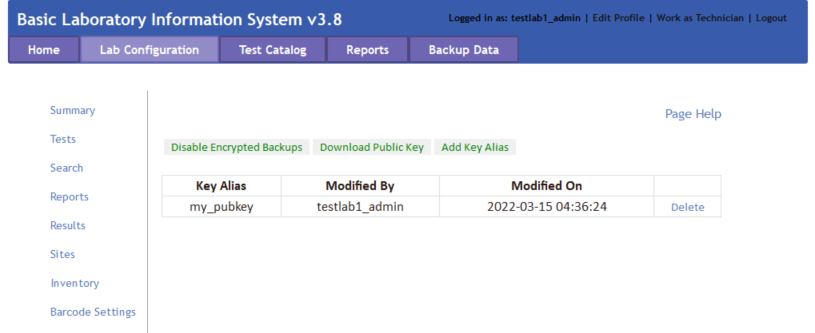

#### Disable Encrypted Backups
Toggle this button to disable or enable encrypted backups. It is recommended to enable encrypted backups to protect private patient information.

#### Download Public Key
This button opens a popup window prompting the user to download a public key. This key should be saved onto the computer.

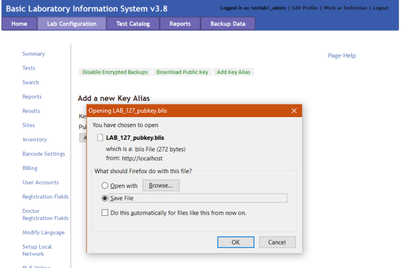

#### Add Key Alias
To add a new public key, click **Add Key Alias**. Fill free to enter in any key alias names here. We recommend entering in some identifying information that describes the origin of the public key. For example, if the public key was provided by the country director, the key alias name could be "country_director_pubkey".

To upload the public key, click **Browse** and use the File Upload navigational controls to select the desired public key (ending in a .blis file extension). After selecting the correct public key, click **Add** to add the public key to the list of currently active public keys, or **Cancel** to discard changes.

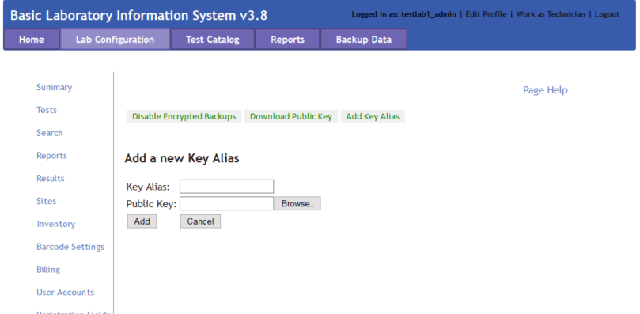

### Export Configuration 
The **Export Configuration** page allows you to export all configuration settings to Microsoft Word. Clicking this link opens a new browser tab with a preview showing all preset and custom fields as well as report settings. The preview has three buttons at the top: Print, Export as Word document, and Close.
Click the **Print** button to open the print dialog box; **Export as Word document** to create a file named **blisreport_[date of report].doc**, which you may open or save, or **Close** to close this browser tab.

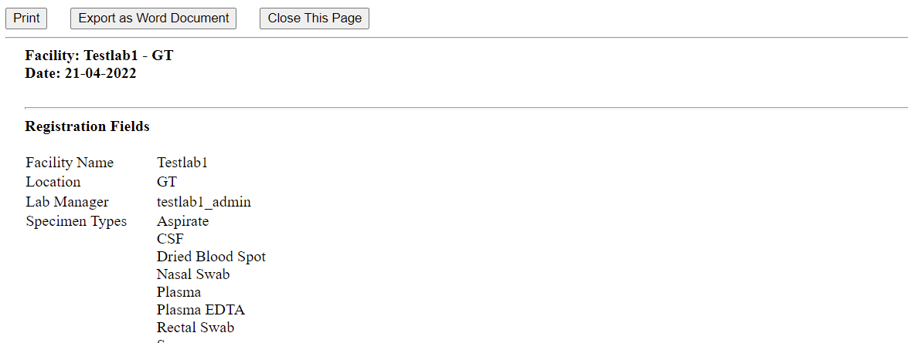

## Test Catalog 
The **Test Catalog** page allows the Manager to add or edit specimen or test types used in their laboratory.

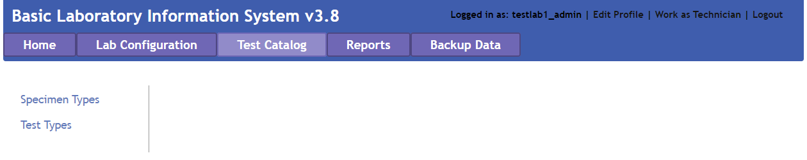

### Specimen Type
The **Specimen Type** page allows for adding or editing specimen types used in the laboratory.

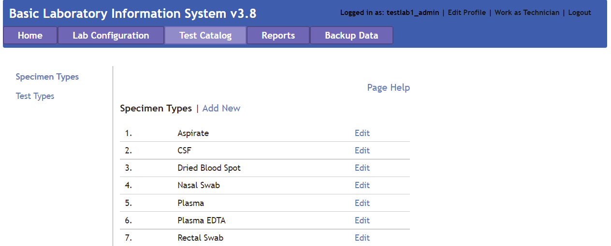

Click **Add** New to enter a new specimen type. Required fields are **Name**, which is a text box for entering the name of the specimen, and **Compatible Tests**, which allows you to check the tests that can be performed using that specimen. **Ctrl-F** opens the Find function to search for a test. You may enter a **Description** of the specimen type, which is optional.

To edit the information about a specimen type, find the one you wish to edit on the list
and then click the **Edit** link in the far-right column.

Click **Submit** button to save changes, **Cancel** to discard.

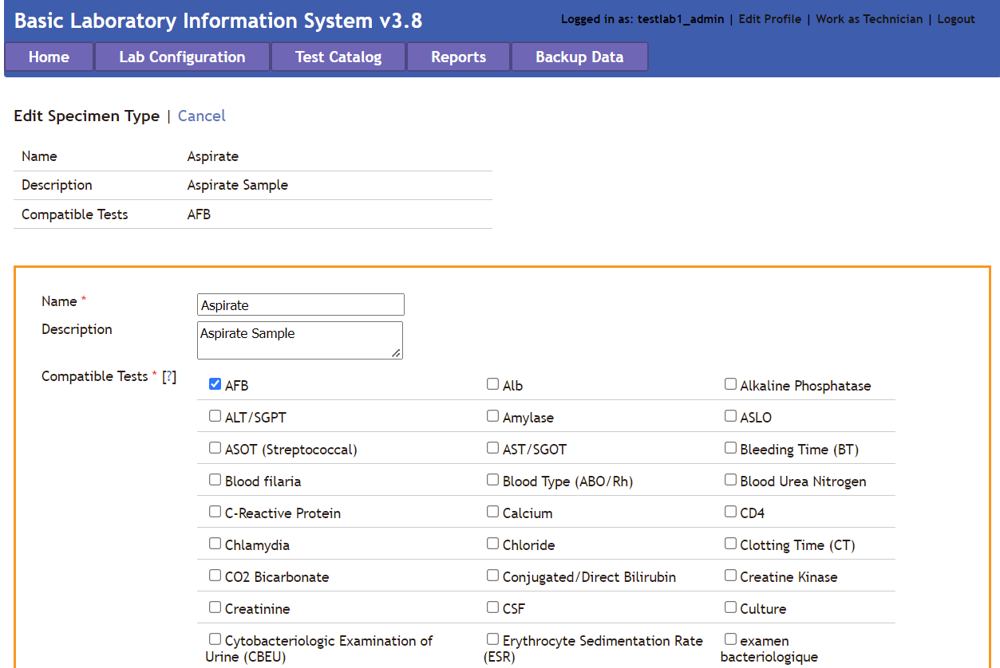

### Test Type
The **Test Type** page allows for adding or editing test types used in the laboratory. It is controlled the same way as Specimen Types.

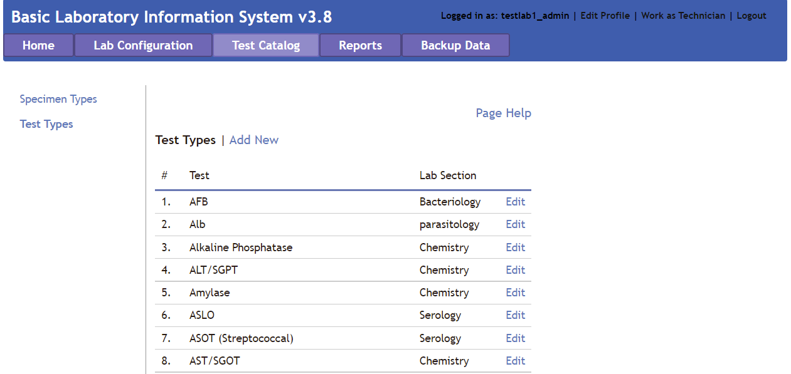

Click **Add New** to enter a new test type. Required fields are Name, which is a text box; **Lab Section**, a drop-down list that includes an option to add a new section; **Measures**, which are editable; and **Compatible Specimens**, which allows you to check one or more specimens that can be used for this test.

Optional fields include **Description** (text box), **Clinical Data**, **Panel Test** (a check-box, checked for Yes), **Hide Patient’s Name** (drop-down Yes/No), **Prevalence Threshold** (text box), and **Target TAT** (text box).

To edit the information about a test type, find the one you wish to edit on the list and then click the **Edit** link in the far-right column.

Click **Submit** button to save changes, or **Cancel** to discard.

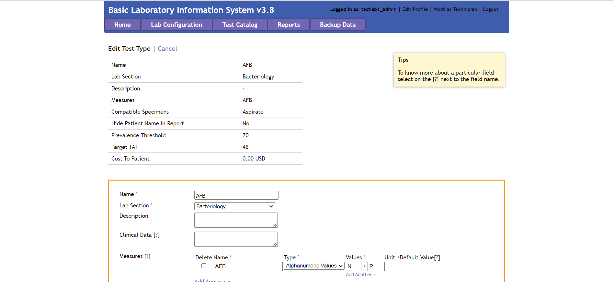

## Reports 
The **Reports** page can be accessed by either the Technician or Manager. 

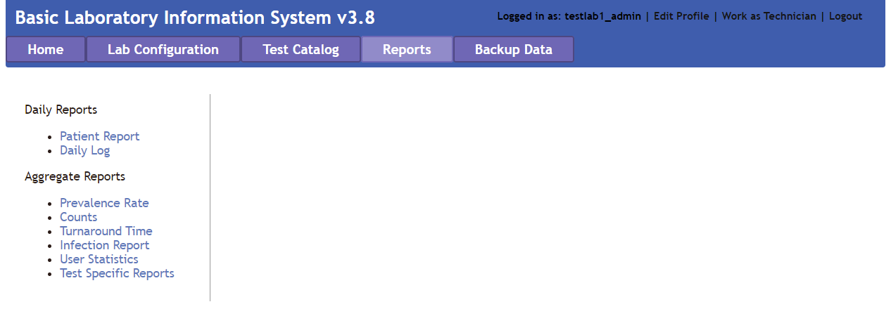

### Daily Reports
The **Daily Reports** should be generated each day for both the Patient Report and also Daily Log.

#### Patient Report
The **Patient Reports** page generates reports for each searchable patient. 

Search for the patient by Patient Name, Patient Number, or Patient ID and Lab Section to which the patients' specimen are registered against. Click the **Search** button to start search. Select the patient you want from the list if more than one patient matches your search criteria. Click **View Report** to see all data for that patient, or **Select Tests** to see tests ordered and the results for that patient.

You can edit the report to show activity within a date range, include pending tests for which results are not available, set printing information, or export to Word using the controls at the top of the page.

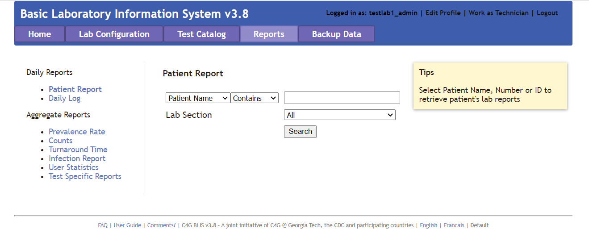

#### Daily Log
The **Daily Log** creats a report of the day's activity.

Set the date range to reflect the log to print. You can run a report of the day’s activity by patients seen (by clicking **Patient Records**), or by tests run (by clicking **Test Records**). If you choose Test Records, You can choose to run a log for one lab section or for one type of test. The default settings are test records, all sections, and all tests. The report opens in a new browser tab and has **Print** and **Export** controls at the top of the page.

Also patient barcodes for each patient with the number of specimens they have handed over can also be printed over a given a range of time by selecting the **Patient Barcode** option.

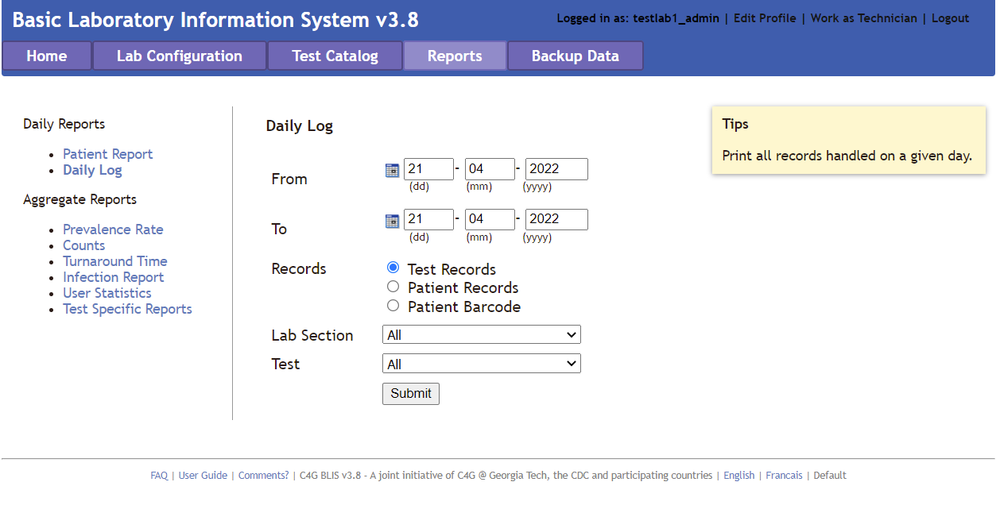

### Aggregate Reports
Aggregate Reports generates reports for specific data selected by the user.

#### Prevalence Rate

#### Counts

#### Turnaround Time

## Backup Data 
The **Backup Data** feature was created for two reasons - to revert to a previously backed-up copy in cases of system failure, but also to create a backup file of the current laboratory patient data for uploading to a **BLIS on Cloud** version. 

For example, one intended use of the second scenario would be to upload the current laboratory data to the director's instantiation of BLIS. A conglomeration of multiple labs' data would permit the director to visualize larger trends in the healthcare data across several laboratories. This would aid the director in understanding the needs of individual labs, and permit them to mobilize aid catered to the specific needs of each laboratories.

The below image is the default view of the **Backup Data** page.

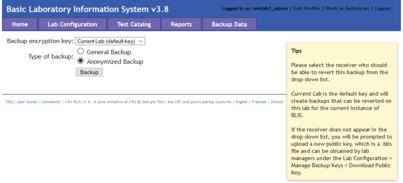

### Backup Data with Pre-Existing Key
If a public key has already been registered to the personnel account through the **Lab Configuration** > **Manage Backup Keys** functionality, then the key should appear in the drop-down menu. In the image below, *my_pubkey* is a pre-existing public key that had been previously registered. Please select the key from the drop-down menu.

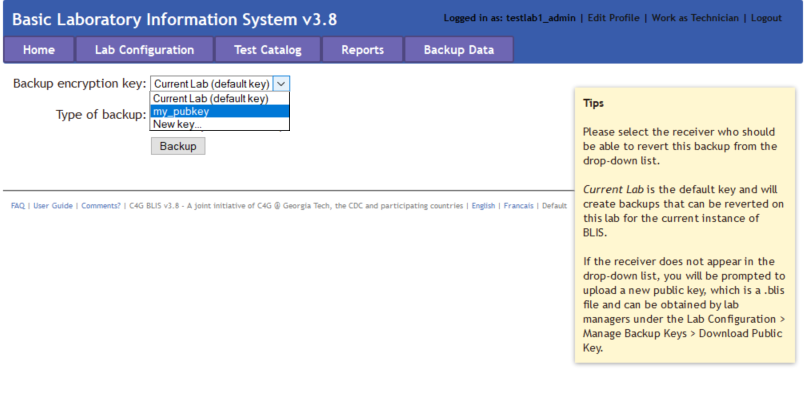

### Backup Data without Pre-Existing Key
If the desired public key has not already been registered to the account, then please select *New Key...* from the drop-down menu. Two new boxes should appear. Give the key a name (recommend either the lab name or lab ID), and click on the **Browse** button. Find the public key that was previously downloaded onto your computer and select it to upload.

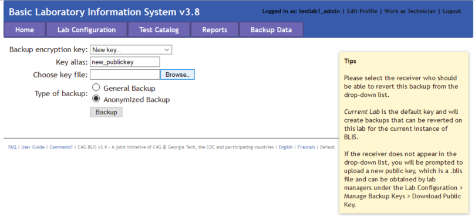

After selecting the public key of choice, please choose the desired backup (General or Anonymized) and then click **Backup** to trigger the data backup. A new page should pop up, confirming that the backup was successful. Please click the **Download Zip** hyperlink to download the zipped file to your Desktop. 

Additionally, if a Backup IP Address was previously set in **Lab Configuration** > **BLIS Online** page, a copy of the backup will be sent to the BLIS version hosted on the specified IP Address.

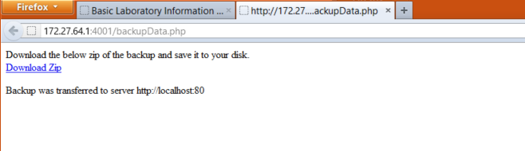

## Technician Overview 
The technician interface allows the Technician to do the following:
1. Register new patients and look up existing patients
2. Add results for a patient based on the specimens provided
3. Manage existing reagents currently being tracked in BLIS

### Registration
The **Registration** page allows the Technician to register new patients or lookup existing patients based on name, patient ID or number.

### Add New Patient
Click on the hyperlink to *Add New Patient >>* illustrated in the red circle in the image below.

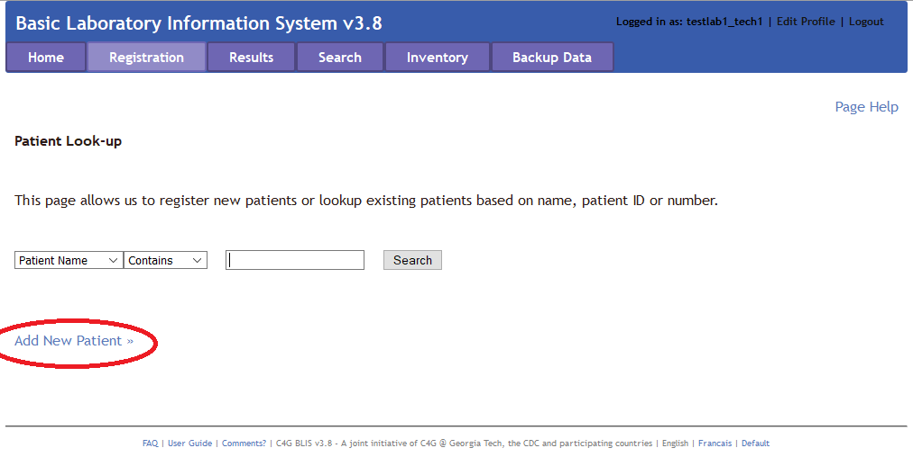

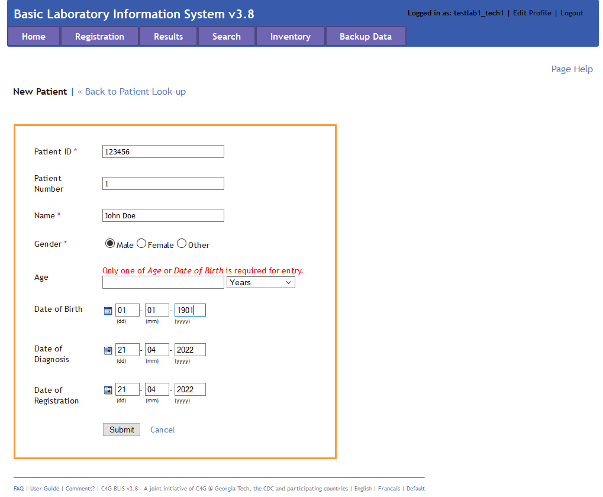

