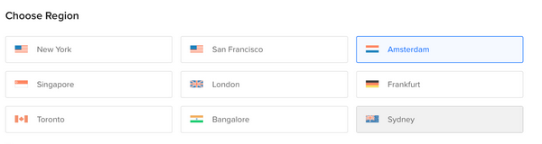
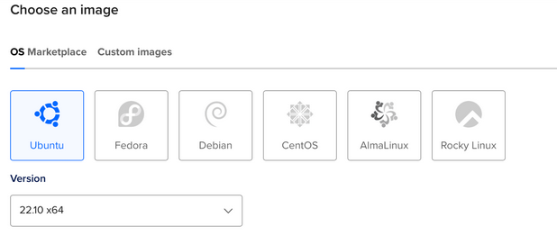
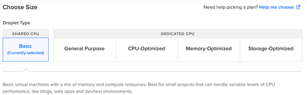
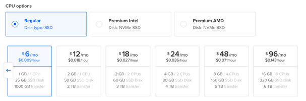
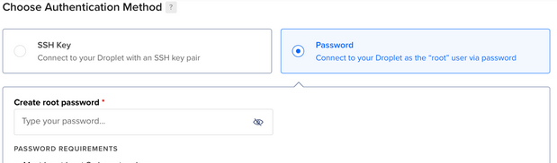
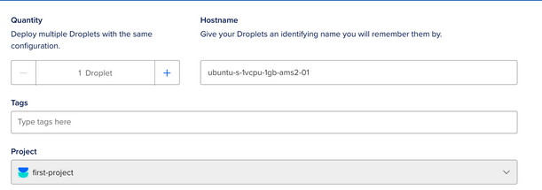
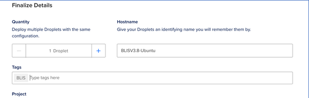
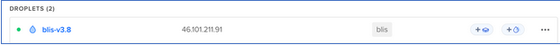
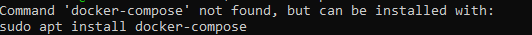
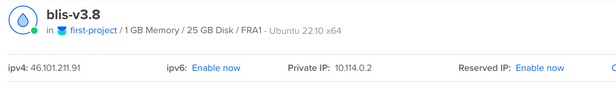

# Running BLIS on a Cloud Provider

**Running BLIS in the cloud is still a new process and there may be issues.**

## Quick Version

!!! warning
    You must already have an account with a cloud provider to continue, and you must create a virtual machine running a relatively modern Linux distribution.

    **The minimum amount of RAM required to run the BLIS container is 1 GB.** As of writing, this is $6 USD per month, not including backups.

You can run our official bootstrap script to start BLIS on a new, Ubuntu-based Digital Ocean image:

```bash
curl https://raw.githubusercontent.com/C4G/BLIS/main/docker/bootstrap.sh | bash
```

You may now proceed to [Running BLIS](#running-blis).

If you are not using Ubuntu, or you want to install BLIS manually, follow the instructions below.

## Manual Instructions

### Creating a Droplet

If you need additional help or feel like something is missing you may want to look at the [Digital Ocean droplet documentation](https://docs.digitalocean.com/products/droplets/how-to/create/) but below are instructions to get you running.

1. Signup for Digital Ocean and start creating a [droplet](https://www.digitalocean.com/products/droplets)

2. Choose a region (preferably closest to the country location)



3. Select the latest **LTS version** of Ubuntu (20.04 LTS, 22.04 LTS, etc)



4. Select the basic droplet type



5. Choose the regular $6 a month or equivalent in your local currency CPU type



6. Choose password for you authentication method, make sure to store this password somewhere.



7. Finalize the details



8. Add BLIS to the Tags section



9. Create droplet by pressing the blue "Create Droplet" button, this may take a few minutes. Once it is complete it will be shown on the home page under droplets.




### Installing Docker

1. To login to your droplet click on the three dots at the end of the droplet on the home page and choose "Access console" or [use SSH to login.](https://docs.digitalocean.com/products/droplets/how-to/connect-with-ssh/) The login will be root and the password you created for your droplet earlier. The console will look something like this.


2. Run this to install docker

```bash
curl https://raw.githubusercontent.com/C4G/BLIS/main/docker/bootstrap.sh |bash
```

3. Check if `docker-compose` is installed. You can check this by running `docker-compose` if it is **not installed** you should see something like this


If you see something like the above run this command

```bash
sudo curl -L "https://github.com/docker/compose/releases/download/1.29.2/docker-compose-$(uname -s)-$(uname -m)" -o /usr/local/bin/docker-compose
```

4. Run this command to allow docker compose to run

```bash
chmod +x /usr/local/bin/docker-compose
```

Now you're ready to run BLIS!

### Running BLIS

1. Install `python3-pip`:

    ```bash
    $ sudo apt-get install -y python3-pip
    ```

1. Install the [BLIS Cloud CLI](https://github.com/C4G/blis-cloud-cli)

    ```
    $ pip3 install git+https://github.com/C4G/blis-cloud-cli.git
    ```

1. Ensure Docker is installed correctly:

    ```bash
    blis docker status
    ```

    You should get something like this:

    ```bash
    root@ubuntu-s-1vcpu-1gb-nyc0-00:~# blis docker status
    Docker is accessible? Yes
    Docker Compose is installed? v2

    ```

1. Install BLIS:

    ```bash
    blis install
    ```

These commands will set up two containers:

1. The `app` container: This contains all of the BLIS source code, as well as the Apache2 web server and PHP 5.6 runtime.
1. The `db` container: This contains the MySQL 5.7 database.

## Accessing BLIS

Now, BLIS should be running. You can access it by visiting a URL that looks like:

```plain
http://[your droplet IP address]/
```



Substitute your droplet IP address above, you should have this from your console.

## Upgrading BLIS

When you want to upgrade BLIS, you can follow these commands to
pull the latest version of the Docker image and restart the containers:

```bash
blis update
```

And that's it!

## Adding an HTTPS certificate to BLIS

By default, BLIS will only communicate over HTTP on port 80 (see `docker/docker-compose.yml`
for the full port configuration.)

BLIS includes support for automatically retrieving and configuring a certificate from
[Let's Encrypt](https://letsencrypt.org/) for communicating over HTTPS. However, you must
already have a domain configured and pointing at the host you are running BLIS on. **This process
is not included in this guide.** If you are using DigitalOcean, [there is a guide you can use as
a jumping-off point here](https://docs.digitalocean.com/products/networking/dns/quickstart/).

### After your domain is pointing to your BLIS host IP address

You will need to add the `BLIS_SERVER_NAME` to the `docker-compose.yml` configuration:

```yml
services:
  app:
    # This image is automatically built and pushed from the GitHub action in .github/workflows/ folder
    image: "ghcr.io/C4G/blis:latest"
    environment:
      DB_HOST: 'db'
      DB_PORT: '3306'
      DB_USER: '[blis database user here]'
      DB_PASS: '[blis database password here]'
      # Add or uncomment this line, and change the domain value to your own
      BLIS_SERVER_NAME: 'blis.mydomain.com'
```

Then, (re)start BLIS:

```bash
# if BLIS is running
$ docker-compose down

# bring the database container up first and daemonize it
$ docker-compose up -d db

# bring the app container up alone, syncronously, so we can see the output
$ docker-compose up app
```

Make sure there are no errors in the output. The container will attempt to read the value
of `BLIS_SERVER_NAME` and set the appropriate `ServerName` directive in the Apache2
web server configuration and a message will say that it is successful.

Assuming it is successful, you can quit with Ctrl-C and restart as a background process
(`docker-compose up -d app`).

In a separate terminal window, while BLIS is running, run the script:

```bash
$ docker-compose exec app get-https-cert.sh
```

This will verify the environment configuration seems correct and execute the certificate tool for you!
Answer the questions about the domain to the best of your knowledge.

Once the domain is verified and the certificate installed, you can visit your BLIS instance
with an `https://` URL and hopefully it just works!


## Troubleshooting

1. There maybe a error when you call `docker-compose` API, the error will show similar to:

  ```bash
  root@blis-test:~/BLIS/docker#docker-compose
  -bash: /usr/local/bin/docker-compose: Permission denied
  ```
Using a `chmod +x /usr/local/bin/docker-compose` will help the work.

