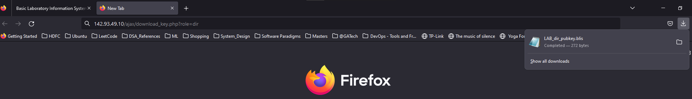
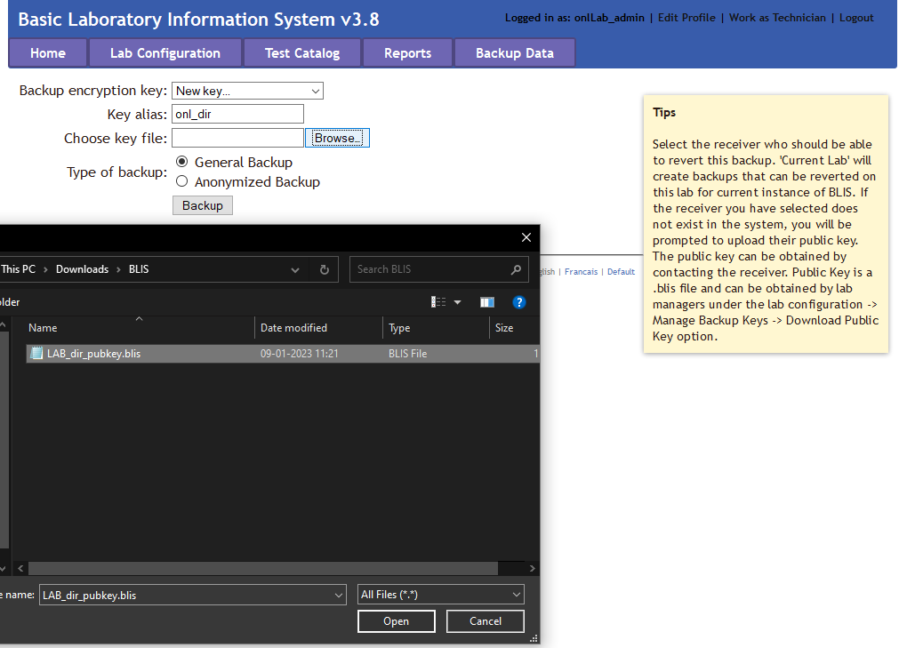
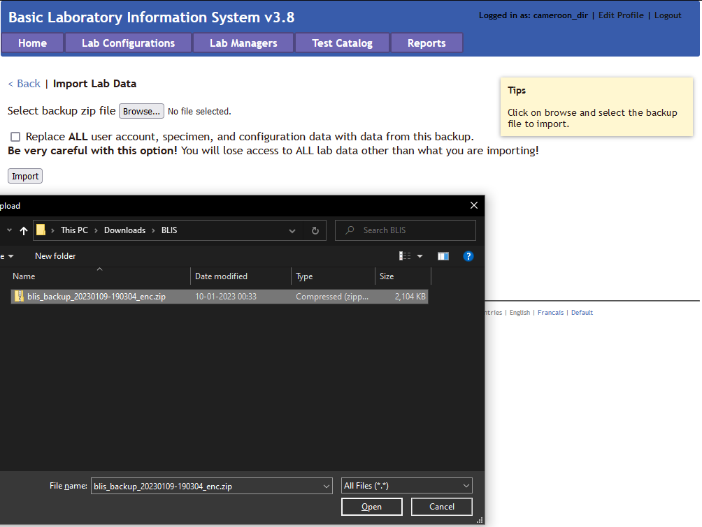
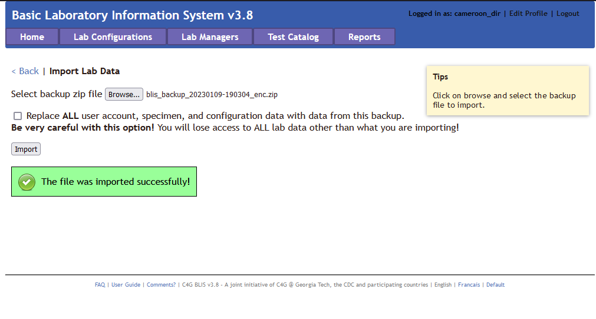
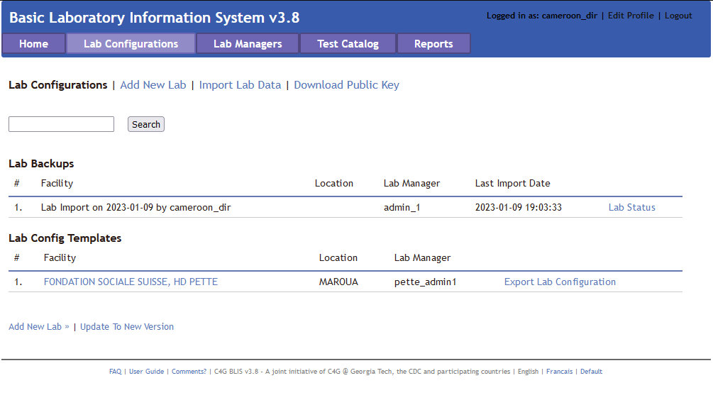

# Migrating Labs to Cloud

1. Upgrade your labs to version 3.8 or later from [C4G BLIS web page](http://blis.cc.gatech.edu/).
2. Open your Firefox browser.
3. Set up BLIS on cloud if not already done. You can follow the [Running BLIS on a Cloud Provider](https://c4g.github.io/BLIS/user_guide/11_blis_cloud/) guide for instructions.
4. Go to the Digital Ocean hosted BLIS webpage.
5. Now either create encrypted or unencrypted backups using the steps below.

## Encrypted lab backup

1. Go to the url <http://digital-ocean-blis-host/ajax/download_key.php?role=dir> to download the public key needed to encrypt the back-up. Example: <http://142.93.49.10/ajax/download_key.php?role=dir>
    

    
    

2. Next, inorder to create an encrypted backup of the local lab:
    1. Navigate to the **Backup Data** tab.
    2. Upload the public key dowloaded in the previous step.
        

        
        

    3. Click on **Backup** and save the .zip encrypted backup.

## Unencrypted lab backup

1. Navigate to the **Lab Configurations** tab.
2. In the left side panel, click **Manage Backup Keys**.
3. Click **Disable Encrypted Backups**.
4. Now, navigate to the **Backup Data** tab.
5. Click on **Backup** and save the .zip encrypted backup.

## Importing the backup into the cloud

1. Now the country Director can upload this lab's encrypted backup onto cloud:
    1. Login onto <http://digital-ocean-blis-host/login.php> as a Director.
    2. Navigate to **Lab Configurations**.
    3. Click on **Import Lab Data** and upload the encrypted lab backup.
        

        
        

    4. Upon successfully importing the lab you will see something like this:
        

        
        

    5. And in the **Lab Configuration** tab you would see:
        

        
        

2. The new admin created for the newly imported lab can login using the default credentials using C4G BLIS in the cloud.
