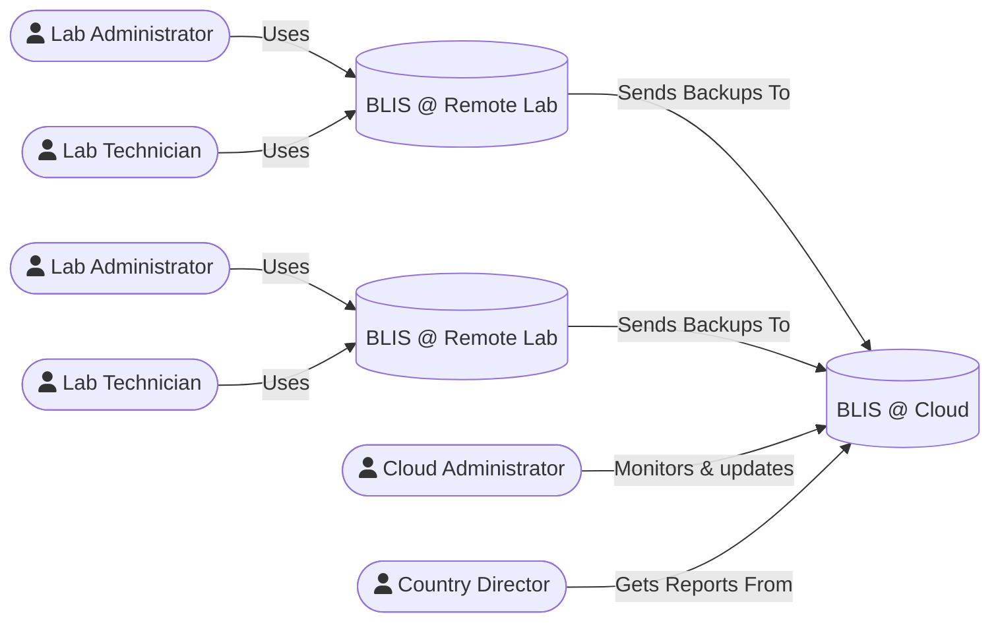

# Syncing with BLIS Cloud

Starting with version 3.10, BLIS is able to send backups of its data to a central cloud instance. This enables labs that do not have a reliable
Internet connection to connect to a copy of BLIS hosted in the cloud and send their data when they do have a steady connection. This process
is **one way.** Data from BLIS cloud is not sent back down to the remote lab. Backups sent to BLIS cloud can be downloaded as a regular backup.

<figcaption>Illustration of the use-case for syncing BLIS data.</figcaption>

## Setup: BLIS Cloud

1. First, **ensure all database migrations are complete by click "Upgrade to BLIS 3.X" on the front page**.
1. As a **cloud administrator** or **country director**, go to the Lab Configurations page.
1. Create a new lab to represent the lab from which you will be **receiving** backups.
1. Click Lab Configurations -> "Manage Backups" for the new lab you just created.
1. Click the "Connect Offline Lab" tab
1. Note the connection URL and connection code

## Setup: Remote Lab

1. First, **ensure all database migrations are complete by click "Upgrade to BLIS 3.X" on the front page**.
1. Log in as a lab administrator to the lab you would like to back up.
1. Perform a data backup. Ensure it is visible in the Backups view.
1. Under Lab Configuration click "BLIS Cloud"
1. Enter URL and code from BLIS Cloud and click "Connect"
1. If the backup from step 3 has completed successfully,click "Send Latest Backup".

On the cloud BLIS, you can now view the lab backup sent from the remote BLIS.
