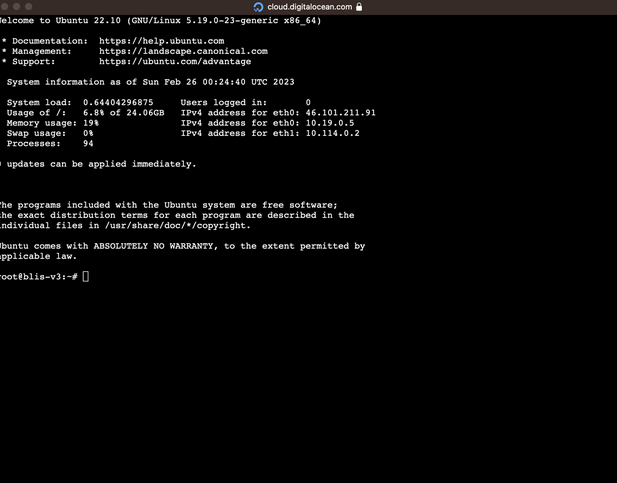

# Updating BLIS Cloud

In order to update BLIS, you will need to access the console. In Digital Ocean, this is the Droplet Console that you used to install BLIS.

Click on the three dots at the end of the droplet on the home page and choose "Access console" or [use SSH to login.](https://docs.digitalocean.com/products/droplets/how-to/connect-with-ssh/) The login will be root and the password you created for your droplet earlier. The console will look something like this.



## Updating `blis-cloud-cli`

First, update `blis-cloud-cli` using this command:

```bash
sudo pip3 install -U blis-cloud-cli
```

## Updating BLIS

Next, you can update BLIS by running:

```bash
blis update
```
