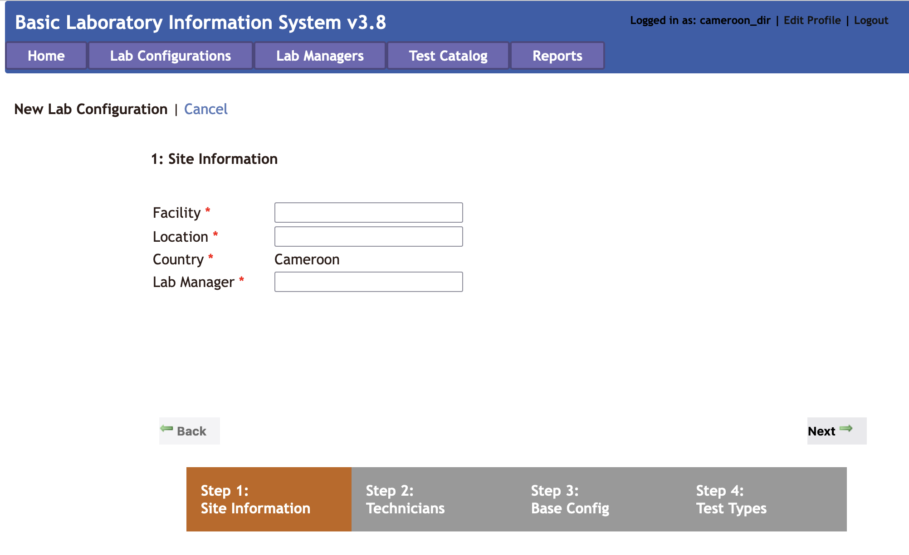

# Director Overview

The Director role allows a user to control some components at a country level. This is organized into tabs, as with the other interfaces.

### Lab Configurations
In the **Lab Configurations** tab, the Director can view lab backups that have been imported. A list of the different lab configurations is also displayed, along with links to export each of these lab configurations. This allows a Director to setup a lab configuration in advance and then export it for a new lab to import to streamline the process.

To setup a new lab configuration, click the button to add a new lab. This walks the user through four steps to setup site information, technicians, base configuation, and test types.

It is possible to add Technicians during this setup process, but note that additional Technicians can be added later. During setup of the base configuration, an existing lab configuration can be selected from the dropdown menu to use as a base. During the next step, test can be imported from an existing facility by selecting it from the dropdown menu. As with the other steps, the configuation can be further customized later from the **Lab Configuration** tab when logged in and work as a Manager.

Clicking on the name of a facility takes the user to the **Lab Configuration** view, with all the same options available in the Manager view, plus three additional menu options: **General Settings**, **Change Manager**, **Delete Configuration**, and **Import Configuration**. For information on the other menu options and how they work, please go to the [Manager Lab Configuration](#lab-managers) section. Each of the additional options are covered here.

The **General Settings** option allows the Director to change the name or location of a facility. Additionally, the user can populate the database with random data or clear randomly populated data. The **Change Manager** option is self-explanatory. This option allows the Director to select a user from the dropdown menu as the new Lab Manager. The **Delete Configuration** menu option should be used with caution. This allows the Director to delete an entire lab configuation. Please use this with caution!

!!! warning
    After a Lab Configuration is deleted, it cannot be recovered. Please take caution when proceeding with deleting a lab configuration.

Another functionality available on the **Lab Configuration** tab is importing lab backups. Lab Managers can perform backups and send the backups to the Director. To import a lab backup from the **Lab Configuration** tab, select **Import Lab Data**. Browse to find the zipped backup provided by the lab, and click the import button. A confirmation message will display indicating that the backup was successful or an error message if there is something wrong with the backup.

If the backup is encrypted, it can only be unencrypted with the correct key. If an encrypted backup is desired, first download the public key and share it with the lab. To do this, click the button to download a public key. It will get saved in the local computer's downloads folder by default. Send this file to the lab that is going to perform the backup. The Lab Manager can use the public key to export an encrypted backup from the Backup Data tab, and then share the zipped backup folder with the user, which can be imported as described above.

??? question "Who else can edit Lab Configurations?"
    Lab Configurations can also be set by Lab Managers. [Click here for more details.](#lab-managers)

### Lab Managers
Under the **Lab Managers** tab, the Director can add, edit, or delete Lab Managers. Click **Edit** on an existing manager to change the name, email address, phone number, or language of a manager, or to reset the managers password.

!!! info "Note"
    Directors cannot edit/reset passwords for Technicians. Navigate to the **User Accounts** menu option in the **Lab Configurations** tab from the Manager view to edit/reset passwords for Technician accounts.

### Test Catalog
The **Test Catalog** tab allows the Director to add country-wide specimens and tests.

### Reports
The **Reports** tab allows the Director to build reports for some or all of the labs that are under the country's management. The aggregate reports work much as the aggegrate reports do within the Manager view, with two additional options to select a specific test and select which facilities should be included in the report. There is also a menu option to configure some of the aggregation settings (e.g. age ranges) for the reports.

#### Export to Excel

The process for exporting to and Excel spreadsheet is identical for the director as it is for a lab manager,
however, the director can select which lab among those they have access to thatthey want to generate the report for.

