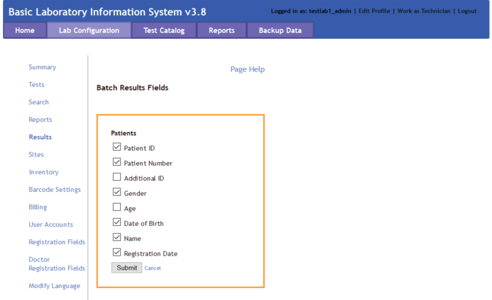
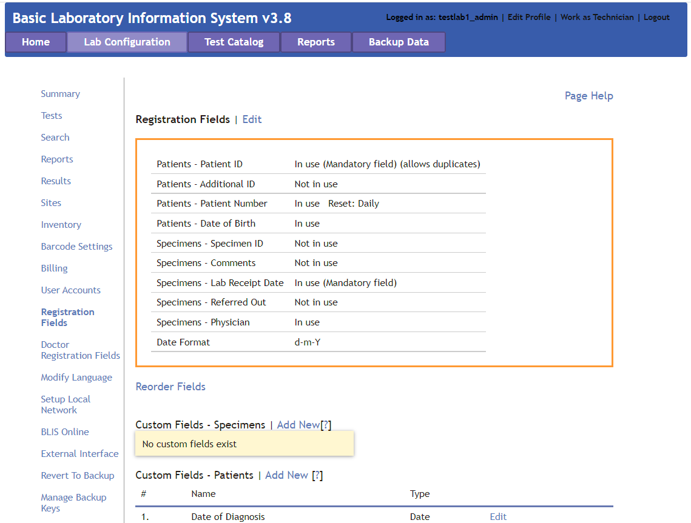
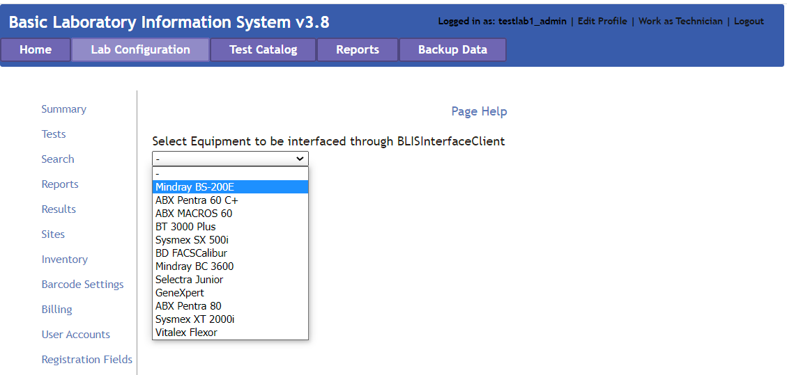
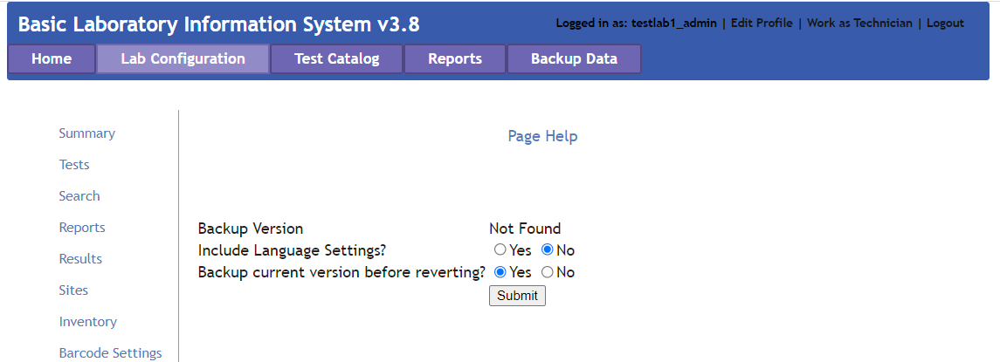
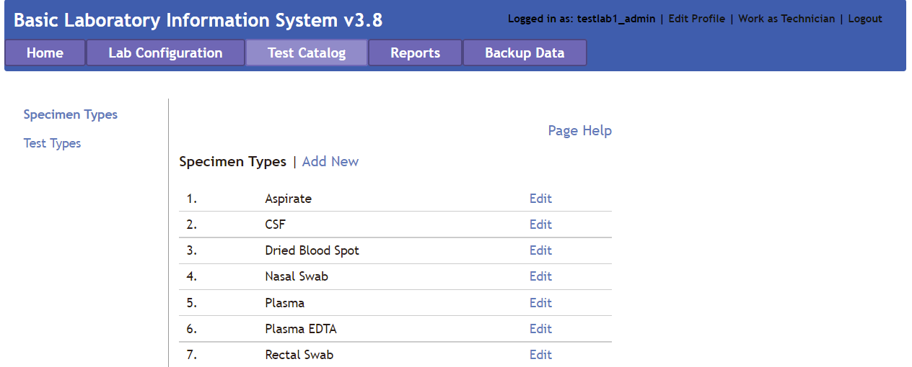
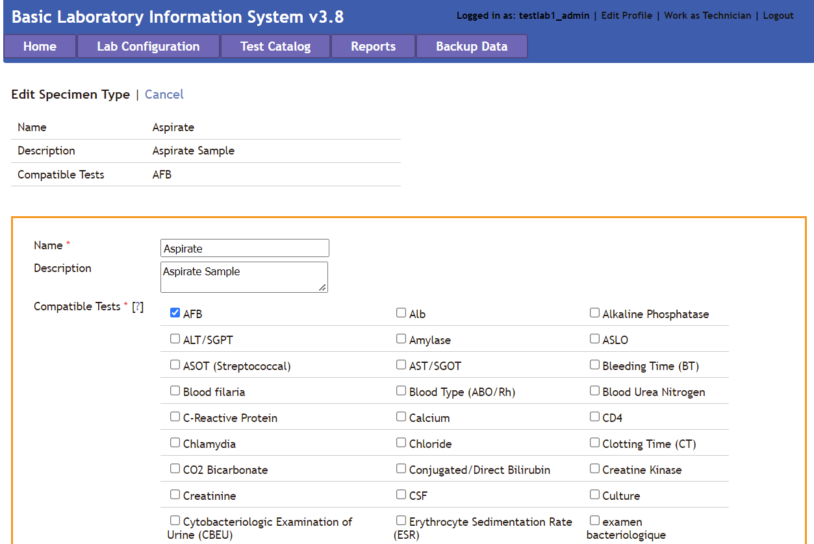

# Manager Overview

The manager interface allows the Manager to do the following:

1. Add, edit, and delete users
2. Change the laboratory configuration settings in the **Lab Configuration** tab in the top menu bar
3. Generate and print reports in the **Reports** tab in the top menu bar

### Manager Lab Configuration
The laboratory configuration can be changed by Managers or admin users of BLIS. Here, Lab Managers can change how reports are generated, what patient data is collected, as well as various other settings. In general, laboratory settings are usually initialized by the Country Director, but can be modified to suit individual labs' needs.

#### Summary
The **Summary** page displays information about the laboratory. Specific information includes the Facility Name, Location, Lab Manager, available Specimen Types, available Test Types, and Technician Accounts allocated to the specific laboratory.

#### Tests
The **Tests** page has a drop down menu that opens up to reveal three different options: **Specimen/Test Types**, **Target TAT**, and **Results Interpretation**.

##### Specimen/Test Types
The **Specimen/Test Types** page allows the Lab Manager to set the specimen and test types as appropriate for their country. Click **Show** to reveal hidden panes and **Hide** to close the panes. Check the box for each specimen type collected or test done at this facility, and click **Submit** to save.

##### Target TAT
The **Target TAT** page displays turnaround times for tests. To enter or change turnaround time, click **Edit**. The number and unit (such as “24 hours”) change to a text field and a drop-down list. Enter the desired number and choose **Hours** or **Days**. When finished, click the **Submit** button to save changes, or **Cancel** to discard changes. These options are below the list.

##### Results Interpretation

The **Results Interpretation** page allows the Lab Manager to specify the interpretation for multiple ranges of values for each test type. To view or edit an existing test’s result, choose the test type from the drop-down list and click the **Search** button. The current interpretation appears. Edit using the text boxes.

To add a new range to the list, click the **Add Another** link and enter data in the text boxes. Click the **Submit** button to save changes, or **Cancel** to discard them.

#### Search
The **Search** page allows the Lab Manager to configure what results are displayed for each patient when a search is executed. It also permits changing how many results are displayed on each page.

#### Reports
The **Reports** page has a drop down menu that opens up to reveal seven different options: **Infection Report**, **Test/Specimen Grouped Reports**, **Daily Report Settings**, **Enable/Disable Test Reports**, **Test Report Configuration**, **Worksheet**, and **Order Patient Fields**.

??? question "Which users can create reports?"
    Previous functionality of BLIS permitted Technicians to create reports. Currently, creating reports is a functionality only available to Managers and Directors.

##### Infection Report
The **Infection Report** page generates an aggregate report of laboratory test results for a particular period for one or all lab sections. The tests listed in the report are the ones checked to include on the **Specimen/Test Types** page. Click **Edit** to make changes to the details reported. When finished, click **Submit** button to save changes, **Preview** to view the report, or **Cancel** to discard changes.

##### Test/Specimen Grouped Reports
The **Test/Specimen Grouped Reports** page allows the Lab Manager to set the **Test Count (Grouped) Report** settings and the **Specimen Count (Grouped) Report** settings. Click **Edit** to change settings. When finished, click the **Submit** button to save changes, or **Cancel** to discard changes.

##### Daily Report Settings
The **Daily Report Settings** page sets the layout of the **Patient Report**, **Daily Log - Specimens**, and **Daily Log - Patients**. Use the drop-down to select the report type, then click **Search**. Check or un-check boxes to show or hide patient, specimen, and test information. If desired, the Lab Manager can upload a .jpg logo file to appear on the report. When finished, click the **Submit** button to save changes, or **Cancel** to discard changes. These options are below the list.

##### Enable/Disable Test Results
The **Enable/Disable Test Results** page allows the Lab Manager to enable or disable specific tests. Items on the left side are disabled; move the test items to the right side to enable them. When finished, click the **Submit** button to save changes, or **Cancel** to discard changes.

##### Test Report Configuration
The **Test Report Configuration** page allows the Lab Manager to visualize the enabled test configurations. Use the drop-down to select the test type from the enabled test list, then click **Search**. Click **Edit** to edit the configuration of the reported test data. Check or un-check boxes to show or hide patient, specimen, and test information. When finished, click the **Submit** button to save changes, or **Cancel** to discard changes.

##### Worksheet
The **Worksheet** page allows the Lab Manager to create templates for gather patient data in the lab. In lab settings where data are not entered at the point of service, the data entry staff can enter the laboratory's patient information and ordered tests, then print the worksheet so that lab technicians can write test results and other data to be entered into BLIS.

Select the **Lab Section** and **Test Type** and click **Search** to edit the report format. To edit a custom report, click **Edit** to the right of the report. To create a new custom worksheet, click the **Add Custom Worksheet** link at the bottom of the list.

#### Results
The **Results** page allows the Lab Manager to edit the parameters displayed in the batch results page. Currently, the editable data is limited to Patient information.

#### Sites
The **Sites** page allows the Lab Manager to add, modify, or remove specimen collection sites to the laboratory records. When first spawning a laboratory, only one site - the default site - will exist.

Additional information about the site can be provided in the textboxes - currently, BLIS supports adding in District and Region information. To add another site, click on the **Add Another** hyperlink at the top and fill in textbox with the new site name, then click **Submit**. To go back, click **Cancel**.

#### Inventory
The **Inventory** page is a list of any existing reagents being tracked in BLIS. To add another, click the **Add Item** link above the list and input the name, unit of measurement associated with the reagent, and any miscellaneous remarks about the reagent. After pressing **Submit**, don't forget to add the item's stock. On the **Current Inventory** page, other features include **Log Stock Usage**, **Add Stock**, or **Edit Details**.

#### Barcode Settings
The **Barcode Settings** page configures the settings for barcode formats. Click on the **Page Help** for more details. After changing the settings, click **Submit** to save any edits.

#### User Accounts
The **User Accounts** page shows all the users with access to the system. Here, a Lab Manager can create new user accounts, edit account settings, delete accounts, and monitor account activity.

Click **Add New Account** to enter a new user.

Click **Edit** on a user to edit the user account details or to reset password. User Type dictates the access the user has in the system. **Reset Password** allows the Lab Manager or admin user to enter a new password for this user. Click the **Submit** button to save changes, or **Cancel** to discard.

To remove a user account, click the **Delete** link for that user. A confirmation box appears. Click **OK** to complete the deletion, or **Cancel** to keep that user’s information.

#### Registration Fields
The **Registration Fields** page shows the configuration of the patient registration page. It allows the Lab Manager to create mandatory fields and hide the fields that are not used, per the country’s protocols. It also allows for creation of certain custom fields for patient registration and new Specimen addition which may be needed by certain labs only.

To customize fields, click **Edit** to make changes: check the box to display a field, uncheck to hide. Set fields as required. After editing, click **Update** button below the fields to save changes, Cancel to discard.

To create new fields, choose the **Add New** link for which to add, and enter field name and type. Click **Submit** button to save changes, **Cancel** to discard.

Also, the Lab Manager can customize the order of the registration fields for Patient and Specimen Registration forms.

#### Doctor Registration Fields
The **Registration Fields** page shows the configuration of the patient registration page. There is currently an issue opened to address the duplicity of the previous **Registration Fields** page.

#### Modify Language
One of the features of BLIS is the ability to toggle between languages. The **Modify Language** page allows the Lab Manager to change the language for a few pages using this option. The pages are listed as a drop-down menu.

Select the language and category (type of page or section). Select **Search** button to view or edit the text. When finished, click **Submit** button to save changes, or **Cancel** to discard.

#### Setup Local Network
The **Setup Local Page** is an instructional page on how to set up a local network for a hospital or laboratory. Please access it from BlisSetup.html in the main folder, then enter login credentials (username and password).

#### External Interface
The **External Interface** Laboratory settings allows the Lab Manager to set up an interface with external devices or websites. The currently featured interface for alternative patient registration system is DHIMS 2. Others may be added upon request.

The **Interfaced Equipment** page allows the Lab Manager to select the equipment to be interfaced through BLISIntterfaceClient. Configurations may be set in the *BLISInterfaceClient.ini* file.

#### Revert to Backup
In case of system failure, the **Revert to Backup** page allows the Lab manager to revert to a previously backed-up copy of the data. Clicking the link presents the dates of the previous backups, click one to select which data set to load.

#### Manage Backup Keys
The **Manage Backup Keys** page creates, manages, or deletes key pairs in order to encrypt laboratory backup data. Encrypting laboratory backup data with a unique key-pair ensures that only the personnel with the correct private key will be able to successfully decrypt the encrypted data with the correlated public key.

The home screen of the **Manage Backup Keys** page displays the list of currently active public keys. In the example image below, only one public key is available for use, with a key alias of "my_pubkey".

##### Disable Encrypted Backups
Toggle this button to disable or enable encrypted backups. It is recommended to enable encrypted backups to protect private patient information.

##### Download Public Key
This button opens a popup window prompting the user to download a public key. This key should be saved onto the computer.

##### Add Key Alias
To add a new public key, click **Add Key Alias**. Fill free to enter in any key alias names here. We recommend entering in some identifying information that describes the origin of the public key. For example, if the public key was provided by the country director, the key alias name could be "country_director_pubkey".

To upload the public key, click **Browse** and use the File Upload navigational controls to select the desired public key (ending in a .blis file extension). After selecting the correct public key, click **Add** to add the public key to the list of currently active public keys, or **Cancel** to discard changes.

#### Export Configuration
The **Export Configuration** page exports all configuration settings to Microsoft Word. Clicking this link opens a new browser tab with a preview showing all preset and custom fields as well as report settings. The preview has three buttons at the top: Print, Export as Word document, and Close.
Click the **Print** button to open the print dialog box; **Export as Word document** to create a file named **blisreport_[date of report].doc**, which may be opened or saved, or **Close** to close this browser tab.

### Test Catalog
The **Test Catalog** page allows the Manager to add or edit specimen or test types used in their laboratory.

#### Specimen Type
The **Specimen Type** page allows for adding or editing specimen types used in the laboratory.

Click **Add New** to enter a new specimen type. Required fields are **Name**, which is a text box for entering the name of the specimen, and **Compatible Tests**, which allows the user to check the tests that can be performed using that specimen. **Ctrl-F** opens the Find function to search for a test. Another feature is a **Description** of the specimen type, which is optional.

To edit the information about a specimen type, find the editable specimen type and then click the **Edit** link in the far-right column.

Click **Submit** button to save changes, **Cancel** to discard.

#### Test Type
The **Test Type** page allows for adding or editing test types used in the laboratory. It is controlled the same way as Specimen Types.

Click **Add New** to enter a new test type. Required fields are **Name**, which is a text box; **Lab Section**, a drop-down list that includes an option to add a new section; **Measures**, which are editable; and **Compatible Specimens**, which allows the user to check one or more specimens that can be used for this test.

Optional fields include **Description** (text box), **Clinical Data**, **Panel Test** (a check-box, checked for Yes), **Hide Patient’s Name** (drop-down Yes/No), **Prevalence Threshold** (text box), and **Target TAT** (text box).

To edit the information about a test type, select the editable test type and then click the **Edit** link in the far-right column.

Click **Submit** button to save changes, or **Cancel** to discard.

### Reports
The **Reports** page is used to generate reports ranging from **Daily Reports** to **Aggregate Reports**.

#### Daily Reports
The **Daily Reports** should be generated each day for both the Patient Report and also Daily Log.

##### Patient Report
The **Patient Reports** page generates reports for each searchable patient.

Search for the patient by Patient Name, Patient Number, or Patient ID and Lab Section to which the patients' specimen are registered against. Click the **Search** button to start search. Select the desired patient from the list if more than one patient matches the search criteria. Click **View Report** to see all data for that patient, or **Select Tests** to see tests ordered and the results for that patient.

Additionally, the user can edit the report to show activity within a date range, include pending tests for which results are not available, set printing information, or export to Word using the controls at the top of the page.

##### Daily Log
The **Daily Log** creats a report of the day's activity.

Set the date range to reflect the log to print. The Lab Manager can run a report of the day’s activity by patients seen (by clicking **Patient Records**), or by tests run (by clicking **Test Records**). If **Test Records** is selected, logs can be generated for one lab section or for one type of test. The default settings are test records, all sections, and all tests. The report opens in a new browser tab and has **Print** and **Export** controls at the top of the page.

Also patient barcodes for each patient with the number of specimens they have handed over can also be printed over a given a range of time by selecting the **Patient Barcode** option.

#### Aggregate Reports
Aggregate Reports generates reports for specific data selected by the user. There are currently six types of reports to generate:

1. **Prevalence Rate** which opens an infection graph and prevalence rates. It gives the prevalence of a particular laboratory test result based on the number of testsdone and the results.
2. **Counts** which can open a specified kind of ungrouped or grouped, test/specimen/doctor statistics. It generates a report for a particular time period of the number of tests, specimens, or doctor statistics.
3. **Turnaround Time** which opens the average test-wise turnaround times for the lab test reports, either for all or specific tests.
4. **Infection Report** which opens an Infection Report for a specified laboratory. It generates reports of infections by patient age and gender.
5. **User Statistics** which displays user specific statistics and user activity logs.
6. **Test Specific Reports** which provides information on specific tests, and can be specified to an individual site.

### Backup Data
The **Backup Data** feature was created for two reasons - to revert to a previously backed-up copy in cases of system failure, but also to create a backup file of the current laboratory patient data for uploading to a **BLIS on Cloud** version.

For example, one intended use of the second scenario would be to upload the current laboratory data to the director's instantiation of BLIS. A conglomeration of multiple labs' data would permit the director to visualize larger trends in the healthcare data across several laboratories. This would aid the director in understanding the needs of individual labs, and permit them to mobilize aid catered to the specific needs of each laboratories.

The below image is the default view of the **Backup Data** page.

#### Backup Data with Pre-Existing Key
If a public key has already been registered to the personnel account through the **Lab Configuration** > **Manage Backup Keys** functionality, then the key should appear in the drop-down menu. In the image below, *my_pubkey* is a pre-existing public key that had been previously registered. Please select the key from the drop-down menu.

#### Backup Data without Pre-Existing Key
If the desired public key has not already been registered to the account, then please select *New Key...* from the drop-down menu. Two new boxes should appear. Give the key a name (recommend either the lab name or lab ID), and click on the **Browse** button. Find the public key that was previously downloaded onto the user's computer and select it to upload.

After selecting the public key of choice, please choose the desired backup (General or Anonymized) and then click **Backup** to trigger the data backup. A new page should pop up, confirming that the backup was successful. Please click the **Download Zip** hyperlink to download the zipped file to the user's Desktop.

