# Technician Overview

The technician interface allows the Technician to do the following:

1. [Register new patients](#add_new_patient) and [look up existing patients.](#patient_lookup)
2. [Add results for a patient based on the specimens provided.](#add_specimen)
3. [Manage existing reagents currently being tracked in BLIS.](#results)

Users with Admin rights can click the **Work as Manager** link in the top right corner to switch to the Lab Manager view.

Users with only Technician rights can access their profile page by clicking **Edit Profile**. Users can edit their profile to add or change email, phone, and language. Click on the **Change Password** link to change the user's password.

!!! warning "Note"
    The Username cannot be changed after creation.

### Registration 
The **Registration** page allows the Technician to register new patients or lookup existing patients based on name, patient ID or number.

#### Add New Patient 
To add a new patient: Click the **Search** button without entering any search criteria. The **Add New Patient** link appears, illustrated in the red circle in the image below.

Also, if no results are found for the desired patient, an option to create a new patient will be presented and the searched name will automatically be filled into the new patient form. Click the link and wait for a dialog box to appear on the screen. Fill in the blank fields and check the appropriate elements. Elements with asterisks * are mandatory.

Click on **Submit** to save, or **Cancel** to discard changes and return to patient look-up page.

#### Patient Look-Up 
Once a patient has been registered, the Technician can use the **Registration** page to view or edit patient profiles. Additionally, a specimen the patient has provided for a particular test can also be registered.

Click on the drop-down list and select patient name, ID, or number. Type in the blank space the patient name, ID, or number. Enter all available patient information for the best search results.

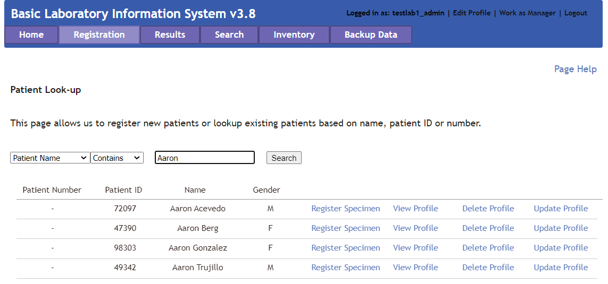

#### Add or Edit a Specimen Record 
To add or edit a specimen record, first begin by finding the patient to whom the specimen belongs to. Then, click the **Register Specimen** link to the right of the patient name.

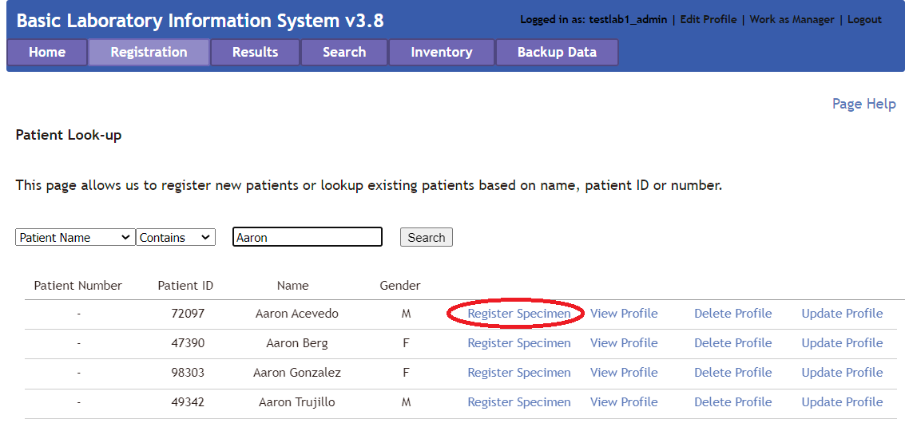

Fill in the blank fields and check the appropriate elements. Elements with asterisks * are mandatory.

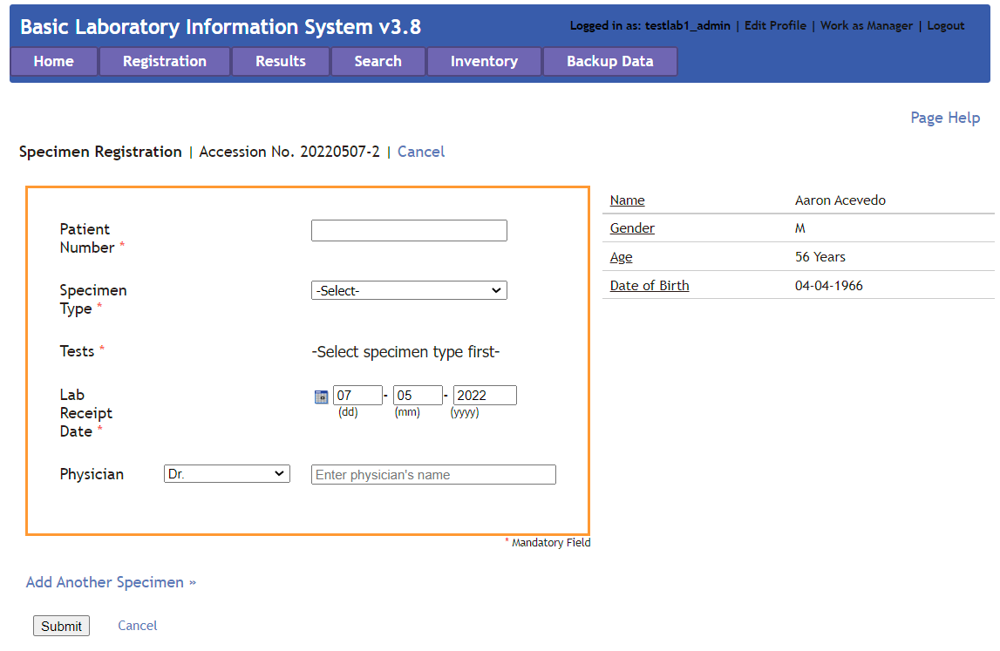

Click on **Submit** to save, or **Cancel** to discard changes and return to patient look-up page. Click **Add Another Specimen**  to add another specimen for this patient.

### Results 
The **Results** page allows the Technician to see, evaluate, and verify results for collected specimens.

#### Single Specimen Results
This option allows the Technician to add results for a patient based on the specimens provided and Lab sections to which the specimen tests are registered. Click on the drop-down list and select patient name, ID, or number. Type in the field at least 2 characters to
search.

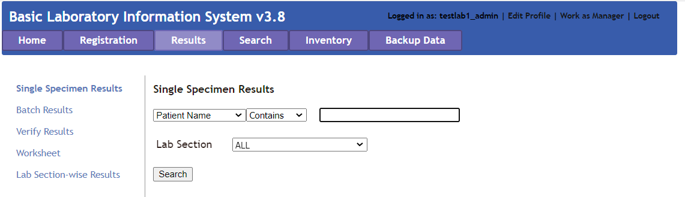

To add or edit a specimen record: Find the patient as above and then click the **Enter Results** link to the right of the patient name. Fill in the blank fields and check the appropriate elements.

 Click on **Submit** to save, or **Cancel** to discard changes.

#### Batch Results
This option allows the Technician to add results for a particular Test Type.

Select a test for which to find results. Set a date range, then click Search. The results appear without patient names. Click on **Submit** to save, or **Cancel** to discard changes.

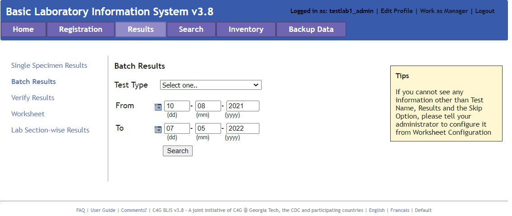

#### Verify Results
This option allows the Technician to verify the result based on the test type. It shows the list of results for all patients whose results have not been verified. Here, results can be modified and entered prior to verifying.

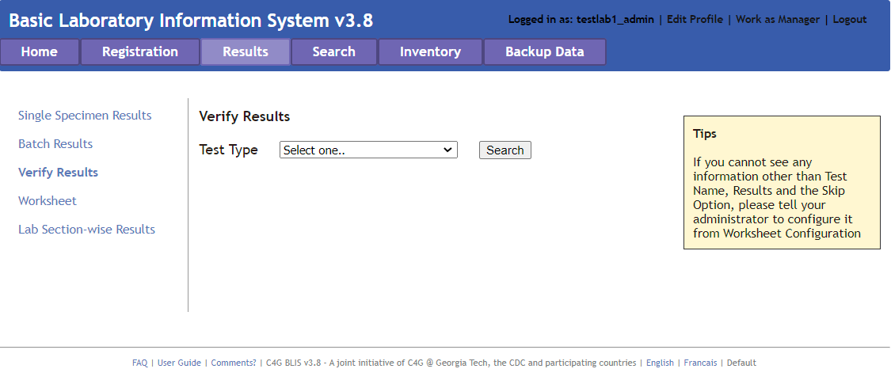

Select a **Test Type** and click **Search**. All test results for that test appear. Look over the test results for accuracy. Edit the results as appropriate. When finished, click on **Verify**, or **Cancel** to discard changes. Choosing **Verify** opens a confirmation dialog box.

Click **OK** to mark results as verified, **Cancel** to discard changes.

#### Worksheet
This option generates a worksheet based on the Lab Section and Test Type. In lab settings where data are not entered at the point of service, the data entry staff enter patient information and the tests ordered, then print the worksheet so that lab technicians can write test results and other data to be entered into BLIS. Custom worksheet which can be created by Admins using Lab Configuration > Tests > Reports > Worksheet.

Create a blank worksheet by choosing the **Keep Blank** option and specifying the number of rows needed. Click **Submit** to create the worksheet.

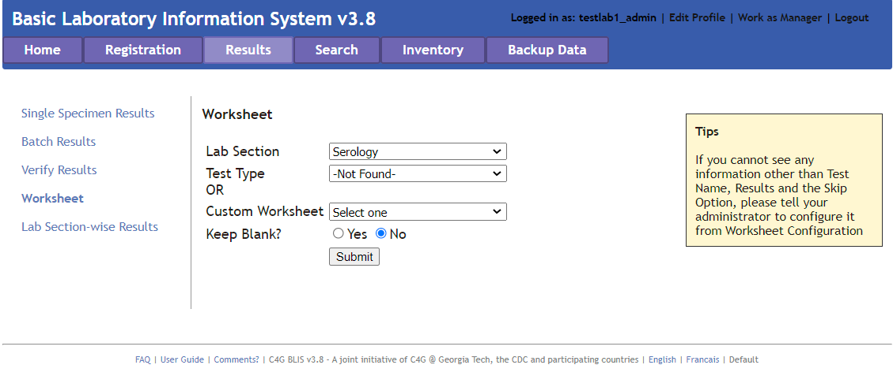

After generating the worksheet, click on a column heading to sort the table by that field. Other features include **Print** in portrait (default) or landscape view, **Export as a Word Document**, or **Close** the page. If **Export** is selected, the default option is to open the Word document. The document can be printed or saved from Word.

### Search 
This page allows the Technician to search for a patient by name, number, or ID. Enter a partial name or ID (at least 2 characters) to generates a list of matches.

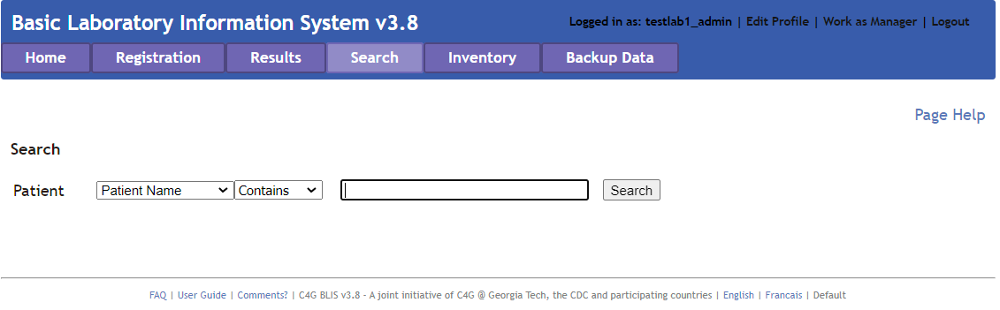

Click **View Profile** to view the patient’s profile and test history.

From the test history section, click **Details** for specimen information. Then, choose **Get Report** for a specimen report; **Track Actions** to view a log of actions on that specimen, or **Enter Results** to enter the specimen analysis results. A report can be generated from the test history section on the profile page by clicking the **Report** link.

From the profile page, other features include can also **Register New Specimen**, **Update Profile**, or **Print Patient Report**.

### Inventory 

#### Current Inventory
This link displays the reagent quantities currently in stock. It is not editable. To edit the list, click **Add Reagent**.

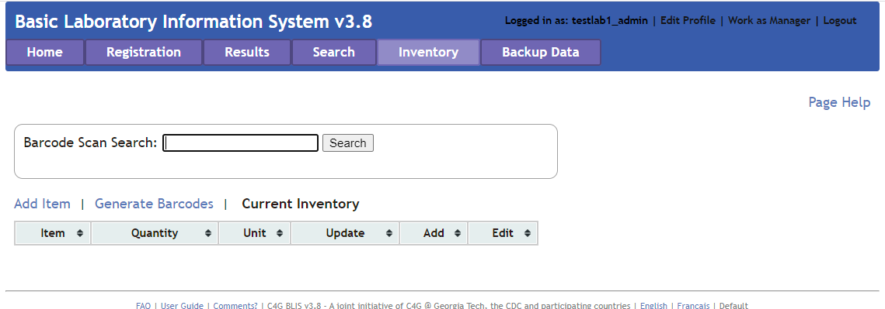

#### Add Item
Click **Add Item** to add a new item to the list. Update the stock as more reagents are acquired by adding the reagent name, quantity received, receiver name, and remarks.

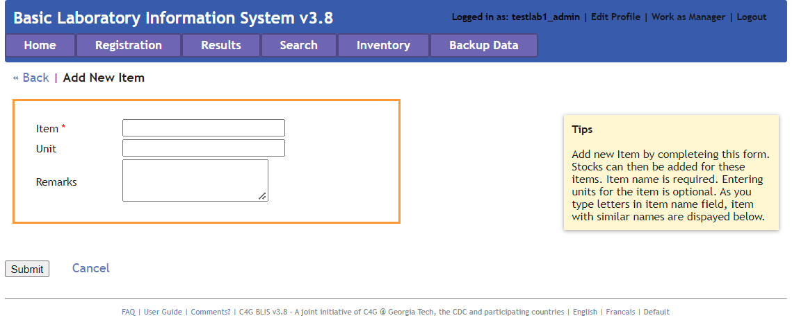

Click **Submit** to save changes.

#### Generate Barcodes
Clicking **Generate Barcodes** allows the Technician to generate a unique barcode. To do so, enter text into the field on the page, and press **Generate**. After generating the barcode, print them by pressing the **Print** button.

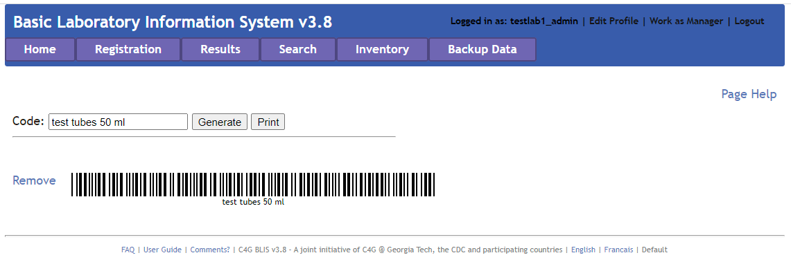

### Backup Data 
The Backup Page is similarly designed to the Backup Data feature available for Lab Managers.

!!! tip "See Also"
    The Backup Data functionality can be found in the [Lab Manager section on Backup Data.](../04_manager_overview/#backup-data)
