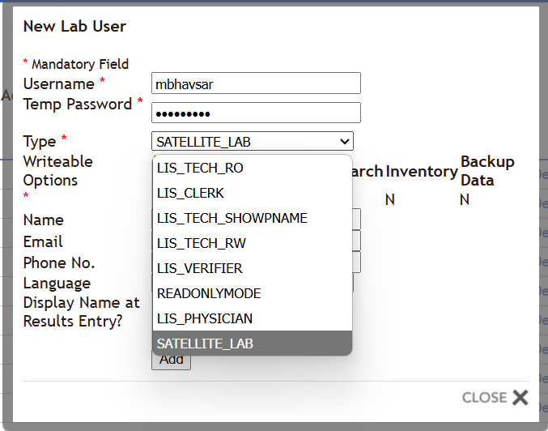
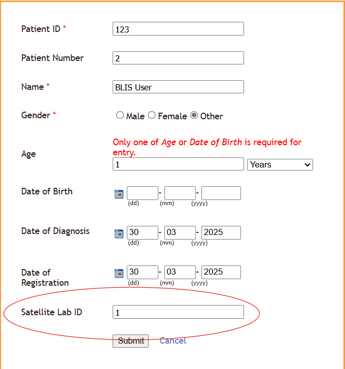
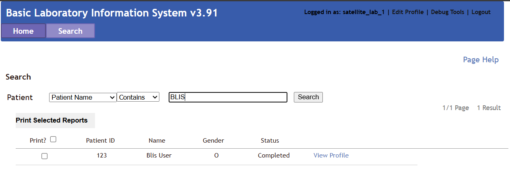

# Satellite Lab Overview

## What is a Satellite Lab?
Satellite labs receive patient samples from reference labs that don't have the necessary equipment to handle certain tests. The results are then sent back to the reference lab through BLIS.

### Satellite Lab ID Functionality
Satellite Lab ID is a unique identifier assigned to satellite labs within the BLIS system. The Satellite Lab ID ensures that satellite labs can only view patient data from patients specifically related to their lab, enhancing data privacy and reducing the risk of misinterpretation.
Satellite Lab ID functionality is added to:
- Restrict satellite labs to viewing only their own test results.
- Enhance data security by preventing unnecessary exposure of unrelated patient data.
- Increase accuracy and efficiency in handling and interpreting test results.

## Create a Satellite Lab Account
1. On BLIS log in as `a lab administrator`.
2. Navigate to the **Lab Configurations** tab.
3. Select **User Accounts** and click on **Add New Account**.
4. From the dropdown menu, select user type `SATELLITE_LAB`.
5. Click **Add** and verify the user creation.

## Add a Patient Associated with a Satellite Lab
1. Stay logged in as `a lab administrator`.
2. Click on **Work as Technician** in the top right corner.
3. Navigate to **Registration**, then click **Search**.
4. Click **Add New Patient**:
   - Fill out patient details.
   - Assign a specific Satellite Lab ID (e.g., `1` for `satellite_lab_1`).
   - Click **Submit**.

### Searching Patients as a Satellite Lab
1. Log in as the satellite lab user (e.g., username: `satellite_lab_1`, password: `tech123`).
2. Navigate to the **Search** tab.
3. Enter the patient's name associated with your Satellite Lab ID.
4. Click **Search** to view results relevant only to your lab.

