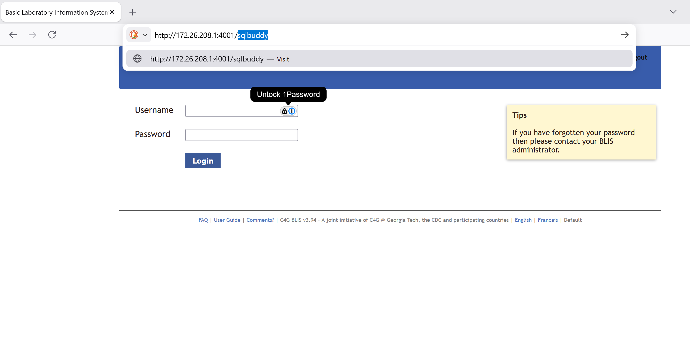
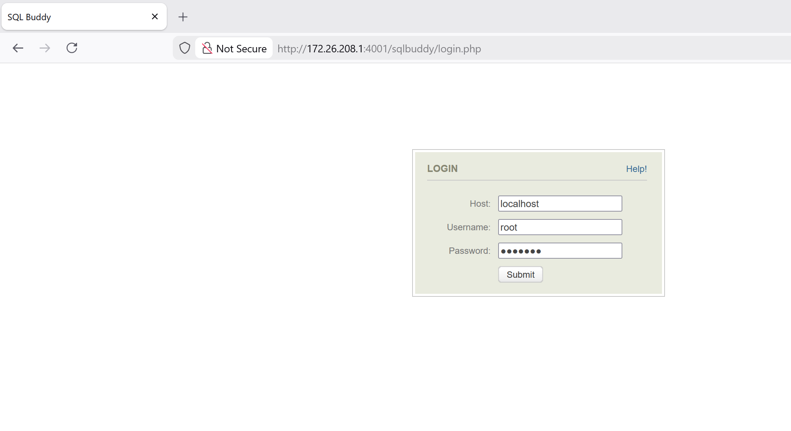
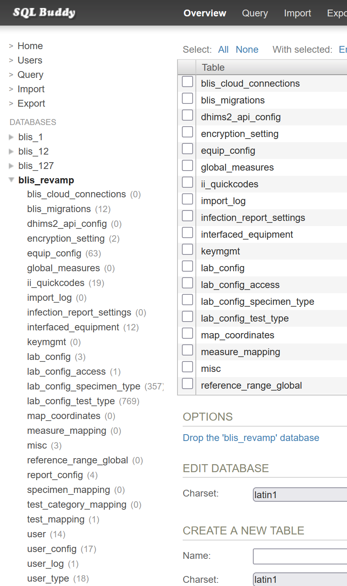
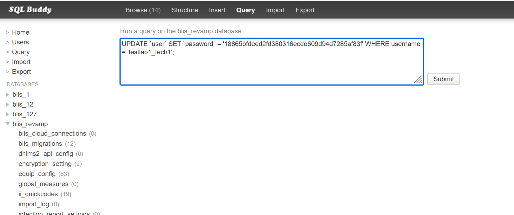

# Experimental: Password Resets (BLIS Local)

## Step 1: Start BLIS and open the login page in Firefox

## Step 2: Go to SQLBuddy

First, navigate to SQLBuddy by changing the URL bar of your browser. Replace the final part of
the URL with `sqlbuddy`. See the picture for an example.



## Step 3: Log in to SQLBuddy

The username is `root` and the password is **`blis123`**.



## Navigate to the `users` table in the `blis_revamp` database

1. Click `bis_revamp` in the left side bar
1. When the list of tables expands, click `users`



## Execute a query to update the password



1. In the top of the window, click "Query"
1. Delete all text from the text box, then enter:

    ```sql
    UPDATE `user` SET `password` = '18865bfdeed2fd380316ecde609d94d7285af83f' WHERE `username` = 'REPLACE-WITH-YOUR-USERNAME-HERE';
    ```
1. Click submit
1. You should see "Your query returned 1 record" or something similar.

The user password should now be set to: **`admin123`**.
