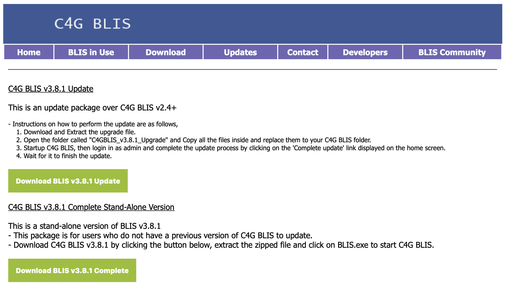
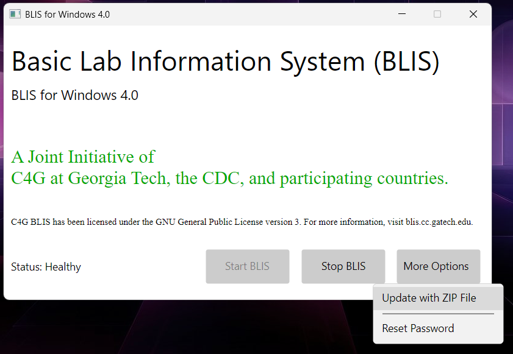
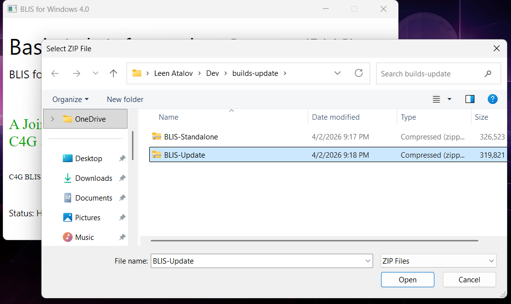
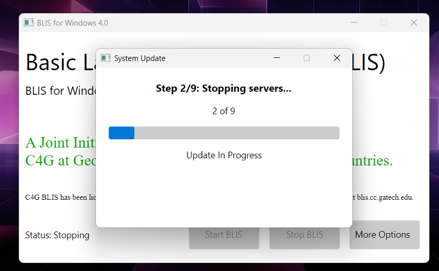

# Experimental: Updating BLIS (Desktop/Windows)

## Overview

BLIS can now be updated directly through the BLIS-NG launcher without requiring a technician or manual file installation. The lab administrator downloads an update package from the project site, selects it in the launcher, and the launcher handles the rest. This replaces the previous process of manually copying files onto the machine, which could result in incomplete or mismatched installations.

---

## Before You Begin

- This feature is only available on **Windows**. It is not supported on Mac or Linux.
- The self-update feature requires **BLIS 4.0 or later**. If the lab is running an older version, a fresh install is required instead. To do this, back up existing data through the BLIS application, perform a fresh install, and then import the backup.
- Download the update ZIP file from the project site at [blis.cc.gatech.edu/download.php](https://blis.cc.gatech.edu/download.php) before starting. The update cannot be performed without this file.

---

## How to Update BLIS

1. Open the BLIS-NG launcher on the lab server PC.

2. Click **More Options** and select **Update with ZIP File** from the dropdown.

    

3. Select the update ZIP file downloaded from the project site when prompted.

    

4. The launcher will proceed through the update process automatically. Wait for it to complete before taking any further action.

    

5. Once the update is complete, open BLIS in the browser. If there are pending database migrations, the BLIS application will display a prompt to apply them. Follow the on-screen instructions to complete this step.

---

## How It Works

When an update is started, the launcher runs through a two-stage process. In the first stage, the launcher updates itself. In the second stage, it stops the running BLIS services, stages the new application files, creates a database backup, and restarts services with the new version active. The previous version is retained on the machine, though reverting to it requires manual intervention. Database migrations are handled separately through the BLIS application after the launcher completes.

---

## Troubleshooting

**The update failed or the launcher displayed an error.**
Verify that the ZIP file was downloaded from [blis.cc.gatech.edu/download.php](https://blis.cc.gatech.edu/download.php). If the issue persists, check the `logs/` directory in the root of the BLIS installation for more detail.

**The version number on the launcher did not change after the update.**
The update did not complete successfully. Check the `logs/` directory for more detail.

**BLIS is not accessible in the browser after the update.**
Verify that the launcher is running and that BLIS services have started. If the problem persists, check the `logs/` directory for more detail.

**Database migrations are pending after the update.**
This is expected. Open BLIS in the browser and follow the on-screen prompt to apply pending migrations.