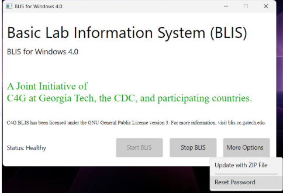
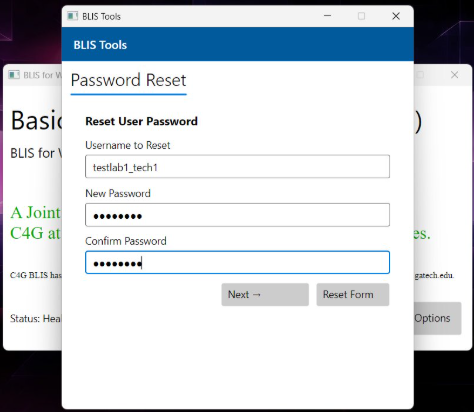
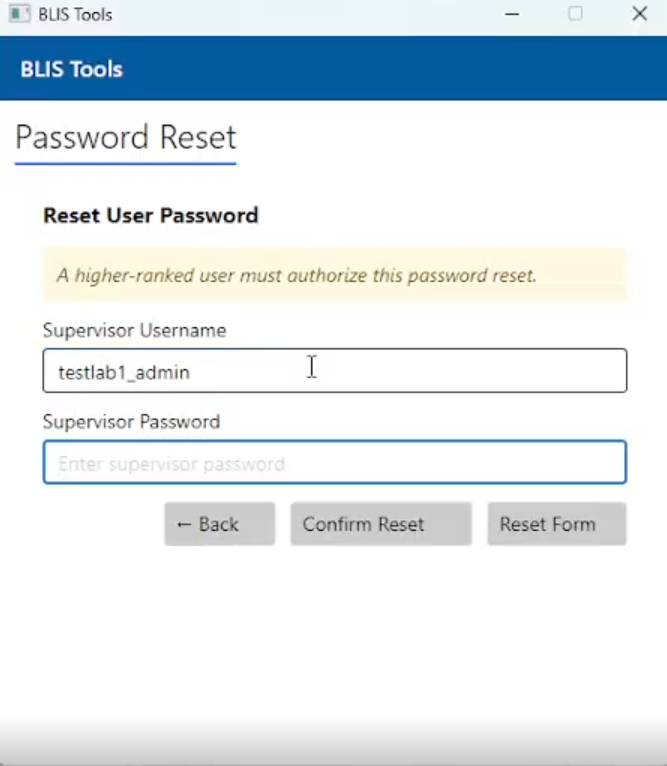

# Password Reset from BLIS Launcher

## Step 1: Click on "More Options" and select "Reset Password" from the BLIS Launcher.

## Step 2: Enter the username and the new password you want to set. Click "Next".

## Step 3: The reset is a role-based privilege, so please enter a supervisor account’s username and password.

## Step 4: Click "Confirm Reset".
A success message will confirm that the password reset is complete.

## Step 5: Use the new password and login to BLIS.

