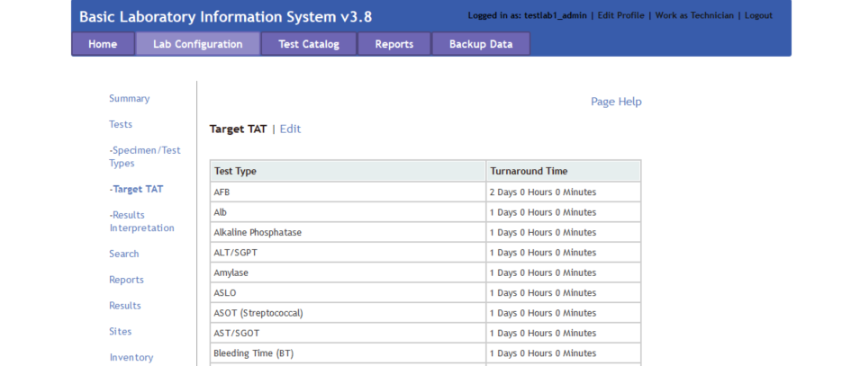
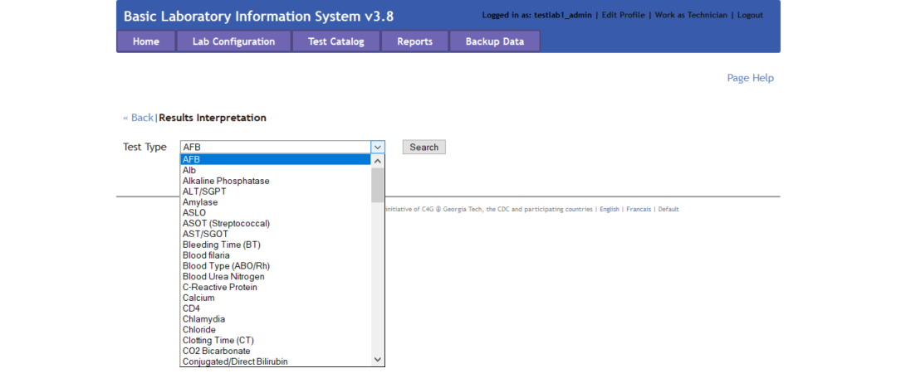
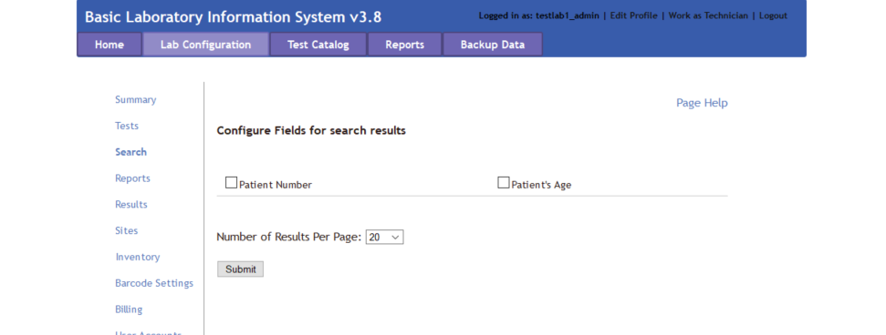
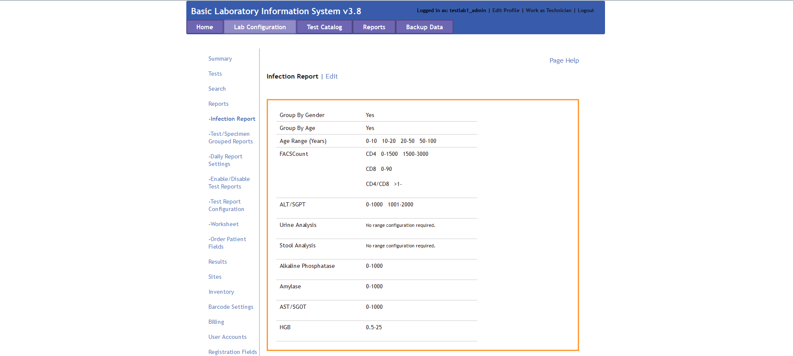
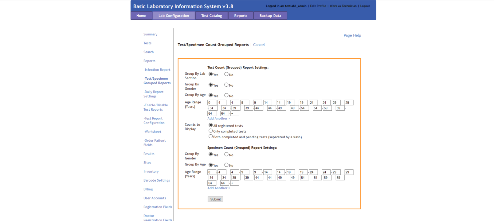
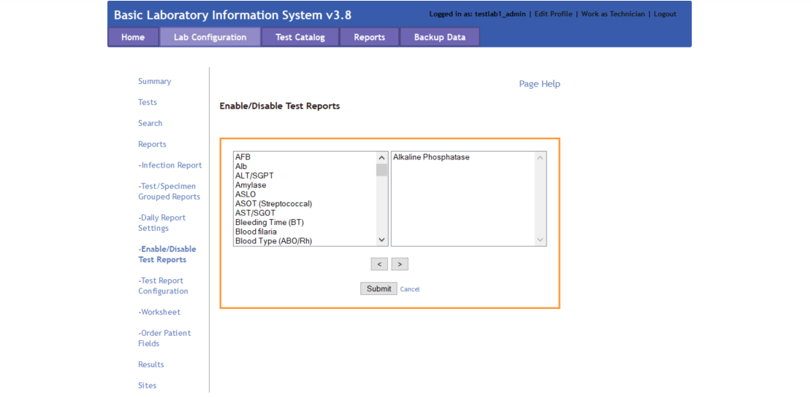
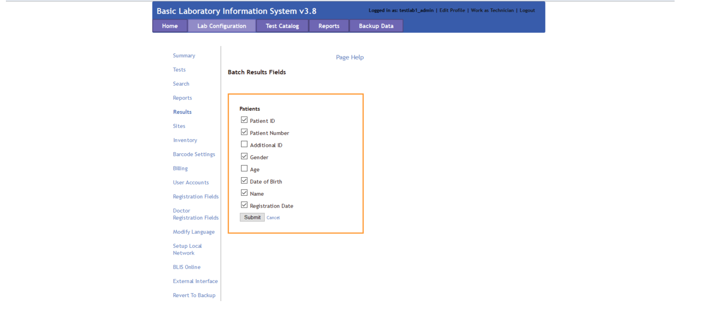
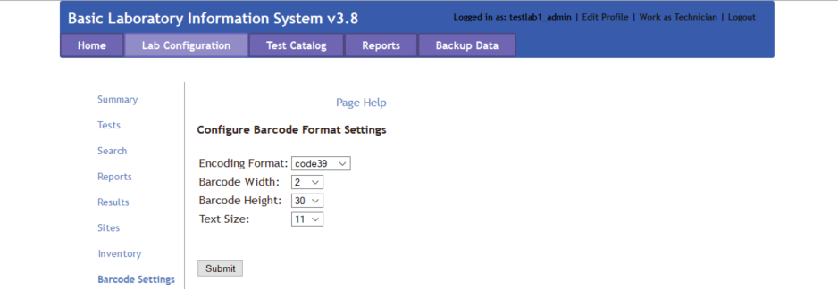

# C4G BLIS User Guide Version 3.8

## User Instruction Manual Rev 3.8

C4G Basic Laboratory Information System is a collaboration between Computing-for-Good (C4G) at Georgia Tech, the CDC, and participating PEPFAR countries.

# Table of contents
1. [Introduction to C4G BLIS](#introduction)
2. [BLIS Start-Up Guide](#startup)
    1. [Installing BLIS For Windows](#blis_windows)
    2. [Starting BLIS](#starting_blis)
    3. [Stopping BLIS](#stopping_blis)

3. [Roles in BLIS](#blis_roles)
    1. [Director Overview](#director_overview)
    2. [Manager Overview](#manager_overview)
        1. [Lab Configuration](#lab_configuration)

    3. [Technician Overview](#technician_overview)

# Introduction to C4G BLIS 
The Basic Laboratory Information System, BLIS, is a freeware Web-based system that can be installed in a local, district, or national laboratory. It is a tool that can help to standardize data, which improves the ability to run useful reports and can both give a realistic picture of laboratory services and assist with staff and budget planning. With enough data, BLIS can be used to track disease prevalence over time.

Features of BLIS include:
- One-time entry of each unique patient
- Standardization of data collected (allowable entries for specimen type, test type, patient data, reagents are set at MOH level and then entered consistently throughout a country)
- Customization to a country’s needs
- Ability to track lab supplies such as test kits, reagents
- Ability to run reports as specified by a country
- Automatic alerting of data values that may be out of range(reference ranges and panic values are set at the regional or national level)
- Daily logs to be reviewed for data verification
- Simple data backup to a zipped file 
- [NEW] BLIS running on a cloud provider
- [NEW] Manual data backup to a version of BLIS running on a remote server

As with any properly implemented electronic record system, BLIS may be found over time to improve data accuracy and reduce costs in laboratories. Benefits already seen in labs using BLIS:
- Reduced burden for technicians, as results are available soon after testing
- Improved consistency of data entry
- Ability to view patient history and track samples
- Ability to aggregate data and analyze data patterns and trends at a regional or national level
- Printed patient records in place of handwritten records
- Printed daily logs that make the reports look like the paper forms used in the laboratory

# BLIS Start-Up Guide 
There are three versions of BLIS that currently exists. 

Firstly, **BLIS on Windows** was the original version developed for end-users. Stand-alone versions, updates, and packaged content are still publicly available on the C4G BLIS home page, [accessible here](http://blis.cc.gatech.edu/).

Secondly, **BLIS on the Cloud** is a newly deployed version of BLIS that is capable of running on a Cloud Provider, and was originally intended to be used as an online backup database for aggregating country-wide data for analysis. For instructions on installing **BLIS on the Cloud**, please see the Developer's Documentation.

Thirdly, **BLIS in a Devcontainer** is an instantiation of BLIS that allows for developers to specify the development environment, and is intended to be used by developers only. For instructions on installing **BLIS in a Devcontainer**, please see the Developer's Documentation.

## BLIS For Windows 
BLIS was originally developed to run on Windows using a discontinued project called Server2Go. This packages Apache2, MySQL, PHP, and Firefox together into a package that can be run all at once on a desktop computer. BLIS on Windows is the primary way that end-users are using BLIS, but can and should be used by developers to test updates.

### Prerequisites
Installing command-line tools can be done with a Windows package manager such as [Scoop](https://scoop.sh/).

* `git`

### Instructions for Installation
1. Navigate to the [C4G BLIS home page](http://blis.cc.gatech.edu/). 
B. Click on the **Download** tab in the top menu bar, then click **Download BLIS v3.8 Complete**.
3. Follow all instructions on the Download page.

## Starting BLIS 

1. Double-click on the BLIS.exe file.
2. A page requesting login information will appear. Enter in your login credentials.

 

## Stopping BLIS 
1. After your session is complete, click the **Logout** button in the top right pane of the screen.
2. A popup window will appear where you can rate your experience with C4G BLIS and write any comments you may have. After entering your feedback, press the **Submit** button to fully logout. Alternatively, you may press **Skip** to logout immediately without providing any feedback. If you do not wish to logout, press **CLOSE**.

 

# Roles in BLIS 
There are three roles in BLIS. 

Firstly, **Directors** (also referenced to as country directors) are a role held by a single individual at the management level of each country. The roles of Directors are to oversee many laboratories using BLIS, summarize data trends from uploaded patient data from across the country, and work with C4G developers to provide user feedback for future versions of BLIS.

Secondly, **Managers** (also referenced as admin users) are the managerial supervisors of laboratories. The roles of Managers are to maintain the user permissions to individual labs and alter individual lab configurations as needed.

Thirdly, **Technicians** are the majority of BLIS users. The role of Technicians is to enter in and verify patient data.

# Director Overview 
# Manager Overview 
The manager interface allows the Manager to do the following:
1. Add, edit, and delete users
2. Change the laboratory configuration settings in the **Lab Configuration** tab in the top menu bar
3. Generate and print reports in the **Reports** tab in the top menu bar

## Lab Configuration 
The laboratory configuration can be changed by Managers or admin users of BLIS. Here, you can change how reports are generated, what patient data is collected, as well as various other settings. In general, laboratory settings are usually initialized by the Country Director, but can be modified to suit individual labs' needs.

The menu selection for the **Lab Configuration** tab - accessible in the top menu bar - is as follows:
1. [Summary](#summary)
2. [Tests](#tests)
3. [Search](#search)
4. [Reports](#reports)
5. [Results](#results)
6. [Sites](#sites)
7. [Inventory](#inventory)
8. [Barcode Settings](#barcode_settings)
9. [Billing](#billing)
10. [User Accounts](#user_accounts)
11. [Registration Fields](#registration_fields)
12. [Doctor Registration Fields](#doctor_registration_fields)
13. [Modify Language](#modify_language)
14. [Setup Local Network](#setup_local_network)
15. [BLIS Online](#blis_online)
16. [External Interface](#external_interface)
17. [Revert to Backup](#revert_to_backup)
18. [Manage Backup Keys](#manage_backup_keys)
19. [Export Configuration](#export_configuration)

### Summary 
The **Summary** page displays information about the laboratory. Specific information includes the Facility Name, Location, Lab Manager, available Specimen Types, available Test Types, and Technician Accounts allocated to the specific laboratory.

### Tests 
The **Tests** page has a drop down menu that opens up to reveal three different options: **Specimen/Test Types**, **Target TAT**, and **Results Interpretation**.

#### Specimen/Test Types
The **Specimen/Test Types** page allows you to set the specimen and test types as appropriate for your country. Click **Show** to reveal hidden panes and **Hide** to close the panes. Check the box for each specimen type collected or test done at this facility, and click **Submit** to save.

#### Target TAT
The **Target TAT** page displays turnaround times for tests. To enter or change turnaround time, click **Edit**. The number and unit (such as “24 hours”) change to a text field and a drop-down list. Enter the desired number and choose **Hours** or **Days**. When finished, click the **Submit** button to save changes, or **Cancel** to discard changes. These options are below the list.

### Results Interpretation

The **Results Interpretation** page allows you to specify the interpretation for multiple ranges of values for each test type. To view or edit an existing test’s result, choose the test type from the drop-down list and click the **Search** button. The current interpretation appears. Edit using the text boxes.

To add a new range to the list, click the **Add Another** link and enter data in the text boxes. Click the **Submit** button to save changes, or **Cancel** to discard them.

### Search 
The **Search** page allows you to configure what results are displayed for each patient when a search is executed. It also allows you to change how many results are displayed on each page.

### Reports 
The **Reports** page has a drop down menu that opens up to reveal seven different options: **Infection Report**, **Test/Specimen Grouped Reports**, **Daily Report Settings**, **Enable/Disable Test Reports**, **Test Report Configuration**, **Worksheet**, and **Order Patient Fields**.

### Infection Report
The **Infection Report** page generates an aggregate report of laboratory test results for a particular period for one or all lab sections. The tests listed in the report are the ones checked to include on the **Specimen/Test Types** page. Click **Edit** to make changes to the details reported. When finished, click **Submit** button to save changes, **Preview** to view the report, or **Cancel** to discard changes.

### Test/Specimen Grouped Reports
The **Test/Specimen Grouped Reports** page allows you to set the **Test Count (Grouped) Report** settings and the **Specimen Count (Grouped) Report** settings. Click **Edit** to change settings. When finished, click the **Submit** button to save changes, or **Cancel** to discard changes. 

### Daily Report Settings
The **Daily Report Settings** page allows you to set the layout of the **Patient Report**, **Daily Log - Specimens**, and **Daily Log - Patients**. Use the drop-down to select the report type, then click **Search**. Check or un-check boxes to show or hide patient, specimen, and test information. If desired, you can upload a .jpg logo file to appear on the report. When finished, click the **Submit** button to save changes, or **Cancel** to discard changes. These options are below the list.

### Enable/Disable Test Results
The **Enable/Disable Test Results** page allows you to enable or disable specific tests. Items on the left side are disabled; move the test items to the right side to enable them. When finished, click the **Submit** button to save changes, or **Cancel** to discard changes.

### Test Report Configuration
The **Test Report Configuration** page allows you to visualize your enabled test configurations. Use the drop-down to select the test type from the enabled test list, then click **Search**. Click **Edit** to edit the configuration of the reported test data. Check or un-check boxes to show or hide patient, specimen, and test information. When finished, click the **Submit** button to save changes, or **Cancel** to discard changes

### Worksheet
The **Worksheet** page allows you to create templates for gather patient data in the lab. In lab settings where data are not entered at the point of service, the data entry staff can enter the laboratory's patient information and ordered tests, then print the worksheet so that lab technicians can write test results and other data to be entered into BLIS. 

Select the **Lab Section** and **Test Type** and click **Search** to edit the report format. To edit a custom report, click **Edit** to the right of the report. To create a new custom worksheet, click the **Add Custom Worksheet** link at the bottom of the list.

### Results 
The **Results** page allows you to edit the parameters displayed in the batch results page. Currently, the editable data is limited to Patient information.

### Sites 
The **Sites** page allows you to add, modify, or remove specimen collection sites to the laboratory records. When first spawning a laboratory, only one site - the default site - will exist. 

Additional information about the site can be provided in the textboxes - currently, BLIS supports adding in District and Region information. To add another site, click on the **Add Another** hyperlink at the top and fill in textbox with the new site name, then click **Submit**. To go back, click **Cancel**. 

### Inventory 
The **Inventory** page is a list of any existing reagents being tracked in BLIS. To add another, click the
**Add Item** link above the list and input the name, unit of measurement associated with the reagent, and any miscellaneous remarks about the reagent. After pressing **Submit**, don't forget to add the item's stock. On the **Current Inventory** page, you can **Log Stock Usage**, **Add Stock**, or **Edit Details**.

### Barcode Settings 
The **Barcode Settings** page allows you to configure the settings for barcode formats. Click on the **Page Help** for more details. After changing the settings, click **Submit** to save your edits.

## Technician Overview 

