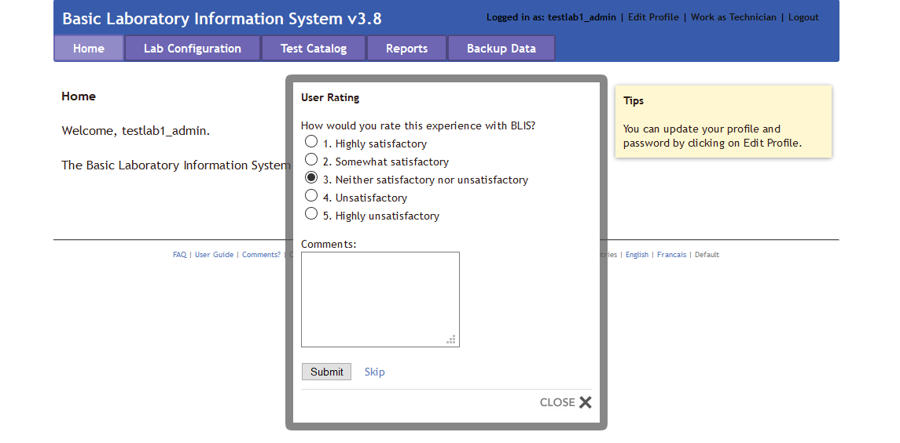
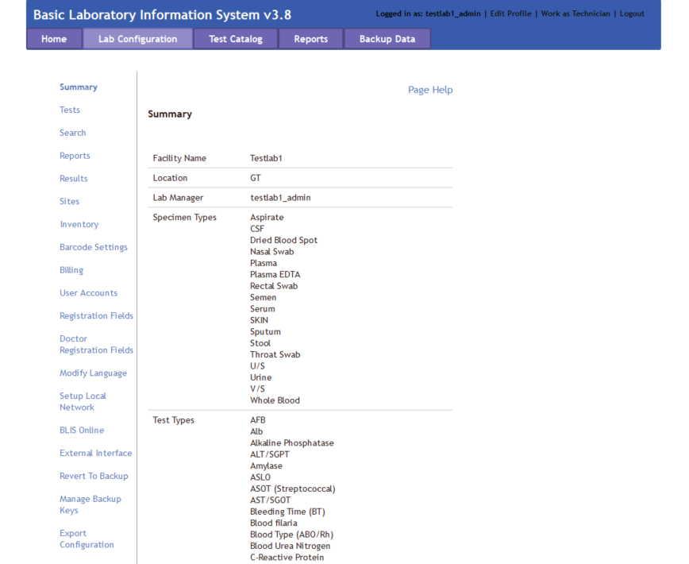

# C4G BLIS User Guide Version 3.8

## User Instruction Manual Rev 3.8

C4G Basic Laboratory Information System is a collaboration between Computing-for-Good (C4G) at Georgia Tech, the CDC, and participating PEPFAR countries.

# Table of contents
1. [Introduction to C4G BLIS](#introduction)
2. [BLIS Start-Up Guide](#startup)
    1. [Installing BLIS For Windows](#blis_windows)
    2. [Starting BLIS](#starting_blis)
    3. [Stopping BLIS](#stopping_blis)

3. [Roles in BLIS](#blis_roles)
    1. [Director Overview](#director_overview)
    2. [Manager Overview](#manager_overview)
        1. [Lab Configuration](#lab_configuration)

    3. [Technician Overview](#technician_overview)

# Introduction to C4G BLIS 
The Basic Laboratory Information System, BLIS, is a freeware Web-based system that can be installed in a local, district, or national laboratory. It is a tool that can help to standardize data, which improves the ability to run useful reports and can both give a realistic picture of laboratory services and assist with staff and budget planning. With enough data, BLIS can be used to track disease prevalence over time.

Features of BLIS include:
- One-time entry of each unique patient
- Standardization of data collected (allowable entries for specimen type, test type, patient data, reagents are set at MOH level and then entered consistently throughout a country)
- Customization to a country’s needs
- Ability to track lab supplies such as test kits, reagents
- Ability to run reports as specified by a country
- Automatic alerting of data values that may be out of range(reference ranges and panic values are set at the regional or national level)
- Daily logs to be reviewed for data verification
- Simple data backup to a zipped file 
- [NEW] BLIS running on a cloud provider
- [NEW] Manual data backup to a version of BLIS running on a remote server

As with any properly implemented electronic record system, BLIS may be found over time to improve data accuracy and reduce costs in laboratories. Benefits already seen in labs using BLIS:
- Reduced burden for technicians, as results are available soon after testing
- Improved consistency of data entry
- Ability to view patient history and track samples
- Ability to aggregate data and analyze data patterns and trends at a regional or national level
- Printed patient records in place of handwritten records
- Printed daily logs that make the reports look like the paper forms used in the laboratory

# BLIS Start-Up Guide 
There are three versions of BLIS that currently exists. 

Firstly, **BLIS on Windows** was the original version developed for end-users. Stand-alone versions, updates, and packaged content are still publically available on the C4G BLIS home page, [accessible here](http://blis.cc.gatech.edu/).

Secondly, **BLIS on the Cloud** is a newly deployed version of BLIS that is capable of running on a Cloud Provider, and was originally intended to be used as an online backup database for aggregating country-wide data for analysis. For instructions on installing **BLIS on the Cloud**, please see the Developer's Documentation.

Thirdly, **BLIS in a Devcontainer** is an instantiation of BLIS that allows for developers to specify the development environment, and is intended to be used by developers only. For instructions on installing **BLIS in a Devcontainer**, please see the Developer's Documentation.

## BLIS For Windows 
BLIS was originally developed to run on Windows using a discontinued project called Server2Go. This packages Apache2, MySQL, PHP, and Firefox together into a package that can be run all at once on a desktop computer. BLIS on Windows is the primary way that end-users are using BLIS, but can and should be used by developers to test updates.

### Prerequesites
Installing command-line tools can be done with a Windows package manager such as [Scoop](https://scoop.sh/).

* `git`

### Instructions for Installation
1. Navigate to the [C4G BLIS home page](http://blis.cc.gatech.edu/). 
2. Click on the *Download* tab in the top menu bar, then click **Download BLIS v3.8 Complete**.
3. Follow all instructions on the Download page.

## Starting BLIS 

1. Double-click on the BLIS.exe file.
2. A page requesting login information will appear. Enter in your login credentials.

 

## Stopping BLIS 
1. After your session is complete, click the **Logout** button in the top right pane of the screen.
2. A popup window will appear where you can rate your experience with C4G BLIS and write any comments you may have. After entering your feedback, press the **Submit** button to fully logout. Alternatively, you may press **Skip** to logout immediately without providing any feedback. If you do not wish to logout, press **CLOSE**.

 

# Roles in BLIS 
There are three roles in BLIS. 

Firstly, **Directors** (also referenced to as country directors) are a role held by a single individual at the management level of each country. The roles of Directors are to oversee many laboratories using BLIS, summarize data trends from uploaded patient data from across the country, and work with C4G developers to provide user feedback for future versions of BLIS.

Secondly, **Managers** (also referenced as admin users) are the managerial supervisors of laboratories. The rolse of Managers are to maintain the user permissions to individual labs and alter individual lab configurations as needed.

Thirdly, **Technicians** are the majority of BLIS users. The role of Technicians is to enter in and verify patient data.

# Director Overview 
The director role allows a user to control some components at a country level. This is organized into tabs, as with the other interfaces. 

## Lab Configurations
In the Lab Configurations tab, the director can view lab backups that have been imported. A list of the different lab configurations is also displayed, along with links to export each of these lab configurations. This allows a director to setup a lab configuration in advance and then export it for a new lab to import to streamline the process. 

To setup a new lab configuration, click the button to add a new lab. This walks the user through four steps to setup site information, technicians, base configuation, and test types. 

It is possible to add technicians during this setup process, but note that additional technicians can be added later. During setup of the base configuration, an existing lab configuration can be selected from the dropdown menu to use as a base. During the next step, test can be imported from an existing facility by selecting it from the dropdown menu. As with the other steps, the configuation can be further customized later from the Lab Configuration tab when logged in and work as a Manager. 

Clicking on the name of a facility takes the user to the Lab Configuration view, with all the same options available in the Manager view, plus three additional menu options: General Settings, Change Manager, Delete Configuration, and Import Configuration. For information on the other menu options and how they work, please go to the [Lab Configuration](#lab-configuration-a-name"labconfiguration") section. Each of the additional options are covered here.

The General Settings option allows the director to change the name or location of a facility. Additionally, the user can populate the database with random data or clear randomly populated data. The Change Manager option is self-explanatory. This option allows the director to select a user from the dropdown menu as the new lab manager. The Delete Configuration menu option should be used with caution. This allows the director to delete an entire lab configuation. Please use this with caution! 

Another functionality available on the Lab Configuration tab is importing lab backups. Lab managers can perform backups and send the backups to the director. To import a lab backup, from the Lab Configuration tab, select Import Lab Data. Browse to find the zipped backup provided by the lab, and click the import button. You will receive a confirmation message that the backup was successful or an error message if there is something wrong with the backup. 

If the backup is encrypted, it can only be unencrypted with the correct key. If you want the lab to send you an encrypted backup, you must first download the public key and share it with the lab. To do this, click the button to download a public key. It will get saved in your downloads folder by default. Send this file to the lab that is going to perform the backup. The lab manager can use the public key to export an encrypted backup from the Backup Data tab, and then share the zipped backup folder with you, which can be imported as described above. 

## Lab Managers
Under the Lab Managers tab, the director can add, edit, or delete lab managers. Click "edit" on an existing manager to change the name, email address, phone number, or language of a manager, or to reset the managers password. Note that you must go to the User Accounts menu option in the Lab Configurations tab from the Manager view to edit/reset passwords for Technician accounts (as opposed to manager accounts). 

## Test Catalog
The test catalog tab allows the director to add country-wide specimens and tests. 

## Reports 
The reports tab allows the director to build reports for some or all of the labs that are under the country's management. The aggregate reports work much as the aggegrate reports do within the Manager view, with two additional options to select a specific test and select which facilities should be included in the report. There is also a menu option to configure some of the aggregation settings (e.g. age ranges) for the reports. 

 

# Manager Overview 
The manager interface allows the Manager to do the following:
1. Add, edit, and delete users
2. Change the laboratory configuration settings in the **Lab Configuration** tab in the top menu bar
3. Generate and print reports in the **Reports** tab in the top menu bar

## Lab Configuration 
The laboratory configuration can be changed by Managers or admin users of BLIS. Here, you can change how reports are generated, what patient data is collected, as well as various other settings. In general, laboratory settings are usually initalized by the Country Director, but can be modified to suit individual labs' needs.

The menu selection for the Lab Configuration tab - accessiable in the top menu bar - is as follows:
1. [Summary](#summary)
2. [Tests](#tests)
3. [Search](#search)
4. [Reports](#reports)
5. [Sites](#sites)
6. [Inventory](#inventory)
7. [Barcode Settings](#barcode_settings)
8. [Billing](#billing)
9. [User Accounts](#user_accounts)
9. [Registration Fields](#registration_fields)
10. [Doctor Registration Fields](#doctor_registration_fields)
11. [Modify Language](#modify_language)
12. [Setup Local Network](#setup_local_network)
13. [BLIS Online](#blis_online)
14. [External Interface](#external_interface)
15. [Revert to Backup](#revert_to_backup)
16. [Manage Backup Keys](#manage_backup_keys)
27. [Export Configuration](#export_configuration)

### Summary 
The Summary page displays information about the laboratory. Specific information includes the Facility Name, Location, Lab Manager, available Specimen Types, available Test Types, and Technician Accounts allocated to the specific laboratory.

### Tests 

### Search 

### Reports 
## Technician Overview 

