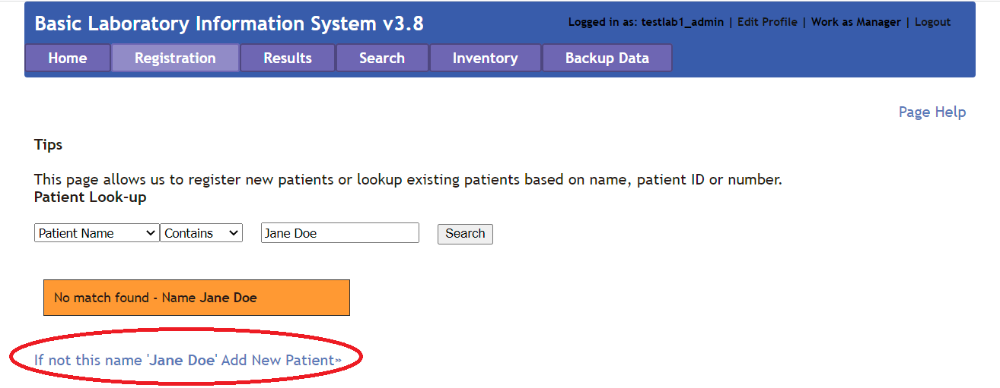

# Frequently Asked Questions

You can see these Frequently Asked Questions displayed on Github!

### Q: I'm using BLIS for Windows and everytime I try to run the executable, it crashes! What's going on?
<b>A</b>: Ensure that the zipped files from the Runtime.zip are extracted directly into the BLIS directory. They should not remain in a Runtime folder.

### Q: I am trying out BLIS. How do I login?
<b>A</b>: Please login using the credentials: testlab1_admin/admin123 (as admin) or testlab1_tech1, testlab1_tech2/tech123 (as lab technician).

### Q: How do I look up a patient in our system?
<b>A</b>: Navigate to the Registration tab and search for the patient by name, number, or ID.

 

### Q: How do I add a new patient?
<b>A</b>: To add a new patient, navigate to the Registration tab. Do not enter anything into the search bar and click 'Search'. You will see an option to add new patient appear. Click the link to proceed.

 

### Q: How do I add a new Specimen to a patient?
<b>A</b>: After pulling open the patient's profile, click the 'Register New Specimen' hyperlink on the righthand side.

### Q: How do I configure BLIS to upload data to the central web instance [Manager View Only]?
<b>A</b>: In the Manager view, naviate to the Lab Configuration Tab, and then BLIS Online. Enter in the IP address of the BLIS server.

### Q: Sometimes, I load a page and the button text disappears. What's going on with the UI?

<b>A</b>: We're still working out the bugs with the UI, but chances are, you might need to click on the Default language option at the bottom of the screen.

BLIS has several language options to cater to a diverse community, and we're still working to implement our changes in all of them! Thank you for your patience.
